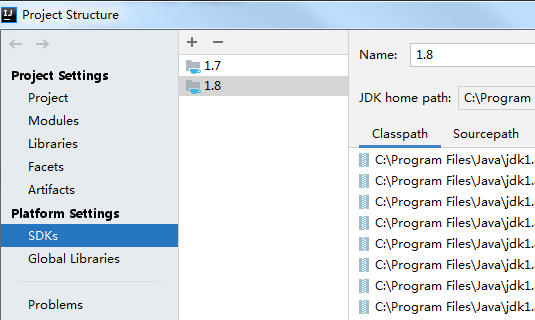
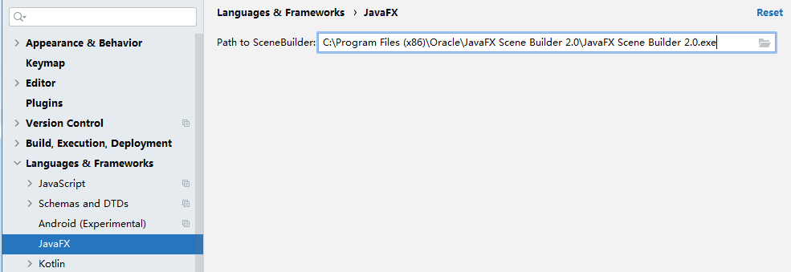

# 准备工作
- IDEA 
- 安装 JavaFx 插件
- SDK 选择 1.8 

- 安装 JavaFx Scene Builder

> **JavaFX Scene Builder**是一种可视布局工具，允许用户快速设计**JavaFX**应用程序用户界面，而无需编码。用户可以将**UI**组件拖放到工作区，修改其属性，应用样式表，并且它们正在创建的布局的`FXML`代码将在后台自动生成。它的结果是一个`FXML`文件，然后可以通过绑定到应用程序的逻辑与Java项目组合。
>
> 你需要使用 JavaFx Scene Builder 设计 GUI 页面。
>
> https://zhuanlan.zhihu.com/p/51517396 for Ubuntu

- 在 IDEA 中指定 Scene Builder 的可执行路径

> 一些你可能用得到的文档
>
> - [Java 8 API](http://docs.oracle.com/javase/8/docs/api/) - Java 标准类的文档。
> - [JavaFX 8 API](http://docs.oracle.com/javase/8/javafx/api/) - JavaFX 类的文档。
> - [ControlsFX API](https://controlsfx.bitbucket.io/) - [ControlsFX project](http://fxexperience.com/controlsfx/) 额外 JavaFX 控件的文档。
> - [Oracle’s JavaFX Tutorials](http://docs.oracle.com/javase/8/javafx/get-started-tutorial/get_start_apps.htm) - Oracle 的 JavaFX 官方教程。