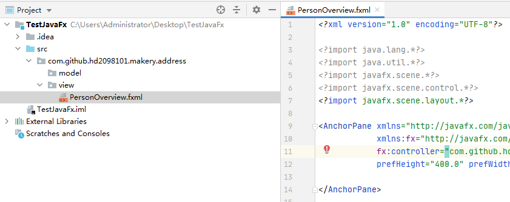
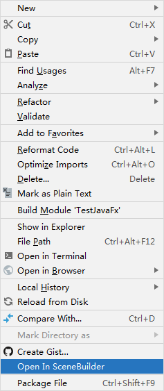
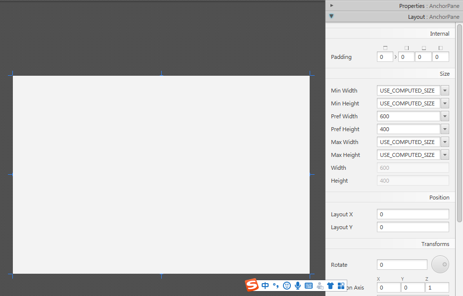

# 开始

[**Model-View-Controller** (MVC)](www.runoob.com/design-pattern/mvc-pattern.html)是一个非常重要的软件设计原则。按照MVC模式可以将我们的应用程序划分成3个部分，然后为这每一部分建立自己的包。

- com.github.hd2098101.makery.address  - 放置所有的控制器类（也就是应用程序的业务逻辑）
- com.github.hd2098101.makery.address.model - 放置所有的模型类
- com.github.hd2098101.makery.address.view - 放置所有的界面和控制类

## 创建FXML布局文件

有两种方式来创建用户界面，一种是通过XML文件来定义，另外一种则是直接通过java代码来创建. 这两种方式你都可以在网上搜到. 我们这里将使用XML的方式来创建大部分的界面。因为这种方式将会更好的将你的业务逻辑和你的界面区分开来，以保持代码的简洁。在接下来的内容里，我们将会介绍使用Scene Builder(所见即所得)来编辑我们的XML布局文件，它可以避免我们直接去修改XML文件。

在view包上右键创建一个新*FXML Document*，把它命名为`PersonOverview`。

在`PersonOverview.fxml` 右键选择 *Open In Scene Builder*，那么你将会在打开的Scene Builder里面看到一个固定的界面设计区域(在整个界面的左边)。

1. 选中这个界面设计区域，你就可以在右边的属性设置栏中对它的尺寸进行修改:

