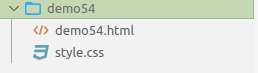

# CSS

## 1. 基础

### 1.1 语法

selector{property:value} 即选择器{属性：值}

> 学习 CSS 即学习有哪些选择器，那些属性以及可以使用什么样的值。

#### 1.1.1 选择所有的 p 元素

选择所有的 p 元素，并且设置文字的颜色为红色

```css
<style>
p{
   color:red;
}
</style>
<p>这是一个P</p>
<p>这是一个P</p>
<p>这是一个P</p>
<p>这是一个P</p>
```

#### 1.1.2 直接在元素上增加 style 属性

直接在元素上增加 style 属性，同样可以达到 CSS 一样的效果

```html
<p style="color:red">这是 style 为红色的</p>
<p>这是一个没有 style 的</p>
```

### 1.2 选择器

#### 1.2.1 元素选择器

元素选择器，通过标签名选择元素。

```html
<style>
p{
   color:red;
}
</style>
<p>这是一个P</p>
<p>这是一个P</p>
<p>这是一个P</p>
<p>这是一个P</p>
```

#### 1.2.2 id 选择器

通过 id 选择元素。

> 注：一个元素的 id 应该是唯一的，另一个元素不应该使用。

```html
<style>
p{
  color:red;
}
#p1{
  color:blue;
}
#p2{
  color:green;
}
</style>
<p>没有id的p</p>
<p id="p1">id=p1的p</p>
<p id="p2">id=p2的p</p>
```

#### 1.2.3 类选择器

当需要多个元素，都使用同样的css的时候，就会使用类选择器。

```html
<style>
.pre{
  color:blue;
}
.after{
  color:green;
}
</style>

<p class="pre">前3个</p>
<p class="pre">前3个</p>
<p class="pre">前3个</p>

<p class="after">后3个</p>
<p class="after">后3个</p>
<p class="after">后3个</p>
```

#### 1.2.4 更准确的选择

同时根据元素名和类名进行选择。

```html
<style>
p.blue{
  color:blue;
}
</style>
<p class="blue">class=blue的p</p>
<span class="blue">class=blue的span</span>
```

### 1.3 注释

注释 style 的样式，`/**/` 

```html
<style>
    /*设置所有 p 元素中的内容都为红色*/
p.blue{
  color:blue;
}
</style>
<p class="blue">class=blue的p</p>
<span class="blue">class=blue的span</span>
```

### 1.4 尺寸

 设置元素的尺寸

- 属性：width

- 值：可以是百分比或者像素

> 为了便于观察一个元素大小设置效果，进行了背景色的设置。

```html
<style>
    p#percentage{
        width: 50%;
        height: 50%;
        background-color: red;
    }
    p#pix{
        width: 180px;
        height: 50px;
        background-color: blue;
    }
</style>

<p id="percentage">按比例设置尺寸 50%</p>
<p id="pix">按像素尺寸 180px 宽 50 px</p>
```

### 1.5 背景

| 关键字                  | 简介           |
| ----------------------- | -------------- |
| background-color        | 背景颜色       |
| background-image:url    | 使用图片做背景 |
| url(background.jpg)     | 本地测试       |
| background-repeat       | 背景重复       |
| background-size:contain | 背景平铺       |

#### 1.5.1 背景颜色

属性名 background-color

颜色的值可以采用 3 种方式

- 预定义的颜色名字；
- rgb 格式，分别代表红绿蓝的比例 rgb(255,0,255) 即表示红色是满的，蓝色是满的混在一起是紫色；
- 16 进制的表示：#00ff00 等同于 rgb(255,0,255)

```html
<style>
p.gray {background-color: gray;}
h1 {background-color: transparent}
h2 {background-color: rgb(250,0,255)}
h3 {background-color: #00ff00}
 
</style>
 
<p class="gray">灰色</p>
<h1>透明背景，默认即透明背景</h1>
<h2>紫色</h2>
<h3>绿色背景</h3>
```

#### 1.5.2 图片做背景

```html
<style>
div#test
  {
    background-image:url(background.jpg);
    width:200px;
    height:100px;
  }
</style>

<div id="test">
  这是一个有背景图的DIV
</div>
```

#### 1.5.3 背景重复（这里还不是太懂 2021.11.14）

background-repeat 属性

属性值：

- repeat; 水平垂直方向都重复；
- repeat-x;只有水平方向重复；
- repeat-y;只有垂直方向重复；
- no-repeat;无重复；

```html
<style>
    div#norepeat
      {
        background-image:url(background_small.jpg);
        width:200px;
        height:100px;
        background-repeat: no-repeat;
      }
     
    div#repeat-x
      {
        background-image:url(background_small.jpg);
        width:200px;
        height:100px;
        background-repeat: repeat-x;
      }
    </style>
     
    <div id="norepeat">
      背景不重复
    </div>
     
    <div id="repeat-x">
      背景水平重复
    </div>
```

#### 1.5.4 背景平铺

- 属性 background-size
- 值：contain

```html
<style>
div#contain
  {
    background-image:url(background_small.jpg);
    width:200px;
    height:100px;
    background-size: contain;
  }
</style>
  
<div id="contain">
   背景平铺，通过拉伸实现，会有失真
</div>
```

### 1.6 文本

| 关键字          | 简介     |
| --------------- | -------- |
| color           | 字体颜色 |
| text-align      | 对齐     |
| text-decoration | 文本修饰 |
| line-height     | 行间距   |
| letter-spacing  | 字符间距 |
| word-spacing    | 单词间距 |
| text-indent     | 首行缩进 |
| text-transform  | 大小写   |
| white-space     | 空白格   |

#### 1.6.1 文字颜色

属性 color 的值有三种

- 预定义颜色名字
- rgb 格式
- 十六进制

```html
<style>
div#colorful{
  color:pink
}
</style>
<div id="colorful">
  粉红色
</div>
```

#### 1.6.2 对齐

- 属性：text-align
- 值：left right center

div 是块级元素，其默认宽度是 100% ，所以文本有对齐的空间前提。

但是， span 看不出右对齐的效果，为什么？

因为，span 是内联元素其默认宽度就是文本内容宽度

使用了后面的样式风格，让 div 和 span 的边框显现出来，便于观察

```html
<style>
    div#left{
        text-align: left;
    }
    div,span{
    border:1px gray solid;
    margin:10px;
    }
    div#right{
        text-align: right;
    }
    div#center{
        text-align: center;
    }
</style>
<div id="left">
    左对齐
</div>
<div id="right">
    右对齐
</div>
<div>
    居中
</div>
```

#### 1.6.3 文本修饰

- 属性 text-decoration
- 值 overline line-through underline blink none

```html
<style>
    h1 {text-decoration: overline;}
    h2 {text-decoration: line-through;}
    h3 {text-decoration: underline;}
    h4 {text-decoration: blink;}
    .a {text-decoration: none;}
</style>

<h1>上划线</h1>
<h2>删除效果</h2>
<h3>下划线</h3>
<h4>闪烁效果 大部分浏览器已经取消这个效果</h4>

<a href="https://www.baidu.com">默认的超链形式</a>
</br>
<a class="a" href="https://www.baidu.com">去掉了下划线的超链</a>
```

#### 1.6.4 行间距

- 属性：line-height
- 数字或者百分比

```html
<style>
p{
  width:200px;
}
 
.p{
  line-height:200%;
}
</style>
 
<p>
默认行间距
默认行间距
默认行间距
默认行间距
默认行间距
默认行间距
默认行间距
默认行间距
默认行间距
默认行间距
默认行间距
默认行间距
默认行间距
</p>
 
<p class="p">
200%行间距
200%行间距
200%行间距
200%行间距
200%行间距
200%行间距
200%行间距
200%行间距
200%行间距
200%行间距
200%行间距
</p>
```

#### 1.6.5 字符间距

- 属性 letter-spacing
- 值：数字

```html
<!-- demo27 -->
<style>
    p{
      width:200px;
    }
    .p{
      letter-spacing:2;
    }
    </style>
    <p>
    abcdefg abcdefg abcdefg abcdefg abcdefg abcdefg
    </p>
    <p class="p">
    abcdefg abcdefg abcdefg abcdefg abcdefg abcdefg
    </p>
```

#### 1.6.6 单词间距

- 属性 word-spacing
- 值 数字

```html
<!-- demo28 -->

<style>
    p{
      width:200px;
    }
    .pp{
      word-spacing:10;
    }
    </style>
    <p>
    abcdefg abcdefg abcdefg abcdefg abcdefg abcdefg
    </p>
    <p class="pp">
    abcdefg abcdefg abcdefg abcdefg abcdefg abcdefg
    </p>
```

#### 1.6.7 首行缩进

- 属性 text-indent
- 数字

```html
<!-- demo29 -->
<style>
    p{
      width:200px;
    }
    .pp{
      text-indent:50;
    }
    </style>
    <p>
    没有缩进效果的一段文字没有缩进效果的一段文字没有缩进效果的一段文字没有缩进效果的一段文字
    </p>
    <p class="pp">
    有缩进效果的一段文字有缩进效果的一段文字有缩进效果的一段文字有缩进效果的一段文字有缩进效果的一段
    文字
    </p>
```

#### 1.6.8 大小写

- text-transform
- 值 uppercase capitalize lowercase

```html
<!-- demo30 -->

<style>
    p.u {text-transform:uppercase}
    p.c {text-transform:capitalize}
    p.l {text-transform:lowercase}
    </style>
    <p class="u">
    abcD
    </p>
    <p class="c">
    abcD
    </p>
    <p class="l">
    abcD
    </p>
```

#### 1.6.9 空白格

- 属性 white-space
- 值 
  - normal 默认，多个空白格或者换行符会被合并成一个空白格；
  - pre 有多少空白格，显示多少空白格，相当于 pre 标签，如果长度超出父容器也不会换行；
  - pre-wrap 有多少空白格，显示多少空白格，相当于 pre 标签，如果长度超出父容器会换行；
  - nowrap 一直不换行，直到使用 br

```html
<!-- demo31 -->
<style>
    p.n {white-space:normal}
    p.p {white-space:pre}
    p.pw {white-space:pre-wrap}
    p.nw {white-space:nowrap}
    </style>    
    <p class="n">
    在默认情况下，多个     空白格或者
    换行符
     
        会被     合并成一个空白格
    </p>
    <p class="p">
    保留所有的    空白格
    以及换行符
    相当于pre元素
    特别长的一段文字特别长的一段文字特别长的一段文字特别长的一段文字特别长的一段文字特别长的一段文字特别长的一段文字特别长的一段文字特别长的一段文字特别长的一段文字特别长的一段文字特别长的一段文字特别长的一段文字特别长的一段文字特别长的一段文字特别长的一段文字特别长的一段文字特别长的一段文字特别长的一段文字特别长的一段文字特别长的一段文字特别长的一段文字特别长的一段文字特别长的一段文字特别长的一段文字特别长的一段文字特别长的一段文字特别长的一段文字特别长的一段文字特别长的一段文字特别长的一段文字特别长的一段文字特别长的一段文字特别长的一段文字
    </p>
    <p class="pw">
    保留所有的    空白格
    以及换行符
    相当于pre元素
    特别长的一段文字特别长的一段文字特别长的一段文字特别长的一段文字特别长的一段文字特别长的一段文字特别长的一段文字特别长的一段文字特别长的一段文字特别长的一段文字特别长的一段文字特别长的一段文字特别长的一段文字特别长的一段文字特别长的一段文字特别长的一段文字特别长的一段文字特别长的一段文字特别长的一段文字特别长的一段文字特别长的一段文字特别长的一段文字特别长的一段文字特别长的一段文字特别长的一段文字特别长的一段文字特别长的一段文字特别长的一段文字特别长的一段文字特别长的一段文字特别长的一段文字特别长的一段文字特别长的一段文字特别长的一段文字
    </p>
    <p class="nw">
    不会换行
    不会换行
    不会换行
    不会换行
    不会换行
    不会换行
    直到br<br/>才换行
    </p>
```

### 1.7 字体

| 关键字      | 简介       |
| ----------- | ---------- |
| font-size   | 尺寸       |
| font-style  | 风格       |
| font-weight | 粗细       |
| font-family | 字库       |
| font        | 声明在一起 |

#### 1.7.1 尺寸

- 属性：font-size
- 值：数字或者百分比

```html
<!-- demo32.html -->
<style>
    p.big{
        font-size:30px;;
    }
    p.small{
        font-size: 50%;
    }
    p.small2{
        font-size: 0.5em;
    }
</style>

<p>正常大小</p>
<p class="big">30 px 大小的文字</p>
<p class="small">50% 比例的文字</p>
<p classs="small2">0.5em 等同于 50% 比例的文字</p>
```

#### 1.7.2 风格

- font-style:
- normal 标准字体
- italic 斜体

```html
<!-- demo33.html -->
<style>
    p.n{
        font-style: normal;
    }
    p.i{
        font-style: italic;
    }
</style>

<p>标准字体</p>
<p class="n"> 标准字体</p>
<p class="i"> 斜体</p>
```

#### 1.7.3 粗细

- 属性 font-weight
- normal 标准粗细
- bold 粗一点

```html
<!-- demo34.html -->
<style>
    p.n{
        font-weight: normal;
    }
    p.b{
        font-weight: bold;
    }
</style>

<p> 标准字体</p>
<p class="n">标准字体</p>
<p class="b">粗体</p>
```

#### 1.7.4 字体

- 属性font-family
- 值：略

```html
<!-- demo35.html -->
<style>
    p.f1{
        font-family: "Times New Roman";
    }
    p.f2{
        font-family: Arial;
    }
    p.f3{
        font-family: 黑体;
    }
    p.f4{
        font-family: 楷体;
    }
    p.f5{
        font-family: 微软雅黑;
    }
    p.f6{
        font-family: 宋体;
    }
</style>

<p class="f1">Times New Roman</p>
<p class="f2">Arial</p>
<p class="f3">黑体</p>
<p class="f4">楷体</p>
<p class="f5">微软雅黑</p>
<p class="f6">宋体</p>
```

#### 1.7.5 声明在一起

- 把大小，风格，粗细，字库都写在一行里面

```html
<!-- demo36.html -->
<style>
    p.all{
        font:italic bold 30px "Times New Roman";
    }
</style>

<p>默认字体</p>
<p class="all">斜体的 粗体的 字体大小：30px "Times New Roman"</p>
```

### 1.8 鼠标样式

```html
<!-- demo37.html -->
<style>
    span{
      cursor:crosshair;
    }
  </style>
   
  <span>鼠标移动到这段文字上，就看到鼠标样式变成了十字架</span>  
```

| 效果               | 样式               |
| ------------------ | ------------------ |
| 鼠标移动上来看效果 | cursor:default     |
| 鼠标移动上来看效果 | cursor:auto        |
| 鼠标移动上来看效果 | cursor:crosshair   |
| 鼠标移动上来看效果 | cursor:pointer     |
| 鼠标移动上来看效果 | cursor:e-resize    |
| 鼠标移动上来看效果 | cursor:ne-resize   |
| 鼠标移动上来看效果 | cursor:nw-resize   |
| 鼠标移动上来看效果 | cursor:n-resize    |
| 鼠标移动上来看效果 | cursor:se-resize   |
| 鼠标移动上来看效果 | cursor:sw-resize   |
| 鼠标移动上来看效果 | cursor:w-resize    |
| 鼠标移动上来看效果 | cursor:text        |
| 鼠标移动上来看效果 | cursor:wait        |
| 鼠标移动上来看效果 | cursor:help        |
| 鼠标移动上来看效果 | cursor:not-allowed |

### 1.9 表格

表格相关样式

| 关键字                             | 简介     |      
| :--------------------------------- | :------- | 
| table-layout:automatic\|fixed      | 表格布局 |      
| border-collapse:separate\|collapse | 表格边框 |      

#### 1.9.1 表格布局

- 属性:table-layout
- automatic; 单元格的大小由td的内容宽度决定
- fixed; 单元格的大小由td上设置的宽度决定

> **注**：只对连续的英文字母起作用，如果使用中文就看不到效果

```html
<!-- demo38.html -->
<style>
    table.t1{
      table-layout:automatic;
    }
     
    table.t2{
      table-layout:fixed;
    }
     
    </style>
     
    <table class="t1" border="1" width="100%">
       <tr>
          <td width="10%">abcdeghfds</td>
          <td width="90%">abc</td>
       </tr>
    </table>
     
    <table class="t2" border="1" width="100%">
       <tr>
          <td width="50px">abc</td>
          <td >abc</td>
       </tr>
    </table>
```

#### 1.9.2 表格边框

- 属性：border-collapse
- 值：
  - separate:边框分隔
  - collapse:边框合并

```html
<!-- demo39.html -->
<style>
    table.t1{
      border-collapse:separate;
    }
     
    table.t2{
       border-collapse:collapse;
    }
     
    </style>
     
    <table class="t1" border="1" width="200px">
       <tr>
          <td width="50%">边框分离</td>
          <td width="50%">边框分离</td>
       </tr>
    </table>
     
    <br/>
    <br/>
     
    <table class="t2" border="1" width="200px">
       <tr>
          <td width="50%">边框合并</td>
          <td width="50%">边框合并</td>
       </tr>
    </table>
```

#### 1.9.3 边框样式

| 关键字                  | 简介                                                        |
| :---------------------- | :---------------------------------------------------------- |
| border-style            | 边框风格 值：solid: 实线 dotted:点状 dashe:虚线 double:双线 |
| border-color            | 边框颜色 值：red,#ff0000,rgb(255,0,0)                       |
| border-width            | 边框宽度 值：数字                                           |
| border                  | 都放在一起 值：                                             |
| border-top              | 只有一个方向有边框                                          |
| border-top，border-left | 有交界的边都有边框                                          |
| div span                | 块级元素和内联元素的边框区别                                |

#### 1.9.4 一些边框示例

```html
<!-- demo40.html -->
<style>
    div.solid{
       border-style:solid;
    }
    div.dotted{
       border-style:dotted;
    }
    div.dashed{
       border-style:dashed;
    }
    div.double{
       border-style:double;
    }
    
    </style>
    
    <div> 默认无边框div </div>
    
    <div class="solid"> 实线边框  </div><br/>
    
    <div class="dotted"> 点状边框  </div> <br/>
    <div class="dashed"> 虚线边框  </div> <br/>
    <div class="double"> 双线边框  </div> <br/>
```

```html
<!-- demo41.html -->
<style>
    div.pink{
        border-style: double;
        border-color: pink;
    }
</style>

<div class="pink">红色边框</div>
```

```html
<!-- demo42.html -->
<style>
    .red{
       border-style:solid;
       border-color:red;
       border-width:1px;
    }
    .default{
       border-style:solid;
       border-color:red;
    }
    </style>
     
    <div> 默认无边框div </div>
    <div class="red"> 实线红色细边框  </div><br/>
    <div class="default"> 实线红色默认宽度边框  </div><br/>
```

```html
<!-- demo43.html -->
<style>
    div.red{
        border: 1px dotted lightskyblue;
    }
</style>

<div> 默认无边框</div>
<div class="red"> 点状天蓝色边框</div>
```

```html
<!-- demo44.html -->
<!-- 通过制定位置，可以只给一个方向设置边框风格，颜色和宽度 -->

<style>
    div.p{
        width: 150px;
        /* height 不算边框的厚度 */
        height: 100px; 
        border-top-style: solid;
        border-top-color: royalblue;
        border-top-width: 30px;
        background-color: lightgray;
    }
</style>

<div class="p">
    只有上面有边框
</div>
```

### 1.10 内边框

- 指的是元素里的内容与边框之间的距离
- 属性：
  - padding-left: 左内边距
  - padding-right: 右内边距
  - padding-top: 上内边距
  - padding-bottom: 下内边距
  - padding: 上 右 下 左

一些示例

**padding-left**

```html
<!-- demo47.html -->
<style>
    .red{
        border: 5px solid red;
        background-color: green;
    }
    .pad-left{
        border: 5px solid red;
        background-color: green;
        padding-left: 50px;   
    }
</style>

<span class="red">无内边距</span>
<br/>
<span class="pad-left">50px 左内边距</span>
```

**内边距，写1个和写4个的区别**

```html
<!-- demo48.html -->

<style>
    .pad-left-one{
        border: 5px solid red;
        background-color: blue;
        padding: 20px;
    }
    .pad-left-four{
        border: 5px solid red;
        background-color: blue;
        padding: 10 20 30 40;
    }
</style>

<span class="pad-left-one"> padding 20 的 span</span>
<br/>
<br/>
<br/>
<br/>
<br/>
<span class="pad-left-four">padding 10 20 30 40 的 span</span>
```

**当内边距的值少于4个的时候**

- 如果**缺少左**内边距的值，则**使用右**内边距的值。
- 如果**缺少下**内边距的值，则**使用上**内边距的值。
- 如果**缺少右**内边距的值，则**使用上**内边距的值。
- 举例说明
这是完整4个的
padding: 10 20 40 80
如果只有3个
padding: 10 20 40
那么left取right
padding: 10 20 40 = padding: 10 20 40 **20**
如果只有两个
padding: 10 20
那么bottom取top，left取right
padding: 10 20 = padding:10 20 **10 20**
如果只有一个
padding:10
那么right取top，bottom取top，left取top
padding:10 = padding:10 **10 10 10**


### 1.11 外边距样式

- 指的是元素边框和元素边框之间的距离
- 属性：
  - margin-left: 左外边距
  - margin-right: 右外边距
  - margin-top: 上外边距
  - margin-bottom: 下外边距

> **注**：像span这样的内联元素，默认情况下，只有左右外边距，没有上下外边距。 为了观察上下外边距的效果，可以采用块级元素，比如div.

一些示例

**左外边距**

```html
<!-- demo49.html -->

<style>
    .red{
        border: 1px solid red;
        background-color: green;
        margin-left: 10px;
    }

    .margin{
        border: 1px solid red;
        background-color: greenyellow;
        margin-left: 10px;
    }
</style>

<span class="red"> 无外边框的 span</span>
<br/>
<br/>
<span class="margin">有外边框的 span</span>

<br/>
<br/>

<div class="red">无外边框的 div</div>
<div class="margin">有外边框的 div</div>
```

### 1.12 边框模型

真正决定一个元素的表现形式，是由其边框模型决定的，由图所示。

- 蓝色框即为内容
- width:70px 表示内容的大小
- 红色框即为边框
- 内容到边框之间的距离，即为内边距 5px
- 灰色框，是指边框与其他元素之间的距离，即为外边距：10px


```html
<style>
.box{
    width:70px;
    padding:5px;
    margin: 10px;
}
 
div{
   border:1px solid gray;
   font-size:70%;
}
</style>
 
<div>
 其他元素
</div>
 
<div class="box">
   内容宽度70px <br><br>
   内边距：5px <br> <br>
   外边距：10px <br>
</div>
 
<div>
 其他元素
</div>
```

### 1.13 超链的样式

超链状态有4种
- link - 初始状态，从未被访问过
- visited - 已访问过
- hover - 鼠标悬停于超链的上方
- active - 鼠标左键点击下去，但是尚未弹起的时候

```html
<!-- demo52.html -->
<style>
    a:link{color: hotpink;}
    a:visited{color: lawngreen;}
    a:hover{color: lightblue;}
    a:active{color: olive;}
</style>

<a href="http://www.12306.cn">超链的不同状态</a>
```

**去除超链的下划线**

- 默认状态下，超链是有下划线的，但是现在网站上的超链普遍采用无下划线风格；
- 使用 text-decoration: none 文本修饰的样式来解决；

```html
<!-- demo52.html -->
<stle>
    a.no_underline {text-decoration: none}
</stle>

<a href="http://www.12306.cn"> 默认超链</a>
<br/>
<br/>
<a class="no_underline" href="http://www.12306.cn">去除了下划线的超链接</a>
```

### 1.14 隐藏

- 使用display:none; 隐藏一个元素，这个元素将不再占有原空间 “坑” 让出来了
- 使用 visibility:hidden;隐藏一个元素，这个元素继续占有原空间，只是“看不见”

```html
<!-- demo53.html -->
<style>
    div.d{
        display: none;
    }
    div.v{
        visibility: hidden;
    }
</style>

<div>可见的 div1</div>
<div class="d">不可见的 div2</div>
<div>可见的 div3</div>
<div class="v">不可见的 div4</div>
```

### 1.15 CSS 文件

- 如果把所有的css都写在html文件里面，一旦样式比较多的时候，就会显得不易维护

- 这个时候就会选择把所有的css内容，放在一个独立文件里

- 然后在html中引用该文件，通常这个文件会被命名为style.css

```html
<!-- 不使用 css 文件 -->
<style>
.p1{
  color:red;
}
.span1{
  color:blue;
}
</style>

<p class="p1">红色</p>
<span class="span1">蓝色</span>
```

使用 css 文件



```css
/* css 文件 stle.css */
.p1{
    color:red;
  }
  .span1{
    color:blue;
  }
```

```html
<!-- demo54.html -->

<link rel="stylesheet" type="text/css" href="https://how2j.cn/study/style.css" />
<p class="p1">红色</p>
<span class="span1">蓝色</span>
```

### 1.16 样式的优先级

如果style.css中，`<style>` 标签中，style 属性上有冲突的样式，那么谁的优先级更高？

**style标签与外部文件style.css样式重复**

-那么优先使用： 最后出现的一个（离它最近的哪一个）。

```css
/*CSS 文件*/
.p1{
  color:red;
}
.span1{
  color:blue;
}
```

```html
<!-- demo55.html -->
<link rel="stylesheet" type="text/css" href="https://how2j.cn/study/style.css" />
 
<style>
.p1{
  color:green;
}
</style>
 
<p class="p1">p1 颜色是绿色，优先使用靠的最后出现的</p>
```

**style标签上的与style属性冲突**

style标签上的与style属性冲突，优先使用style属性。

```html
<!-- demo56 -->
<style>
.p1{
  color:green;
}
</style>
 
<p class="p1" style="color:red">p1 颜色是红色，优先使用style属性</p>
```

**!important**

如果样式上增加了!important，则优先级最高，甚至高于style属性。

```html
<style>
.p1{
  color:green !important;
}
 
</style>
 
<p class="p1" style="color:red">p1 颜色是绿色，优先使用!important样式</p>
```

## 2.布局

### 2.1 绝对定位

- 属性：position
- 值： absolute
- 通过指定left,top绝对定位一个元素

**绝对定位**

- 属性：position
- 值： absolute
- 设置了绝对定位的元素，相当于该元素被从原文档中删除了
- 所以”正常文字4“会紧接着出现在 ”正常文字2“后面，而不会留下空档

```html
<!-- demo57.html -->
<style>
    p.abs{
      position: absolute;
      left: 150px;
      top: 50px;
    }
     
    </style>
     
    <p >正常文字1</p>
    <p >正常文字2</p>
    <p class="abs" >绝对定位的文字3</p>
    <p >正常文字4</p>
    <p >正常文字5</p>
```

**绝对定位是基于最近的一个定位了的父容器**

对于 "绝对定位的文字" 这个p，其定位了的父容器即 class="absdiv" 的div
所以 "绝对定位的文字" 这个p 出现的位置是以这个div 为基础的

