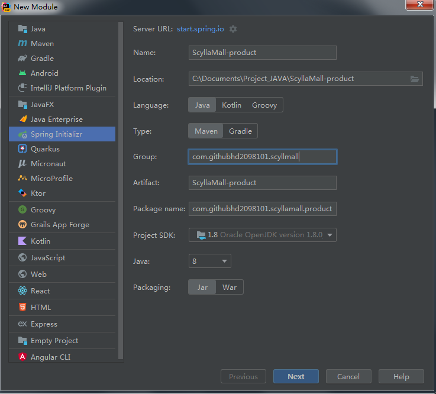
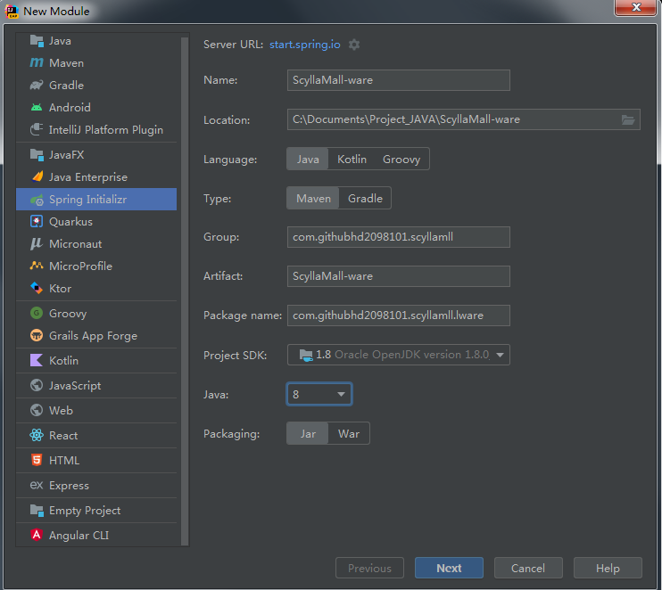
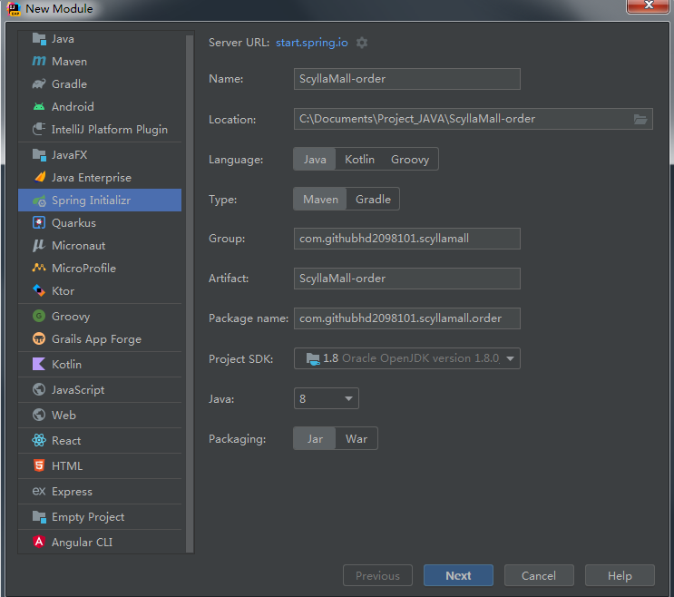

# 创建项目

ScyllaMall

- spring boot 2.1.8

## 创建项目微服务

商品服务、仓储服务、订单服务、优惠券服务、用户服务

```
com.yanghao.scyllamall

scyllamall-product
scyllamall-order
scyllamall-member
scyllamall-coupon
scyllamall-ware
	<parent>
		<groupId>org.springframework.boot</groupId>
		<artifactId>spring-boot-starter-parent</artifactId>
		<version>2.1.8.RELEASE</version>
		<relativePath/> <!-- lookup parent from repository -->
	</parent>
	<groupId>com.yanghao.scyllamall</groupId>
	<artifactId>scyllamall-order</artifactId>
	<version>0.0.1-SNAPSHOT</version>
	<name>scyllamall-order</name>
	<description>scyllamall-order</description>
	<properties>
		<java.version>1.8</java.version>
		<spring-cloud.version>Greenwich.SR3</spring-cloud.version>
	</properties>	
```

**商品服务**



**仓储服务**



**订单服务**



**优惠券服务**

其他的略

**更改 spring boot 版本**

```
waiting
```


**创建聚合 pom**

```
<?xml version="1.0" encoding="UTF-8"?>
<project xmlns="http://maven.apache.org/POM/4.0.0" xmlns:xsi="http://www.w3.org/2001/XMLSchema-instance"
	xsi:schemaLocation="http://maven.apache.org/POM/4.0.0 https://maven.apache.org/xsd/maven-4.0.0.xsd">
	<modelVersion>4.0.0</modelVersion>
	<groupId>com.githubhd2098101.scyllamall</groupId>
	<artifactId>scyllamall</artifactId>
	<version>0.0.1-SNAPSHOT</version>
	<name>聚合各个模块</name>
	<packaging>pom</packaging>
	<modules>
		<module>scyllamall-coupon</module>
		<module>scyllamall-member</module>
		<module>scyllamall-order</module>
		<module>scyllamall-product</module>
		<module>scyllamall-ware</module>
	</modules>

</project>
```

