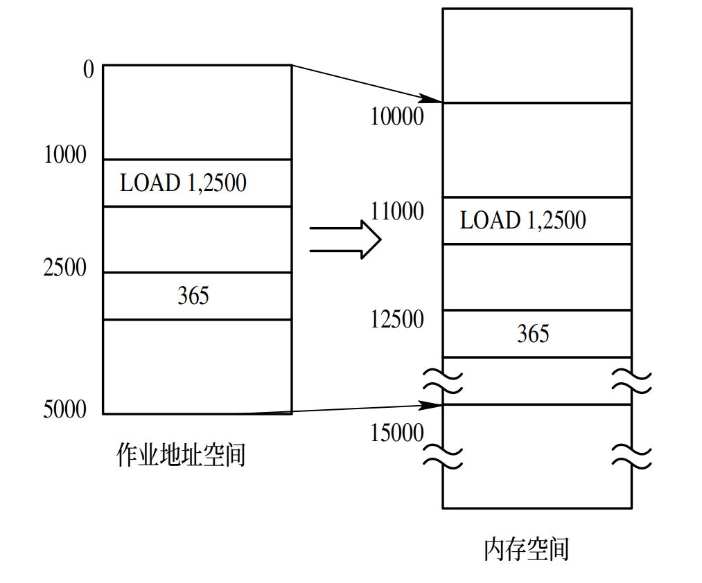
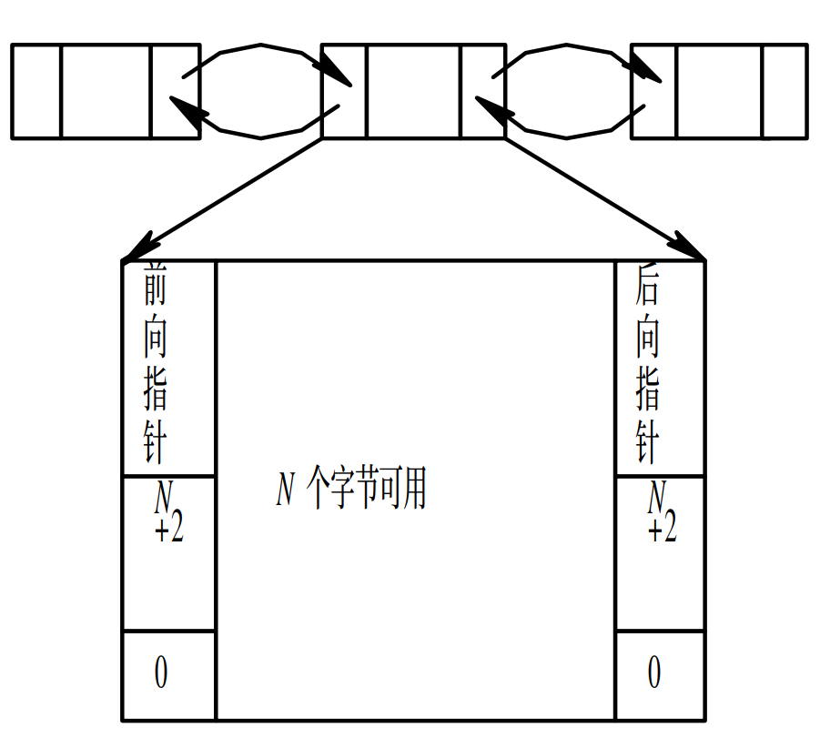
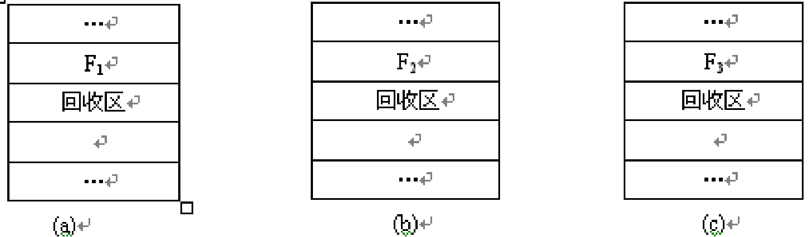
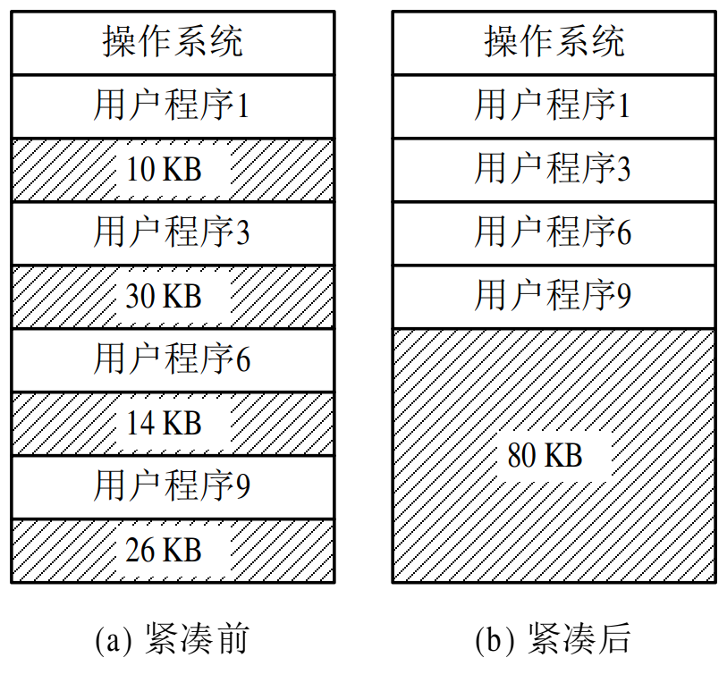
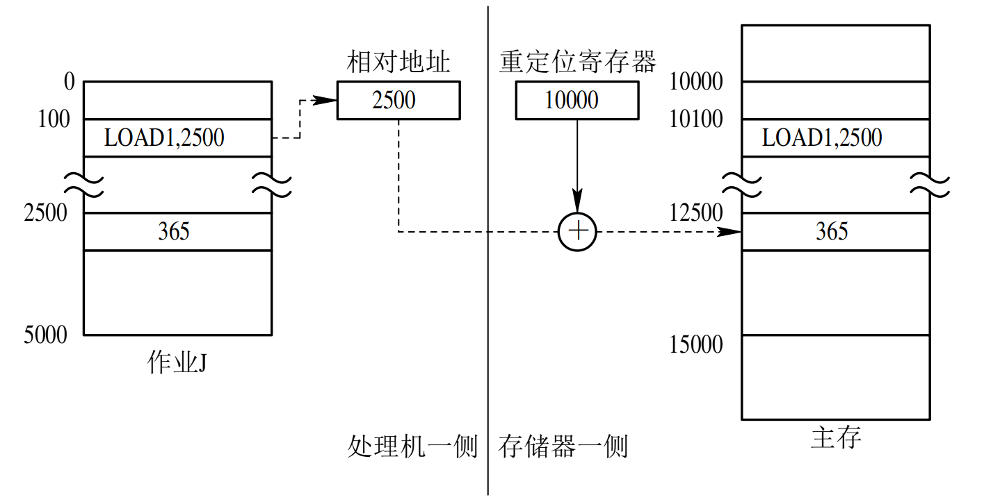
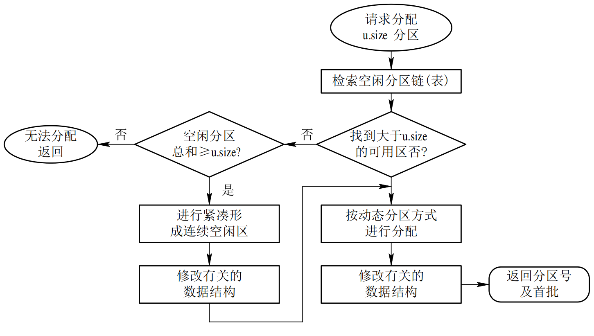
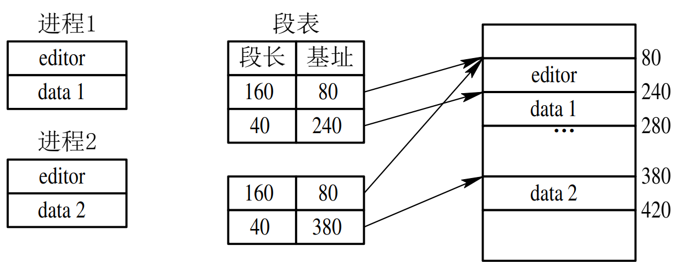
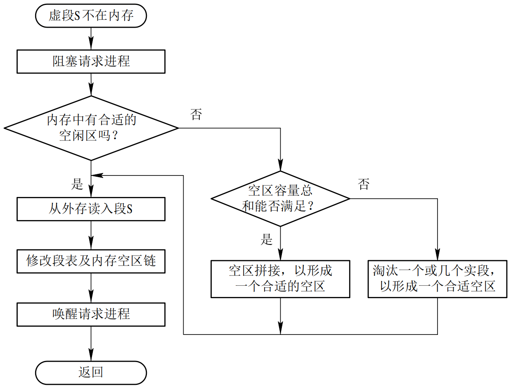

# 存储器管理

## 4.1 存储器的层次结构

### 4.1.1  多级存储器结构

　　对于通用计算机而言，存储层次至少应具有三级：最高层为CPU寄存器，中间为主存，最底层是辅存。在较高档的计算机中，还可以根据具体的功能分工细划为寄存器、高速缓存、主存储器、磁盘缓存、固定磁盘、可移动存储介质等6层。如图4-1所示，在存储层次中越往上，存储介质的访问速度越快，价格也越高，相对存储容量也越小。其中，寄存器、高速缓存、主存储器和磁盘缓存均属于操作系统存储管理的管辖范畴，掉电后它们存储的信息不再存在。固定磁盘和可移动存储介质属于设备管理的管辖范畴，它们存储的信息将被长期保存。 　


图4-1  计算机系统存储层次示意 

### 4.1.2  主存储器与寄存器

#### 　　1．主存储器

　　主存储器(简称内存或主存)是计算机系统中一个主要部件，用于保存进程运行时的程序和数据，也称可执行存储器，其容量对于当前的微机系统和大中型机，可能一般为数十MB到数GB，而且容量还在不断增加，而嵌入式计算机系统一般仅有几十KB到几MB。CPU的控制部件只能从主存储器中取得指令和数据，数据能够从主存储器读取并将它们装入到寄存器中，或者从寄存器存入到主存储器。CPU与外围设备交换的信息一般也依托于主存储器地址空间。由于主存储器的访问速度远低于CPU执行指令的速度，为缓和这一矛盾，在计算机系统中引入了寄存器和高速缓存。 

#### 　　2．寄存器

　　寄存器访问速度最快，完全能与CPU协调工作，但价格却十分昂贵，因此容量不可能做得很大。寄存器的长度一般以字(word)为单位。寄存器的数目，对于当前的微机系统和大中型机，可能有几十个甚至上百个；而嵌入式计算机系统一般仅有几个到几十个。寄存器用于加速存储器的访问速度，如用寄存器存放操作数，或用作地址寄存器加快地址转换速度等。 

### 4.1.3  高速缓存和磁盘缓存

#### 　　1．高速缓存

　　高速缓存是现代计算机结构中的一个重要部件，其容量大于或远大于寄存器，而比内存约小两到三个数量级左右，从几十KB到几MB，访问速度快于主存储器。
　　根据程序执行的局部性原理(即程序在执行时将呈现出局部性规律，在一较短的时间内，程序的执行仅局限于某个部分)，将主存中一些经常访问的信息存放在高速缓存中，减少访问主存储器的次数，可大幅度提高程序执行速度。

#### 　　2．磁盘缓存

　　由于目前磁盘的I/O速度远低于对主存的访问速度，因此将频繁使用的一部分磁盘数据和信息，暂时存放在磁盘缓存中，可减少访问磁盘的次数。磁盘缓存本身并不是一种实际存在的存储介质，它依托于固定磁盘，提供对主存储器存储空间的扩充，即利用主存中的存储空间，来暂存从磁盘中读出(或写入)的信息。主存也可以看做是辅存的高速缓存，因为，辅存中的数据必须复制到主存方能使用；反之，数据也必须先存在主存中，才能输出到辅存。 

　　一个文件的数据可能出现在存储器层次的不同级别中，例如，一个文件数据通常被存储在辅存中(如硬盘)，当其需要运行或被访问时，就必须调入主存，也可以暂时存放在主存的磁盘高速缓存中。大容量的辅存常常使用磁盘，磁盘数据经常备份到磁带或可移动磁盘组上，以防止硬盘故障时丢失数据。有些系统自动地把老文件数据从辅存转储到海量存储器中，如磁带上，这样做还能降低存储成本。 

## 4.2　程序的装入和链接 

　　在多道程序环境下，要使程序运行，必须先为之创建进程。而创建进程的第一件事，便是将程序和数据装入内存。如何将一个用户源程序变为一个可在内存中执行的程序，通常都要经过以下几个步骤：

- 首先是要编译，由编译程序(Compiler)将用户源代码编译成若干个目标模块(Object Module)；
- 其次是链接，由链接程序(Linker)将编译后形成的一组目标模块，以及它们所需要的库函数链接在一起，形成一个完整的装入模块(Load Module)；
- 最后是装入，由装入程序(Loader)将装入模块装入内存。图4-2示出了这样的三步过程。本节将扼要阐述程序(含数据)的链接和装入过程。 


图4-2　对用户程序的处理步骤 

### 4.2.1　程序的装入

#### 　　1．绝对装入方式(Absolute Loading Mode)

　　在编译时，如果知道程序将驻留在内存的什么位置，那么，编译程序将产生绝对地址的目标代码。例如，事先已知用户程序(进程)驻留在从R处开始的位置，则编译程序所产生的目标模块(即装入模块)便从R处开始向上扩展。绝对装入程序按照装入模块中的地址，将程序和数据装入内存。装入模块被装入内存后，由于程序中的逻辑地址与实际内存地址完全相同，故不须对程序和数据的地址进行修改。

　　程序中所使用的绝对地址，既可在编译或汇编时给出，也可由程序员直接赋予。但在由程序员直接给出绝对地址时，不仅要求程序员熟悉内存的使用情况，而且一旦程序或数据被修改后，可能要改变程序中的所有地址。因此，通常是在程序中采用符号地址，然后在编译或汇编时，再将这些符号地址转换为绝对地址。

####  　　2．可重定位装入方式(Relocation Loading Mode) 

　　绝对装入方式只能将目标模块装入到内存中事先指定的位置。在多道程序环境下，编译程序不可能预知所编译的目标模块应放在内存的何处，因此，绝对装入方式只适用于单道程序环境。在多道程序环境下，所得到的目标模块的起始地址通常是从0开始的，程序中的其它地址也都是相对于起始地址计算的。此时应采用可重定位装入方式，根据内存的当前情况，将装入模块装入到内存的适当位置。 



　　例如，在用户程序的1000号单元处有一条指令LOAD 1，2500，该指令的功能是将2500单元中的整数365取至寄存器1。但若将该用户程序装入到内存的10000～15000号单元而不进行地址变换，则在执行11000号单元中的指令时，它将仍从2500号单元中把数据取至寄存器1而导致数据错误。由图4-3可见，正确的方法应该是将取数指令中的地址2500修改成12500，即把指令中的相对地址2500与本程序在内存中的起始地址10000相加，才得到正确的物理地址12500。除了数据地址应修改外，指令地址也须做同样的修改，即将指令的相对地址1000与起始地址10000相加，得到绝对地址11000。**通常是把在装入时对目标程序中指令和数据的修改过程称为重定位。又因为地址变换通常是在装入时一次完成的，以后不再改变，故称为静态重定位。** 

#### 　　3．动态运行时装入方式(Dynamic Run-time Loading)

　　可重定位装入方式可将装入模块装入到内存中任何允许的位置，故可用于多道程序环境；但这种方式并不允许程序运行时在内存中移动位置。因为，程序在内存中的移动，意味着它的物理位置发生了变化，这时必须对程序和数据的地址(是绝对地址)进行修改后方能运行。然而，实际情况是，在运行过程中它在内存中的位置可能经常要改变，此时就应采用动态运行时装入的方式。 

### 4.2.2　程序的链接

　　根据链接时间的不同，可把链接分成如下三种：

　　(1) 静态链接。在程序运行之前，先将各目标模块及它们所需的库函数，链接成一个完整的装配模块，以后不再拆开。我们把这种事先进行链接的方式称为静态链接方式。

　　(2) 装入时动态链接。这是指将用户源程序编译后所得到的一组目标模块，在装入内存时，采用边装入边链接的链接方式。

　　(3) 运行时动态链接。这是指对某些目标模块的链接，是在程序执行中需要该(目标)模块时，才对它进行的链接。 


#### 　　1．静态链接方式(Static Linking)

　　(1) 对相对地址进行修改。在由编译程序所产生的所有目标模块中，使用的都是相对地址，其起始地址都为0，每个模块中的地址都是相对于起始地址计算的。在链接成一个装入模块后，原模块B和C在装入模块的起始地址不再是0，而分别是L和L+M，所以此时须修改模块B和C中的相对地址，即把原B中的所有相对地址都加上L，把原C中的所有相对地址都加上L+M。 

　　(2) 变换外部调用符号。将每个模块中所用的外部调用符号也都变换为相对地址，如把B的起始地址变换为L，把C的起始地址变换为L+M，如图4-4(b)所示。这种先进行链接所形成的一个完整的装入模块，又称为可执行文件。通常都不再拆开它，要运行时可直接将它装入内存。这种事先进行链接，以后不再拆开的链接方式，称为静态链接方式。 


#### 　　2．装入时动态链接(Load-time Dynamic Linking)

　　用户源程序经编译后所得的目标模块，是在装入内存时边装入边链接的，即在装入一个目标模块时，若发生一个外部模块调用事件，将引起装入程序去找出相应的外部目标模块，并将它装入内存，还要按照图4-4所示的方式来修改目标模块中的相对地址。装入时动态链接方式有以下优点：

　　(1) 便于修改和更新。对于经静态链接装配在一起的装入模块，如果要修改或更新其中的某个目标模块，则要求重新打开装入模块。这不仅是低效的，而且有时是不可能的。若采用动态链接方式，由于各目标模块是分开存放的，所以要修改或更新各目标模块是件非常容易的事。 

　　(2) 便于实现对目标模块的共享。在采用静态链接方式时，每个应用模块都必须含有其目标模块的拷贝，无法实现对目标模块的共享。但采用装入时动态链接方式，OS则很容易将一个目标模块链接到几个应用模块上，实现多个应用程序对该模块的共享。 

#### 　　3．运行时动态链接(Run-time Dynamic Linking)

　　在许多情况下，应用程序在运行时，每次要运行的模块可能是不相同的。但由于事先无法知道本次要运行哪些模块，故只能是将所有可能要运行到的模块都全部装入内存，并在装入时全部链接在一起。显然这是低效的，因为往往会有些目标模块根本就不运行。比较典型的例子是作为错误处理用的目标模块，如果程序在整个运行过程中都不出现错误，则显然就不会用到该模块。 

　　近几年流行起来的运行时动态链接方式，是对上述在装入时链接方式的一种改进。这种链接方式是将对某些模块的链接推迟到程序执行时才进行链接，亦即，在执行过程中，当发现一个被调用模块尚未装入内存时，立即由OS去找到该模块并将之装入内存，把它链接到调用者模块上。凡在执行过程中未被用到的目标模块，都不会被调入内存和被链接到装入模块上，这样不仅可加快程序的装入过程，而且可节省大量的内存空间。 


## 4.3　连续分配方式 

### 4.3.1　单一连续分配

　　这是最简单的一种存储管理方式，但只能用于单用户、单任务的操作系统中。采用这种存储管理方式时，可把内存分为系统区和用户区两部分，系统区仅提供给OS使用，通常是放在内存的低址部分；用户区是指除系统区以外的全部内存空间，提供给用户使用。

　　虽然在早期的单用户、单任务操作系统中，有不少都配置了存储器保护机构，用于防止用户程序对操作系统的破坏，但近年来常见的几种单用户操作系统中，如CP/M、MS-DOS及RT11等，都未采取存储器保护措施。这是因为，一方面可以节省硬件，另一方面也因为这是可行的。在单用户环境下，机器由一用户独占，不可能存在其他用户干扰的问题；这时可能出现的破坏行为也只是用户程序自己去破坏操作系统，其后果并不严重，只是会影响该用户程序的运行，且操作系统也很容易通过系统的再启动而重新装入内存。 

### 4.3.2　固定分区分配

#### 　　1．划分分区的方法

　　可用下述两种方法将内存的用户空间划分为若干个固定大小的分区：

　　(1) 分区大小相等，即使所有的内存分区大小相等。其缺点是缺乏灵活性，即当程序太小时，会造成内存空间的浪费；当程序太大时，一个分区又不足以装入该程序，致使该程序无法运行。尽管如此，这种划分方式仍被用于利用一台计算机去控制多个相同对象的场合，因为这些对象所需的内存空间是大小相等的。例如，炉温群控系统，就是利用一台计算机去控制多台相同的冶炼炉。 

　　(2) 分区大小不等。为了克服分区大小相等而缺乏灵活性的这个缺点，可把内存区划分成含有多个较小的分区、适量的中等分区及少量的大分区。这样，便可根据程序的大小为之分配适当的分区。 

#### 　　2．内存分配

　　为了便于内存分配，通常将分区按大小进行排队，并为之建立一张分区使用表，其中各表项包括每个分区的起始地址、大小及状态(是否已分配)，见图4-5(a)所示。当有一用户程序要装入时，由内存分配程序检索该表，从中找出一个能满足要求的、尚未分配的分区，将之分配给该程序，然后将该表项中的状态置为“已分配”；若未找到大小足够的分区，则拒绝为该用户程序分配内存。存储空间分配情况如图4-5(b)所示。 


图 4-5　固定分区使用表

### 4.3.3　动态分区分配

　　动态分区分配是根据进程的实际需要，动态地为之分配内存空间。在实现可变分区分配时，将涉及到分区分配中所用的数据结构、分区分配算法和分区的分配与回收操作这样三个问题。

#### 　　1．分区分配中的数据结构

　　为了实现分区分配，系统中必须配置相应的数据结构，用来描述空闲分区和已分配分区的情况，为分配提供依据。常用的数据结构有以下两种形式： 



　　(1) 空闲分区表。在系统中设置一张空闲分区表，用于记录每个空闲分区的情况。每个空闲分区占一个表目，表目中包括分区序号、分区始址及分区的大小等数据项。

　　(2) 空闲分区链。为了实现对空闲分区的分配和链接，在每个分区的起始部分，设置一些用于控制分区分配的信息，以及用于链接各分区所用的前向指针；在分区尾部则设置一后向指针，通过前、后向链接指针，可将所有的空闲分区链接成一个双向链，如图4-6所示。为了检索方便，在分区尾部重复设置状态位和分区大小表目。当分区被分配出去以后，把状态位由“0”改为“1”，此时，前、后向指针已无意义。 

#### 　　2．分区分配算法

　　**首次适应算法(first fit)**

　　我们以空闲分区链为例来说明采用FF算法时的分配情况。FF算法要求空闲分区链以地址递增的次序链接。在分配内存时，从链首开始顺序查找，直至找到一个大小能满足要求的空闲分区为止；然后再按照作业的大小，从该分区中划出一块内存空间分配给请求者，余下的空闲分区仍留在空闲链中。若从链首直至链尾都不能找到一个能满足要求的分区，则此次内存分配失败，返回。该算法倾向于优先利用内存中低址部分的空闲分区，从而保留了高址部分的大空闲区。这给为以后到达的大作业分配大的内存空间创造了条件。其缺点是低址部分不断被划分，会留下许多难以利用的、很小的空闲分区，而每次查找又都是从低址部分开始，这无疑会增加查找可用空闲分区时的开销。 

　　**循环首次适应算法(next fit)**

　　该算法是由首次适应算法演变而成的。在为进程分配内存空间时，不再是每次都从链首开始查找，而是从上次找到的空闲分区的下一个空闲分区开始查找，直至找到一个能满足要求的空闲分区，从中划出一块与请求大小相等的内存空间分配给作业。为实现该算法，应设置一起始查寻指针，用于指示下一次起始查寻的空闲分区，并采用循环查找方式，即如果最后一个(链尾)空闲分区的大小仍不能满足要求，则应返回到第一个空闲分区，比较其大小是否满足要求。找到后，应调整起始查寻指针。该算法能使内存中的空闲分区分布得更均匀，从而减少了查找空闲分区时的开销，但这样会缺乏大的空闲分区。 

　　**最佳适应算法(best fit)**

　　所谓“最佳”是指每次为作业分配内存时，总是把能满足要求、又是最小的空闲分区分配给作业，避免“大材小用”。为了加速寻找，该算法要求将所有的空闲分区按其容量以从小到大的顺序形成一空闲分区链。这样，第一次找到的能满足要求的空闲区，必然是最佳的。孤立地看，最佳适应算法似乎是最佳的，然而在宏观上却不一定。因为每次分配后所切割下来的剩余部分总是最小的，这样，在存储器中会留下许多难以利用的小空闲区。 

　　**最坏适应算法(worst fit)**

　　最坏适应分配算法要扫描整个空闲分区表或链表，总是挑选一个最大的空闲区分割给作业使用，其优点是可使剩下的空闲区不至于太小，产生碎片的几率最小，对中、小作业有利，同时最坏适应分配算法查找效率很高。该算法要求将所有的空闲分区按其容量以从大到小的顺序形成一空闲分区链，查找时只要看第一个分区能否满足作业要求。但是该算法的缺点也是明显的，它会使存储器中缺乏大的空闲分区。最坏适应算法与前面所述的首次适应算法、循环首次适应算法、最佳适应算法一起，也称为顺序搜索法。 

　　**快速适应算法(quick fit)**

　　该算法又称为分类搜索法，是将空闲分区根据其容量大小进行分类，对于每一类具有相同容量的所有空闲分区，单独设立一个空闲分区链表，这样，系统中存在多个空闲分区链表，同时在内存中设立一张管理索引表，该表的每一个表项对应了一种空闲分区类型，并记录了该类型空闲分区链表表头的指针。空闲分区的分类是根据进程常用的空间大小进行划分，如2 KB、4 KB、8 KB等，对于其它大小的分区，如7 KB这样的空闲区，既可以放在8 KB的链表中，也可以放在一个特殊的空闲区链表中。 

　　该算法的优点是查找效率高，仅需要根据进程的长度，寻找到能容纳它的最小空闲区链表，并取下第一块进行分配即可。另外该算法在进行空闲分区分配时，不会对任何分区产生分割，所以能保留大的分区，满足对大空间的需求，也不会产生内存碎片。

　　该算法的缺点是在分区归还主存时算法复杂，系统开销较大。此外，该算法在分配空闲分区时是以进程为单位，一个分区只属于一个进程，因此在为进程所分配的一个分区中，或多或少地存在一定的浪费。空闲分区划分越细，浪费则越严重，整体上会造成可观的存储空间浪费，这是典型的以空间换时间的作法。 

#### 　　3．分区分配操作

　　**分配内存**

　　系统应利用某种分配算法，从空闲分区链(表)中找到所需大小的分区。设请求的分区大小为u.size，表中每个空闲分区的大小可表示为m.size。若m.size-u.size≤size(size是事先规定的不再切割的剩余分区的大小)，说明多余部分太小，可不再切割，将整个分区分配给请求者；否则(即多余部分超过size)，从该分区中按请求的大小划分出一块内存空间分配出去，余下的部分仍留在空闲分区链(表)中。然后，将分配区的首址返回给调用者。图4-7示出了分配流程。 


图 4-7　内存分配流程 

　　**回收内存**

　　当进程运行完毕释放内存时，系统根据回收区的首址，从空闲区链(表)中找到相应的插入点，此时可能出现以下四种情况之一：

　　(1) 回收区与插入点的前一个空闲分区F1相邻接，见图4-8(a)。此时应将回收区与插入点的前一分区合并，不必为回收分区分配新表项，而只需修改其前一分区F1的大小。

　　(2) 回收分区与插入点的后一空闲分区F2相邻接，见图4-8(b)。此时也可将两分区合并，形成新的空闲分区，但用回收区的首址作为新空闲区的首址，大小为两者之和。 

　　(3) 回收区同时与插入点的前、后两个分区邻接，见图4-8(c)。此时将三个分区合并，使用F1的表项和F1的首址，取消F2的表项，大小为三者之和。

　　(4) 回收区既不与F1邻接，又不与F2邻接。这时应为回收区单独建立一新表项，填写回收区的首址和大小，并根据其首址插入到空闲链中的适当位置。 




### 4.3.4　伙伴系统

　　固定分区和动态分区方式都有不足之处。固定分区方式限制了活动进程的数目，当进程大小与空闲分区大小不匹配时，内存空间利用率很低。动态分区方式算法复杂，回收空闲分区时需要进行分区合并等，系统开销较大。伙伴系统方式是对以上两种内存方式的一种折衷方案。

　　伙伴系统规定，无论已分配分区或空闲分区，其大小均为2的k次幂，k为整数，l≤k≤m，其中：2^1^  表示分配的最小分区的大小，2^m^ 表示分配的最大分区的大小，通常2^m^ 是整个可分配内存的大小。 

　　假设系统的可利用空间容量为2^m^个字，则系统开始运行时，整个内存区是一个大小为2^m^的空闲分区。在系统运行过程中，由于不断的划分，可能会形成若干个不连续的空闲分区，将这些空闲分区根据分区的大小进行分类，对于每一类具有相同大小的所有空闲分区，单独设立一个空闲分区双向链表。这样，不同大小的空闲分区形成了k(0≤k≤m)个空闲分区链表。 

　　当需要为进程分配一个长度为 n 的存储空间时，首先计算一个 i 值，使 2^i－1^<n≤2^i^，然后在空闲分区大小为 2^i^ 的空闲分区链表中查找。若找到，即把该空闲分区分配给进程。否则，表明长度为 2^i^ 的空闲分区已经耗尽，则在分区大小为 2^i＋1^ 的空闲分区链表中寻找。若存在 2^i＋1^ 的一个空闲分区，则把该空闲分区分为相等的两个分区，这两个分区称为一对伙伴，其中的一个分区用于分配，而把另一个加入分区大小为 2^i^ 的空闲分区链表中。若大小为 2^i＋1^ 的空闲分区也不存在，则需要查找大小为 2^i＋2^ 的空闲分区，若找到则对其进行两次分割：第一次，将其分割为大小为 2^i＋1^ 的两个分区，一个用于分配，一个加入到大小为 2^i＋1^ 的空闲分区链表中；第二次，将第一次用于分配的空闲区分割为 2^i^ 的两个分区，一个用于分配，一个加入到大小为 2^i^ 的空闲分区链表中。若仍然找不到，则继续查找大小为 2^i＋3^ 的空闲分区，以此类推。由此可见，在最坏的情况下，可能需要对 2^k^ 的空闲分区进行k次分割才能得到所需分区。 

　与一次分配可能要进行多次分割一样，一次回收也可能要进行多次合并，如回收大小为 2^i^ 的空闲分区时，若事先已存在 2^i^ 的空闲分区时，则应将其与伙伴分区合并为大小为　2^i＋1^ 的空闲分区，若事先已存在 2^i＋1^ 的空闲分区时，又应继续与其伙伴分区合并为大小为 2^i＋2^ 的空闲分区，依此类推。

　　在伙伴系统中，其分配和回收的时间性能取决于查找空闲分区的位置和分割、合并空闲分区所花费的时间。与前面所述的多种方法相比较，由于该算法在回收空闲分区时，需要对空闲分区进行合并，所以其时间性能比前面所述的分类搜索算法差，但比顺序搜索算法好，而其空间性能则远优于前面所述的分类搜索法，比顺序搜索法略差。

### 4.3.5  哈希算法

　　在上述的分类搜索算法和伙伴系统算法中，都是将空闲分区根据分区大小进行分类，对于每一类具有相同大小的空闲分区，单独设立一个空闲分区链表。在为进程分配空间时，需要在一张管理索引表中查找到所需空间大小所对应的表项，从中得到对应的空闲分区链表表头指针，从而通过查找得到一个空闲分区。如果对空闲分区分类较细，则相应的空闲分区链表也较多，因此选择合适的空闲链表的开销也相应增加，且时间性能降低。 

　哈希算法就是利用哈希快速查找的优点，以及空闲分区在可利用空间表中的分布规律，建立哈希函数，构造一张以空闲分区大小为关键字的哈希表，该表的每一个表项记录了一个对应的空闲分区链表表头指针。

　当进行空闲分区分配时，根据所需空闲分区大小，通过哈希函数计算，即得到在哈希表中的位置，从中得到相应的空闲分区链表，实现最佳分配策略。 

### 4.3.6　可重定位分区分配

#### 　　1．动态重定位的引入

　　在连续分配方式中，必须把一个系统或用户程序装入一连续的内存空间。如果在系统中只有若干个小的分区，即使它们容量的总和大于要装入的程序，但由于这些分区不相邻接，也无法把该程序装入内存。例如，图4-9(a)中示出了在内存中现有四个互不邻接的小分区，它们的容量分别为10 KB、30 KB、14 KB和26 KB，其总容量是80 KB。但如果现在有一作业到达，要求获得40 KB的内存空间，由于必须为它分配一连续空间，故此作业无法装入。这种不能被利用的小分区称为“零头”或“碎片”。 



图4- 9  紧凑的示意 

　　若想把作业装入，可采用的一种方法是：将内存中的所有作业进行移动，使它们全都相邻接，这样，即可把原来分散的多个小分区拼接成一个大分区，这时就可把作业装入该区。这种通过移动内存中作业的位置，以把原来多个分散的小分区拼接成一个大分区的方法，称为“拼接”或“紧凑”，见图4-9(b)。由于经过紧凑后的某些用户程序在内存中的位置发生了变化，此时若不对程序和数据的地址加以修改(变换)，则程序必将无法执行。为此，在每次“紧凑”后，都必须对移动了的程序或数据进行重定位。 

#### 　　2．动态重定位的实现

　　在动态运行时装入的方式中，作业装入内存后的所有地址都仍然是相对地址，将相对地址转换为物理地址的工作，被推迟到程序指令要真正执行时进行。为使地址的转换不会影响到指令的执行速度，必须有硬件地址变换机构的支持，即须在系统中增设一个重定位寄存器，用它来存放程序(数据)在内存中的起始地址。程序在执行时，真正访问的内存地址是相对地址与重定位寄存器中的地址相加而形成的。图4-10示出了动态重定位的实现原理。地址变换过程是在程序执行期间，随着对每条指令或数据的访问自动进行的，故称为动态重定位。当系统对内存进行了“紧凑”而使若干程序从内存的某处移至另一处时，不需对程序做任何修改，只要用该程序在内存的新起始地址，去置换原来的起始地址即可。 



图 4-10　动态重定位示意图 

#### 　　3．动态重定位分区分配算法

　　动态重定位分区分配算法与动态分区分配算法基本上相同，差别仅在于：在这种分配算法中，增加了紧凑的功能，通常，在找不到足够大的空闲分区来满足用户需求时进行紧凑。图4-11示出了动态重定位分区分配算法。 　



图4-11　动态分区分配算法流程图 

### 4.3.7　对换

#### 　　1．对换(Swapping)的引入

　　在多道程序环境下，一方面，在内存中的某些进程由于某事件尚未发生而被阻塞运行，但它却占用了大量的内存空间，甚至有时可能出现在内存中所有进程都被阻塞而迫使CPU停止下来等待的情况；另一方面，却又有着许多作业在外存上等待，因无内存而不能进入内存运行的情况。显然这对系统资源是一种严重的浪费，且使系统吞吐量下降。为了解决这一问题，在系统中又增设了对换(也称交换)设施。所谓“对换”，是指把内存中暂时不能运行的进程或者暂时不用的程序和数据调出到外存上，以便腾出足够的内存空间，再把已具备运行条件的进程或进程所需要的程序和数据调入内存。对换是提高内存利用率的有效措施。自从在60年代初期出现“对换”技术后，它便引起了人们的重视，现在该技术已被广泛地应用于操作系统中。 

　　如果对换是以整个进程为单位的，便称之为“整体对换”或“进程对换”。这种对换被广泛地应用于分时系统中，其目的是用来解决内存紧张问题，并可进一步提高内存的利用率。而如果对换是以“页”或“段”为单位进行的，则分别称之为“页面对换”或“分段对换”，又统称为“部分对换”。这种对换方法是实现后面要讲到的请求分页和请求分段式存储管理的基础，其目的是为了支持虚拟存储系统。在此，我们只介绍进程对换，而分页或分段对换将放在虚拟存储器中介绍。为了实现进程对换，系统必须能实现三方面的功能：对换空间的管理、进程的换出，以及进程的换入。 

#### 　　2．对换空间的管理

　　在具有对换功能的OS中，通常把外存分为文件区和对换区。前者用于存放文件，后者用于存放从内存换出的进程。由于通常的文件都是较长久地驻留在外存上，故对文件区管理的主要目标，是提高文件存储空间的利用率，为此，对文件区采取离散分配方式。然而，进程在对换区中驻留的时间是短暂的，对换操作又较频繁，故对对换空间管理的主要目标，是提高进程换入和换出的速度。为此，采取的是连续分配方式，较少考虑外存中的碎片问题。 

　　为了能对对换区中的空闲盘块进行管理，在系统中应配置相应的数据结构，以记录外存的使用情况。其形式与内存在动态分区分配方式中所用数据结构相似，即同样可以用空闲分区表或空闲分区链。在空闲分区表中的每个表目中应包含两项，即对换区的首址及其大小，分别用盘块号和盘块数表示。 

#### 　　3．进程的换出与换入

　　(1) 进程的换出。每当一进程由于创建子进程而需要更多的内存空间，但又无足够的内存空间等情况发生时，系统应将某进程换出。其过程是：系统首先选择处于阻塞状态且优先级最低的进程作为换出进程，然后启动磁盘，将该进程的程序和数据传送到磁盘的对换区上。若传送过程未出现错误，便可回收该进程所占用的内存空间，并对该进程的进程控制块做相应的修改。
　　(2) 进程的换入。系统应定时地查看所有进程的状态，从中找出“就绪”状态但已换出的进程，将其中换出时间最久(换出到磁盘上)的进程作为换入进程，将之换入，直至已无可换入的进程或无可换出的进程为止。

## 4.4　基本分页存储管理方式  

### 4.4.1　页面与页表

#### 1．页面

　　**页面和物理块**

　　分页存储管理是将一个进程的逻辑地址空间分成若干个大小相等的片，称为页面或页，并为各页加以编号，从0开始，如第0页、第1页等。相应地，也把内存空间分成与页面相同大小的若干个存储块，称为(物理)块或页框(frame)，也同样为它们加以编号，如0#块、1#块等等。在为进程分配内存时，以块为单位将进程中的若干个页分别装入到多个可以不相邻接的物理块中。由于进程的最后一页经常装不满一块而形成了不可利用的碎片，称之为“页内碎片”。 

　　**页面大小**

　　在分页系统中的页面其大小应适中。页面若太小，一方面虽然可使内存碎片减小，从而减少了内存碎片的总空间，有利于提高内存利用率，但另一方面也会使每个进程占用较多的页面，从而导致进程的页表过长，占用大量内存；此外，还会降低页面换进换出的效率。然而，如果选择的页面较大，虽然可以减少页表的长度，提高页面换进换出的速度，但却又会使页内碎片增大。因此，页面的大小应选择适中，且页面大小应是2的幂，通常为512 B～8 KB。 

#### 2．地址结构

分页地址中的地址结构如下： 


　　它含有两部分：前一部分为页号P，后一部分为位移量W(或称为页内地址)。

图中的地址长度为32位，其中0～11位为页内地址，即每页的大小为4 KB；12～31位为页号，地址空间最多允许有1 M页。 

　　对于某特定机器，其地址结构是一定的。若给定一个逻辑地址空间中的地址为A，页面的大小为L，则页号P和页内地址d可按下式求得： 


其中，INT是整除函数，MOD是取余函数。例如，其系统的页面大小为1 KB，设A = 2170 B，则由上式可以求得P = 2，d = 122。 

#### 3．页表

　　在分页系统中，允许将进程的各个页离散地存储在内存不同的物理块中，但系统应能保证进程的正确运行，即能在内存中找到每个页面所对应的物理块。为此，系统又为每个进程建立了一张页面映像表，简称页表。在进程地址空间内的所有页(0～n)，依次在页表中有一页表项，其中记录了相应页在内存中对应的物理块号，见图4-14的中间部分。在配置了页表后，进程执行时，通过查找该表，即可找到每页在内存中的物理块号。可见，页表的作用是实现从页号到物理块号的地址映射。 


图4-14　页表的作用 

### 4.4.2　地址变换机构

#### 　　1．基本的地址变换机构

　　页表的功能可以由一组专门的寄存器来实现。一个页表项用一个寄存器。由于寄存器具有较高的访问速度，因而有利于提高地址变换的速度；但由于寄存器成本较高，且大多数现代计算机的页表又可能很大，使页表项的总数可达几千甚至几十万个，显然这些页表项不可能都用寄存器来实现，因此，页表大多驻留在内存中。在系统中只设置一个页表寄存器PTR(Page-Table Register)，在其中存放页表在内存的始址和页表的长度。平时，进程未执行时，页表的始址和页表长度存放在本进程的PCB中。当调度程序调度到某进程时，才将这两个数据装入页表寄存器中。因此，在单处理机环境下，虽然系统中可以运行多个进程，但只需一个页表寄存器。 

　　当进程要访问某个逻辑地址中的数据时，分页地址变换机构会自动地将有效地址(相对地址)分为页号和页内地址两部分，再以页号为索引去检索页表。查找操作由硬件执行。在执行检索之前，先将页号与页表长度进行比较，如果页号大于或等于页表长度，则表示本次所访问的地址已超越进程的地址空间。于是，这一错误将被系统发现并产生一地址越界中断。若未出现越界错误，则将页表始址与页号和页表项长度的乘积相加，便得到该表项在页表中的位置，于是可从中得到该页的物理块号，将之装入物理地址寄存器中。与此同时，再将有效地址寄存器中的页内地址送入物理地址寄存器的块内地址字段中。这样便完成了从逻辑地址到物理地址的变换。图4-15示出了分页系统的地址变换机构。 　　


图4-15　分页系统的地址变换机构 

#### 　　2．具有快表的地址变换机构

　　由于页表是存放在内存中的，这使CPU在每存取一个数据时，都要两次访问内存。第一次是访问内存中的页表，从中找到指定页的物理块号，再将块号与页内偏移量W拼接，以形成物理地址。第二次访问内存时，才是从第一次所得地址中获得所需数据(或向此地址中写入数据)。因此，采用这种方式将使计算机的处理速度降低近1/2。可见，以此高昂代价来换取存储器空间利用率的提高，是得不偿失的。 

 　　为了提高地址变换速度，可在地址变换机构中增设一个具有并行查寻能力的特殊高速缓冲寄存器，又称为“联想寄存器”(Associative Memory)，或称为“快表”，在IBM系统中又取名为TLB(Translation Lookaside Buffer)，用以存放当前访问的那些页表项。此时的地址变换过程是：在CPU给出有效地址后，由地址变换机构自动地将页号P送入高速缓冲寄存器，并将此页号与高速缓存中的所有页号进行比较，若其中有与此相匹配的页号，便表示所要访问的页表项在快表中。于是，可直接从快表中读出该页所对应的物理块号，并送到物理地址寄存器中。如在块表中未找到对应的页表项，则还须再访问内存中的页表，找到后，把从页表项中读出的物理块号送地址寄存器；同时，再将此页表项存入快表的一个寄存器单元中，亦即，重新修改快表。但如果联想寄存器已满，则OS必须找到一个老的且已被认为不再需要的页表项，将它换出。图 4-16示出了具有快表的地址变换机构。 


图4-16　具有快表的地址变换机构 

### 4.4.3　两级和多级页表

　　现代的大多数计算机系统，都支持非常大的逻辑地址空间(232～264)。在这样的环境下，页表就变得非常大，要占用相当大的内存空间。例如，对于一个具有32位逻辑地址空间的分页系统，规定页面大小为4 KB即212 B，则在每个进程页表中的页表项可达1兆个之多。又因为每个页表项占用一个字节，故每个进程仅仅其页表就要占用1 MB的内存空间，而且还要求是连续的。显然这是不现实的，我们可以采用下述两个方法来解决这一问题：
　　(1) 采用离散分配方式来解决难以找到一块连续的大内存空间的问题；
　　(2) 只将当前需要的部分页表项调入内存，其余的页表项仍驻留在磁盘上，需要时再调入。 

#### 　　1．两级页表(Two-Level Page Table)

　　对于要求连续的内存空间来存放页表的问题，可利用将页表进行分页，并离散地将各个页面分别存放在不同的物理块中的办法来加以解决，同样也要为离散分配的页表再建立一张页表，称为外层页表(Outer Page Table)，在每个页表项中记录了页表页面的物理块号。下面我们仍以前面的32位逻辑地址空间为例来说明。当页面大小为 4 KB时(12位)，若采用一级页表结构，应具有20位的页号，即页表项应有1兆个；在采用两级页表结构时，再对页表进行分页，使每页中包含210 (即1024)个页表项，最多允许有210个页表分页；或者说，外层页表中的外层页内地址P2为10位，外层页号P1也为10位。此时的逻辑地址结构可描述如下： 　


　　由图可以看出，在页表的每个表项中存放的是进程的某页在内存中的物理块号，如第0#页存放在1#物理块中；1#页存放在4#物理块中。而在外层页表的每个页表项中，所存放的是某页表分页的首址，如第0#页表是存放在第1011#物理块中。我们可以利用外层页表和页表这两级页表，来实现从进程的逻辑地址到内存中物理地址间的变换。 


图4-18　两级页表结构 

　　为了地址变换实现上的方便起见，在地址变换机构中同样需要增设一个外层页表寄存器，用于存放外层页表的始址，并利用逻辑地址中的外层页号，作为外层页表的索引，从中找到指定页表分页的始址，再利用P2作为指定页表分页的索引，找到指定的页表项，其中即含有该页在内存的物理块号，用该块号和页内地址d即可构成访问的内存物理地址。图4-19示出了两级页表时的地址变换机构。 


图4-19　具有两级页表的地址变换机构 

#### 　　2．多级页表

　　对于32位的机器，采用两级页表结构是合适的；但对于64位的机器，采用两级页表是否仍可适用的问题，须做以下简单分析。如果页面大小仍采用4 KB即212 B，那么还剩下52位，假定仍按物理块的大小(212位)来划分页表，则将余下的42位用于外层页号。此时在外层页表中可能有4096 G个页表项，要占用16 384 GB的连续内存空间。这样的结果显然是不能令人接受的，因此必须采用多级页表，将外层页表再进行分页，也就是将各分页离散地装入到不相邻接的物理块中，再利用第2级的外层页表来映射它们之间的关系。 　　

　　对于64位的计算机，如果要求它能支持264 B(= 1 844 744 TB)规模的物理存储空间，则即使是采用三级页表结构也是难以办到的；而在当前的实际应用中也无此必要。故在近两年推出的64位OS中，把可直接寻址的存储器空间减少为45位长度(即245)左右，这样便可利用三级页表结构来实现分页存储管理。 

## 4.5　基本分段存储管理方式 

### 4.5.1　分段存储管理方式的引入

　　**方便编程**

　　通常，用户把自己的作业按照逻辑关系划分为若干个段，每个段都是从0开始编址，并有自己的名字和长度。因此，希望要访问的逻辑地址是由段名(段号)和段内偏移量(段内地址)决定的。例如，下述的两条指令便是使用段名和段内地址：

```
　　LOAD 1，[A] |〈D〉;
　　STORE 1，[B] |〈C〉;
```
　　其中，前一条指令的含义是将分段A中D单元内的值读入寄存器1；后一条指令的含义是将寄存器1的内容存入B分段的C单元中。 

　　**信息共享**

　　在实现对程序和数据的共享时，是以信息的逻辑单位为基础的。比如，共享某个例程和函数。分页系统中的“页”只是存放信息的物理单位(块)，并无完整的意义，不便于实现共享；然而段却是信息的逻辑单位。由此可知，为了实现段的共享，希望存储管理能与用户程序分段的组织方式相适应。 

　　**信息保护**

　　信息保护同样是对信息的逻辑单位进行保护，因此，分段管理方式能更有效和方便地实现信息保护功能。

　　**动态增长**

　　在实际应用中，往往有些段，特别是数据段，在使用过程中会不断地增长，而事先又无法确切地知道数据段会增长到多大。前述的其它几种存储管理方式，都难以应付这种动态增长的情况，而分段存储管理方式却能较好地解决这一问题。 　　

　　**动态链接**

　　动态链接是指在作业运行之前，并不把几个目标程序段链接起来。要运行时，先将主程序所对应的目标程序装入内存并启动运行，当运行过程中又需要调用某段时，才将该段(目标程序)调入内存并进行链接。可见，动态链接也要求以段作为管理的单位。 

### 4.5.2　分段系统的基本原理

#### 1. 分段

　　在分段存储管理方式中，作业的地址空间被划分为若干个段，每个段定义了一组逻辑信息。例如，有主程序段MAIN、子程序段X、数据段D及栈段S等，如图4-17所示。每个段都有自己的名字。为了实现简单起见，通常可用一个段号来代替段名，每个段都从0开始编址，并采用一段连续的地址空间。段的长度由相应的逻辑信息组的长度决定，因而各段长度不等。整个作业的地址空间由于是分成多个段，因而是二维的，亦即，其逻辑地址由段号(段名)和段内地址所组成。 　

分段地址中的地址具有如下结构： 


　　在该地址结构中，允许一个作业最长有 64 K个段，每个段的最大长度为64 KB。

　　分段方式已得到许多编译程序的支持，编译程序能自动地根据源程序的情况而产生若干个段。例如，Pascal编译程序可以为全局变量、用于存储相应参数及返回地址的过程调用栈、每个过程或函数的代码部分、每个过程或函数的局部变量等等，分别建立各自的段。类似地，Fortran编译程序可以为公共块(Common block)建立单独的段，也可以为数组分配一个单独的段。装入程序将装入所有这些段，并为每个段赋予一个段号。 

#### 2．段表

　　在前面所介绍的动态分区分配方式中，系统为整个进程分配一个连续的内存空间。而在分段式存储管理系统中，则是为每个分段分配一个连续的分区，而进程中的各个段可以离散地移入内存中不同的分区中。为使程序能正常运行，亦即，能从物理内存中找出每个逻辑段所对应的位置，应像分页系统那样，在系统中为每个进程建立一张段映射表，简称“段表”。每个段在表中占有一个表项，其中记录了该段在内存中的起始地址(又称为“基址”)和段的长度，如图4-21 所示。段表可以存放在一组寄存器中，这样有利于提高地址转换速度，但更常见的是将段表放在内存中。 


图4-21　利用段表实现地址映射 

#### 3．地址变换机构

　　为了实现从进程的逻辑地址到物理地址的变换功能，在系统中设置了段表寄存器，用于存放段表始址和段表长度TL。在进行地址变换时，系统将逻辑地址中的段号与段表长度TL进行比较。若S>TL，表示段号太大，是访问越界，于是产生越界中断信号；若未越界，则根据段表的始址和该段的段号，计算出该段对应段表项的位置，从中读出该段在内存的起始地址，然后，再检查段内地址d是否超过该段的段长SL。若超过，即d>SL，同样发出越界中断信号；若未越界，则将该段的基址d与段内地址相加，即可得到要访问的内存物理地址。图4-22示出了分段系统的地址变换过程。 　　


图4-22　分段系统的地址变换过程 

　　像分页系统一样，当段表放在内存中时，每要访问一个数据，都须访问两次内存，从而极大地降低了计算机的速率。解决的方法也和分页系统类似，再增设一个联想存储器，用于保存最近常用的段表项。由于一般情况是段比页大，因而段表项的数目比页表项的数目少，其所需的联想存储器也相对较小，便可以显著地减少存取数据的时间，比起没有地址变换的常规存储器的存取速度来仅慢约10%～15%。 

#### 4．分页和分段的主要区别

　　由上所述不难看出，分页和分段系统有许多相似之处。比如，两者都采用离散分配方式，且都要通过地址映射机构来实现地址变换。但在概念上两者完全不同，主要表现在下述三个方面。

　　(1) 页是信息的物理单位，分页是为实现离散分配方式，以消减内存的外零头，提高内存的利用率。或者说，分页仅仅是由于系统管理的需要而不是用户的需要。段则是信息的逻辑单位，它含有一组其意义相对完整的信息。分段的目的是为了能更好地满足用户的需要。 

　　(2) 页的大小固定且由系统决定，由系统把逻辑地址划分为页号和页内地址两部分，是由机器硬件实现的，因而在系统中只能有一种大小的页面；而段的长度却不固定，决定于用户所编写的程序，通常由编译程序在对源程序进行编译时，根据信息的性质来划分。
　　(3) 分页的作业地址空间是一维的，即单一的线性地址空间，程序员只需利用一个记忆符，即可表示一个地址；而分段的作业地址空间则是二维的，程序员在标识一个地址时，既需给出段名，又需给出段内地址。 

### 4.5.3　信息共享

　　分段系统的一个突出优点，是易于实现段的共享，即允许若干个进程共享一个或多个分段，且对段的保护也十分简单易行。在分页系统中，虽然也能实现程序和数据的共享，但远不如分段系统来得方便。我们通过一个例子来说明这个问题。例如，有一个多用户系统，可同时接纳40个用户，他们都执行一个文本编辑程序(Text Editor)。如果文本编辑程序有160 KB的代码和另外40 KB的数据区，则总共需有 8 MB的内存空间来支持40个用户。如果160 KB的代码是可重入的(Reentrant)，则无论是在分页系统还是在分段系统中，该代码都能被共享，在内存中只需保留一份文本编辑程序的副本，此时所需的内存空间仅为1760 KB(40×40+160)，而不是8000 KB。 

　　假定每个页面的大小为4 KB，那么，160 KB的代码将占用40个页面，数据区占10个页面。为实现代码的共享，应在每个进程的页表中都建立40个页表项，它们的物理块号都是21#～60#。在每个进程的页表中，还须为自己的数据区建立页表项，它们的物理块号分别是61#～70#、71#～80#、81#～90#，…，等等。图 4-23 是分页系统中共享editor的示意图。 


图4-23　分页系统中共享editor的示意图 

　　在分段系统中，实现共享则容易得多，只需在每个进程的段表中为文本编辑程序设置一个段表项。图4-24是分段系统中共享editor的示意图。 



图 4-24　分段系统中共享editor的示意图 

　　可重入代码(Reentrant Code)又称为“纯代码”(Pure Code)，是一种允许多个进程同时访问的代码。为使各个进程所执行的代码完全相同，绝对不允许可重入代码在执行中有任何改变。因此，可重入代码是一种不允许任何进程对它进行修改的代码。但事实上，大多数代码在执行时都可能有些改变，例如，用于控制程序执行次数的变量以及指针、信号量及数组等。为此，在每个进程中，都必须配以局部数据区，把在执行中可能改变的部分拷贝到该数据区，这样，程序在执行时，只需对该数据区(属于该进程私有)中的内容进行修改，并不去改变共享的代码，这时的可共享代码即成为可重入码。 

### 4.5.4　段页式存储管理方式

#### 1．基本原理

　　段页式系统的基本原理，是分段和分页原理的结合，即先将用户程序分成若干个段，再把每个段分成若干个页，并为每一个段赋予一个段名。图4-21示出了一个作业地址空间的结构。该作业有三个段，页面大小为4 KB。在段页式系统中，其地址结构由段号、段内页号及页内地址三部分所组成，如图 4-25 所示。 


图 4-25　作业地址空间和地址结


图4-26　利用段表和页表实现地址映射 

#### 2．地址变换过程

　　在段页式系统中，为了便于实现地址变换，须配置一个段表寄存器，其中存放段表始址和段表长TL。进行地址变换时，首先利用段号S，将它与段表长TL进行比较。若S<TL，表示未越界，于是利用段表始址和段号来求出该段所对应的段表项在段表中的位置，从中得到该段的页表始址，并利用逻辑地址中的段内页号P来获得对应页的页表项位置，从中读出该页所在的物理块号b，再利用块号b和页内地址来构成物理地址。图4-23示出了段页式系统中的地址变换机构。 


图4-27　段页式系统中的地址变换机构 

　　在段页式系统中，为了获得一条指令或数据，须三次访问内存。第一次访问是访问内存中的段表，从中取得页表始址；第二次访问是访问内存中的页表，从中取出该页所在的物理块号，并将该块号与页内地址一起形成指令或数据的物理地址；第三次访问才是真正从第二次访问所得的地址中，取出指令或数据。

　　显然，这使访问内存的次数增加了近两倍。为了提高执行速度，在地址变换机构中增设一个高速缓冲寄存器。每次访问它时，都须同时利用段号和页号去检索高速缓存，若找到匹配的表项，便可从中得到相应页的物理块号，用来与页内地址一起形成物理地址；若未找到匹配表项，则仍须再三次访问内存。

## 4.6　虚拟存储器的基本概念 

　　前面所介绍的各种存储器管理方式有一个共同的特点，即它们都要求将一个作业全部装入内存后方能运行，于是，出现了下面这样两种情况：
　　(1) 有的作业很大，其所要求的内存空间超过了内存总容量，作业不能全部被装入内存，致使该作业无法运行。
　　(2) 有大量作业要求运行，但由于内存容量不足以容纳所有这些作业，只能将少数作业 装入内存让它们先运行，而将其它大量的作业留在外存上等待。 

### 4.6.1　虚拟存储器的引入

#### 　　1．常规存储器管理方式的特征

　　(1) 一次性。在前面所介绍的几种存储管理方式中，都要求将作业全部装入内存后方能运行，即作业在运行前需一次性地全部装入内存，而正是这一特征导致了上述两种情况的发生。此外，还有许多作业在每次运行时，并非其全部程序和数据都要用到。如果一次性地装入其全部程序，也是一种对内存空间的浪费。 

　　(2) 驻留性。作业装入内存后，便一直驻留在内存中，直至作业运行结束。尽管运行中的进程会因I/O而长期等待，或有的程序模块在运行过一次后就不再需要(运行)了，但它们都仍将继续占用宝贵的内存资源。

　　由此可以看出，上述的一次性及驻留性，使许多在程序运行中不用或暂不用的程序(数据)占据了大量的内存空间，使得一些需要运行的作业无法装入运行。现在要研究的问题是：一次性及驻留性在程序运行时是否是必需的。 

#### 2．局部性原理

　　早在1968年，Denning.P就曾指出：程序在执行时将呈现出局部性规律，即在一较短的时间内，程序的执行仅局限于某个部分；相应地，它所访问的存储空间也局限于某个区域。他提出了下述几个论点：

　　(1) 程序执行时，除了少部分的转移和过程调用指令外，在大多数情况下仍是顺序执行的。该论点也在后来的许多学者对高级程序设计语言(如FORTRAN语言、PASCAL语言)及C语言规律的研究中被证实。 　

　　(2) 过程调用将会使程序的执行轨迹由一部分区域转至另一部分区域，但经研究看出，过程调用的深度在大多数情况下都不超过5。这就是说，程序将会在一段时间内都局限在这些过程的范围内运行。

　　(3) 程序中存在许多循环结构，这些虽然只由少数指令构成，但是它们将多次执行。

　　(4) 程序中还包括许多对数据结构的处理，如对数组进行操作，它们往往都局限于很小的范围内。 

　　局限性还表现在下述两个方面：

　　(1) 时间局限性。如果程序中的某条指令一旦执行，则不久以后该指令可能再次执行；如果某数据被访问过，则不久以后该数据可能再次被访问。产生时间局限性的典型原因是由于在程序中存在着大量的循环操作。

　　(2) 空间局限性。一旦程序访问了某个存储单元，在不久之后，其附近的存储单元也将被访问，即程序在一段时间内所访问的地址，可能集中在一定的范围之内，其典型情况便是程序的顺序执行。 

#### 3．虚拟存储器的定义

　　基于局部性原理，应用程序在运行之前，没有必要全部装入内存，仅须将那些当前要运行的少数页面或段先装入内存便可运行，其余部分暂留在盘上。程序在运行时，如果它所要访问的页(段)已调入内存，便可继续执行下去；但如果程序所要访问的页(段)尚未调入内存(称为缺页或缺段)，此时程序应利用OS所提供的请求调页(段)功能，将它们调入内存，以使进程能继续执行下去。如果此时内存已满，无法再装入新的页(段)，则还须再利用页(段)的置换功能，将内存中暂时不用的页(段)调至盘上，腾出足够的内存空间后，再将要访问的页(段)调入内存，使程序继续执行下去。

### 4.6.2　虚拟存储器的实现方法

#### 1．分页请求系统

　　这是在分页系统的基础上，增加了请求调页功能和页面置换功能所形成的页式虚拟存储系统。它允许只装入少数页面的程序(及数据)，便启动运行。以后，再通过调页功能及页面置换功能，陆续地把即将要运行的页面调入内存，同时把暂不运行的页面换出到外存上。置换时以页面为单位。为了能实现请求调页和置换功能，系统必须提供必要的硬件支持和相应的软件。 

　　**硬件支持**

　　主要的硬件支持有：
　　① 请求分页的页表机制，它是在纯分页的页表机制上增加若干项而形成的，作为请求分页的数据结构；
　　② 缺页中断机构，即每当用户程序要访问的页面尚未调入内存时，便产生一缺页中断，以请求OS将所缺的页调入内存；
　　③ 地址变换机构，它同样是在纯分页地址变换机构的基础上发展形成的。 

　　**实现请求分页的软件**

　　这里包括有用于实现请求调页的软件和实现页面置换的软件。它们在硬件的支持下，将程序正在运行时所需的页面(尚未在内存中的)调入内存，再将内存中暂时不用的页面从内存置换到磁盘上。 

#### 　　2．请求分段系统

　　这是在分段系统的基础上，增加了请求调段及分段置换功能后所形成的段式虚拟存储系统。它允许只装入少数段(而非所有的段)的用户程序和数据，即可启动运行。以后再通过调段功能和段的置换功能将暂不运行的段调出，同时调入即将运行的段。置换是以段为单位进行的。

　　为了实现请求分段，系统同样需要必要的硬件支持。一般需要下列支持：
　　(1) 请求分段的段表机制。这是在纯分段的段表机制基础上增加若干项而形成的。
　　(2) 缺段中断机构。每当用户程序所要访问的段尚未调入内存时，产生一个缺段中断，请求OS将所缺的段调入内存。
　　(3) 地址变换机构。 

### 4.6.3　虚拟存储器的特征

#### 　　1．多次性

　　多次性是指一个作业被分成多次调入内存运行，亦即在作业运行时没有必要将其全部装入，只需将当前要运行的那部分程序和数据装入内存即可；以后每当要运行到尚未调入的那部分程序时，再将它调入。多次性是虚拟存储器最重要的特征，任何其它的存储管理方式都不具有这一特征。因此，我们也可以认为虚拟存储器是具有多次性特征的存储器系统。

#### 　　2．对换性

　　对换性是指允许在作业的运行过程中进行换进、换出，亦即，在进程运行期间，允许将那些暂不使用的程序和数据，从内存调至外存的对换区(换出)，待以后需要时再将它们从外存调至内存(换进)；甚至还允许将暂时不运行的进程调至外存，待它们重又具备运行条件时再调入内存。换进和换出能有效地提高内存利用率。可见，虚拟存储器具有对换性特征。 

#### 　　3．虚拟性

　　虚拟性是指能够从逻辑上扩充内存容量，使用户所看到的内存容量远大于实际内存容量。这是虚拟存储器所表现出来的最重要的特征，也是实现虚拟存储器的最重要的目标。
　　值得说明的是，虚拟性是以多次性和对换性为基础的，或者说，仅当系统允许将作业分多次调入内存，并能将内存中暂时不运行的程序和数据换至盘上时，才有可能实现虚拟存储器；而多次性和对换性又必须建立在离散分配的基础上。 

## 4.7　请求分页存储管理方式 

### 4.7.1　请求分页中的硬件支持

#### 　　1．页表机制

　　在请求分页系统中所需要的主要数据结构是页表。其基本作用仍然是将用户地址空间中的逻辑地址变换为内存空间中的物理地址。由于只将应用程序的一部分调入内存，还有一部分仍在盘上，故须在页表中再增加若干项，供程序(数据)在换进、换出时参考。在请求分页系统中的每个页表项如下所示： 


　　现对其中各字段说明如下：
　　(1) 状态位P：用于指示该页是否已调入内存，供程序访问时参考。

　　(2) 访问字段A：用于记录本页在一段时间内被访问的次数，或记录本页最近已有多长时间未被访问，供选择换出页面时参考。

　　(3) 修改位M：表示该页在调入内存后是否被修改过。由于内存中的每一页都在外存上保留一份副本，因此，若未被修改，在置换该页时就不需再将该页写回到外存上，以减少系统的开销和启动磁盘的次数；若已被修改，则必须将该页重写到外存上，以保证外存中所保留的始终是最新副本。简言之，M位供置换页面时参考。

　　(4) 外存地址：用于指出该页在外存上的地址，通常是物理块号，供调入该页时参考。 

#### 　　2．缺页中断机构

　　在请求分页系统中，每当所要访问的页面不在内存时，便产生一缺页中断，请求OS将所缺之页调入内存。缺页中断作为中断，它们同样需要经历诸如保护CPU环境、分析中断原因、转入缺页中断处理程序进行处理、恢复CPU环境等几个步骤。但缺页中断又是一种特殊的中断，它与一般的中断相比，有着明显的区别，主要表现在下面两个方面：

　　(1) 在指令执行期间产生和处理中断信号。通常，CPU都是在一条指令执行完后，才检查是否有中断请求到达。若有，便去响应，否则，继续执行下一条指令。然而，缺页中断是在指令执行期间，发现所要访问的指令或数据不在内存时所产生和处理的。 

　　(2) 一条指令在执行期间，可能产生多次缺页中断。在图4-29中示出了一个例子。如在执行一条指令COPY A TO B时，可能要产生6次缺页中断，其中指令本身跨了两个页面，A和B又分别各是一个数据块，也都跨了两个页面。基于这些特征，系统中的硬件机构应能保存多次中断时的状态，并保证最后能返回到中断前产生缺页中断的指令处继续执行。 


图4-29  涉及6次缺页中断的指令 

#### 　　3．地址变换机构

　　请求分页系统中的地址变换机构，是在分页系统地址变换机构的基础上，再为实现虚拟存储器而增加了某些功能而形成的，如产生和处理缺页中断，以及从内存中换出一页的功能等等。图4-30示出了请求分页系统中的地址变换过程。在进行地址变换时，首先去检索快表，试图从中找出所要访问的页。若找到，便修改页表项中的访问位。对于写指令，还须将修改位置成“1”，然后利用页表项中给出的物理块号和页内地址形成物理地址。地址变换过程到此结束。 


图 4-30　请求分页中的地址变换过程 

　　如果在快表中未找到该页的页表项时，应到内存中去查找页表，再从找到的页表项中的状态位P，来了解该页是否已调入内存。若该页已调入内存，这时应将此页的页表项写入快表，当快表已满时，应先调出按某种算法所确定的页的页表项，然后再写入该页的页表项；若该页尚未调入内存，这时应产生缺页中断，请求OS从外存把该页调入内存。 

### 4.7.2　内存分配策略和分配算法

#### 　　1．最小物理块数的确定

　　这里所说的最小物理块数，是指能保证进程正常运行所需的最小物理块数。当系统为进程分配的物理块数少于此值时，进程将无法运行。进程应获得的最少物理块数与计算机的硬件结构有关，取决于指令的格式、功能和寻址方式。对于某些简单的机器，若是单地址指令且采用直接寻址方式，则所需的最少物理块数为2。其中，一块是用于存放指令的页面，另一块则是用于存放数据的页面。

　　如果该机器允许间接寻址时，则至少要求有三个物理块。对于某些功能较强的机器，其指令长度可能是两个或多于两个字节，因而其指令本身有可能跨两个页面，且源地址和目标地址所涉及的区域也都可能跨两个页面。正如前面所介绍的在缺页中断机构中要发生6次中断的情况一样，对于这种机器，至少要为每个进程分配6个物理块，以装入6个页面。 

#### 　　2．物理块的分配策略

　　**1)固定分配局部置换(Fixed Allocation，Local Replacement)**

　　这是指基于进程的类型(交互型或批处理型等)，或根据程序员、程序管理员的建议，为每个进程分配一定数目的物理块，在整个运行期间都不再改变。采用该策略时，如果进程在运行中发现缺页，则只能从该进程在内存的n个页面中选出一个页换出，然后再调入一页，以保证分配给该进程的内存空间不变。实现这种策略的困难在于：应为每个进程分配多少个物理块难以确定。若太少，会频繁地出现缺页中断，降低了系统的吞吐量；若太多，又必然使内存中驻留的进程数目减少，进而可能造成CPU空闲或其它资源空闲的情况，而且在实现进程对换时，会花费更多的时间。 

　　**2)可变分配全局置换(Variable Allocation，Global Replacement)**

　　这可能是最易于实现的一种物理块分配和置换策略，已用于若干个OS中。在采用这种策略时，先为系统中的每个进程分配一定数目的物理块，而OS自身也保持一个空闲物理块队列。当某进程发现缺页时，由系统从空闲物理块队列中取出一个物理块分配给该进程，并将欲调入的(缺)页装入其中。这样，凡产生缺页(中断)的进程，都将获得新的物理块。仅当空闲物理块队列中的物理块用完时，OS才能从内存中选择一页调出，该页可能是系统中任一进程的页，这样，自然又会使那个进程的物理块减少，进而使其缺页率增加。 

　　**3)可变分配局部置换(Variable Allocation，Local Replacement)**

　　这同样是基于进程的类型或根据程序员的要求，为每个进程分配一定数目的物理块，但当某进程发现缺页时，只允许从该进程在内存的页面中选出一页换出，这样就不会影响其它进程的运行。如果进程在运行中频繁地发生缺页中断，则系统须再为该进程分配若干附加的物理块，直至该进程的缺页率减少到适当程度为止；反之，若一个进程在运行过程中的缺页率特别低，则此时可适当减少分配给该进程的物理块数，但不应引起其缺页率的明显增加。 

#### 　　3．物理块分配算法

　　**1)平均分配算法**

　　这是将系统中所有可供分配的物理块平均分配给各个进程。例如，当系统中有100个物理块，有5个进程在运行时，每个进程可分得20个物理块。这种方式貌似公平，但实际上是不公平的，因为它未考虑到各进程本身的大小。如有一个进程其大小为200页，只分配给它20个块，这样，它必然会有很高的缺页率；而另一个进程只有10页，却有10个物理块闲置未用。 

　　**2)按比例分配算法**

　　这是根据进程的大小按比例分配物理块的算法。如果系统中共有n个进程，每个进程的页面数为Si，则系统中各进程页面数的总和为：
$$
S=\sum_{i=1}^{n}S_{i}
$$


　　又假定系统中可用的物理块总数为m，则每个进程所能分到的物理块数为bi，将有： 
$$
b_i=\frac{S_{i}}{S}\times m
$$
b 应该取整，它必须大于最小物理块数。 

　**3)考虑优先权的分配算法**

　　在实际应用中，为了照顾到重要的、紧迫的作业能尽快地完成，应为它分配较多的内存空间。通常采取的方法是把内存中可供分配的所有物理块分成两部分：一部分按比例地分配给各进程；另一部分则根据各进程的优先权，适当地增加其相应份额后，分配给各进程。在有的系统中，如重要的实时控制系统，则可能是完全按优先权来为各进程分配其物理块的。 

### 4.7.3　调页策略

#### 　1．调入页面的时机

　    1)预调页策略

　　如果进程的许多页是存放在外存的一个连续区域中，则一次调入若干个相邻的页，会比一次调入一页更高效些。但如果调入的一批页面中的大多数都未被访问，则又是低效的。可采用一种以预测为基础的预调页策略，将那些预计在不久之后便会被访问的页面预先调入内存。如果预测较准确，那么，这种策略显然是很有吸引力的。但遗憾的是，目前预调页的成功率仅约50%。故这种策略主要用于进程的首次调入时，由程序员指出应该先调入哪些页。 

　　2)请求调页策略

　　当进程在运行中需要访问某部分程序和数据时，若发现其所在的页面不在内存，便立即提出请求，由OS将其所需页面调入内存。由请求调页策略所确定调入的页，是一定会被访问的，再加之请求调页策略比较易于实现，故在目前的虚拟存储器中大多采用此策略。但这种策略每次仅调入一页，故须花费较大的系统开销，增加了磁盘I/O的启动频率。 

#### 　　2．确定从何处调入页面

　　在请求分页系统中的外存分为两部分：用于存放文件的文件区和用于存放对换页面的对换区。通常，由于对换区是采用连续分配方式，而文件区是采用离散分配方式，故对换区的磁盘I/O速度比文件区的高。这样，每当发生缺页请求时，系统应从何处将缺页调入内存，可分成如下三种情况：
　　(1) 系统拥有足够的对换区空间，这时可以全部从对换区调入所需页面，以提高调页速度。为此，在进程运行前，便须将与该进程有关的文件从文件区拷贝到对换区。 

　　(2) 系统缺少足够的对换区空间，这时凡是不会被修改的文件都直接从文件区调入；而当换出这些页面时，由于它们未被修改而不必再将它们换出，以后再调入时，仍从文件区直接调入。但对于那些可能被修改的部分，在将它们换出时，便须调到对换区，以后需要时，再从对换区调入。

　　(3)  UNIX方式。由于与进程有关的文件都放在文件区，故凡是未运行过的页面，都应从文件区调入。而对于曾经运行过但又被换出的页面，由于是被放在对换区，因此在下次调入时，应从对换区调入。由于UNIX系统允许页面共享，因此，某进程所请求的页面有可能已被其它进程调入内存，此时也就无须再从对换区调入。 　

#### 　　3．页面调入过程

　　每当程序所要访问的页面未在内存时，便向CPU发出一缺页中断，中断处理程序首先保留CPU环境，分析中断原因后转入缺页中断处理程序。该程序通过查找页表，得到该页在外存的物理块后，如果此时内存能容纳新页，则启动磁盘I/O将所缺之页调入内存，然后修改页表。如果内存已满，则须先按照某种置换算法从内存中选出一页准备换出；如果该页未被修改过，可不必将该页写回磁盘；但如果此页已被修改，则必须将它写回磁盘，然后再把所缺的页调入内存，并修改页表中的相应表项，置其存在位为“1”，并将此页表项写入快表中。在缺页调入内存后，利用修改后的页表，去形成所要访问数据的物理地址，再去访问内存数据。整个页面的调入过程对用户是透明的。 

## 4.8　页面置换算法 

### 4.8.1　最佳置换算法和先进先出置换算法

#### 1．最佳(Optimal)置换算法

　　最佳置换算法是由Belady于1966年提出的一种理论上的算法。其所选择的被淘汰页面，将是以后永不使用的，或许是在最长(未来)时间内不再被访问的页面。采用最佳置换算法，通常可保证获得最低的缺页率。但由于人们目前还无法预知一个进程在内存的若干个页面中，哪一个页面是未来最长时间内不再被访问的，因而该算法是无法实现的，但可以利用该算法去评价其它算法。现举例说明如下。 

　　假定系统为某进程分配了三个物理块，并考虑有以下的页面号引用串：
7，0，1，2，0，3，0，4，2，3，0，3，2，1，2，0，1，7，0，1
　　进程运行时，先将7，0，1三个页面装入内存。以后，当进程要访问页面2时，将会产生缺页中断。此时OS根据最佳置换算法，将选择页面7予以淘汰。这是因为页面0将作为第5个被访问的页面，页面1是第14个被访问的页面，而页面7则要在第18次页面访问时才需调入。下次访问页面0时，因它已在内存而不必产生缺页中断。当进程访问页面3时，又将引起页面1被淘汰；因为，它在现有的1，2，0三个页面中，将是以后最晚才被访问的。图4-26示出了采用最佳置换算法时的置换图。由图可看出，采用最佳置换算法发生了6次页面置换。 


图 4-31　利用最佳页面置换算法时的置换图 

#### 2．先进先出(FIFO)页面置换算法

　　这是最早出现的置换算法。该算法总是淘汰最先进入内存的页面，即选择在内存中驻留时间最久的页面予以淘汰。该算法实现简单，只需把一个进程已调入内存的页面，按先后次序链接成一个队列，并设置一个指针，称为替换指针，使它总是指向最老的页面。但该算法与进程实际运行的规律不相适应，因为在进程中，有些页面经常被访问，比如，含有全局变量、常用函数、例程等的页面，FIFO算法并不能保证这些页面不被淘汰。 

　　这里，我们仍用上面的例子，但采用FIFO算法进行页面置换(图4-27)。当进程第一次访问页面2时，将把第7页换出，因为它是最先被调入内存的；在第一次访问页面3时，又将把第0页换出，因为它在现有的2，0，1 三个页面中是最老的页。由图4-27 可以看出，利用FIFO算法时进行了12次页面置换，比最佳置换算法正好多一倍。 


图 4-32　利用FIFO置换算法时的置换图 

### 4.8.2　最近最久未使用(LRU)置换算法

#### 1．LRU(Least Recently Used)置换算法的描述

　　FIFO置换算法性能之所以较差，是因为它所依据的条件是各个页面调入内存的时间，而页面调入的先后并不能反映页面的使用情况。最近最久未使用(LRU)的页面置换算法，是根据页面调入内存后的使用情况进行决策的。由于无法预测各页面将来的使用情况，只能利用“最近的过去”作为“最近的将来”的近似，因此，LRU置换算法是选择最近最久未使用的页面予以淘汰。该算法赋予每个页面一个访问字段，用来记录一个页面自上次被访问以来所经历的时间t，当须淘汰一个页面时，选择现有页面中其t值最大的，即最近最久未使用的页面予以淘汰。 

　　利用LRU算法对上例进行页面置换的结果如图4-28 所示。当进程第一次对页面2进行访问时，由于页面7是最近最久未被访问的，故将它置换出去。当进程第一次对页面3进行访问时，第1页成为最近最久未使用的页，将它换出。由图可以看出，前5个时间的图像与最佳置换算法时的相同，但这并非是必然的结果。因为，最佳置换算法是从“向后看”的观点出发的，即它是依据以后各页的使用情况；而LRU算法则是“向前看”的，即根据各页以前的使用情况来判断，而页面过去和未来的走向之间并无必然的联系。 


图4-33　LRU页面置换算法 

#### 2．LRU置换算法的硬件支持

　　LRU置换算法虽然是一种比较好的算法，但要求系统有较多的支持硬件。为了了解一个进程在内存中的各个页面各有多少时间未被进程访问，以及如何快速地知道哪一页是最近最久未使用的页面，须有两类硬件之一的支持：寄存器或栈。

　　1)寄存器

　　为了记录某进程在内存中各页的使用情况，须为每个在内存中的页面配置一个移位寄存器，可表示为 
$$
R=R_{n-1}R_{n-2}\dots R_2R_1R_0
$$
　　当进程访问某物理块时，要将相应寄存器的Rn－1位置成1。此时，定时信号将每隔一定时间(例如100 ms)将寄存器右移一位。如果我们把n位寄存器的数看做是一个整数，那么，具有最小数值的寄存器所对应的页面，就是最近最久未使用的页面。图4-29示出了某进程在内存中具有8个页面，为每个内存页面配置一个8位寄存器时的LRU访问情况。这里，把8个内存页面的序号分别定为1～8。由图可以看出，第3个内存页面的R值最小，当发生缺页时，首先将它置换出去。 


图4-34　某进程具有8个页面时的LRU访问情况 

　　2)栈
　　可利用一个特殊的栈来保存当前使用的各个页面的页面号。每当进程访问某页面时，便将该页面的页面号从栈中移出，将它压入栈顶。因此，栈顶始终是最新被访问页面的编号，而栈底则是最近最久未使用页面的页面号。假定现有一进程所访问的页面的页面号序列为：
　　　　　4，7，0，7，1，0，1，2，1，2，6
　　随着进程的访问，栈中页面号的变化情况如图4-30所示。在访问页面6时发生了缺页，此时页面4是最近最久未被访问的页，应将它置换出去。 


图4-35　用栈保存当前使用页面时栈的变化情况 

### 4.8.3　Clock置换算法

#### 1．简单的Clock置换算法

　　当采用简单Clock算法时，只需为每页设置一位访问位，再将内存中的所有页面都通过链接指针链接成一个循环队列。当某页被访问时，其访问位被置1。置换算法在选择一页淘汰时，只需检查页的访问位。如果是0，就选择该页换出；若为1，则重新将它置0，暂不换出，而给该页第二次驻留内存的机会，再按照FIFO算法检查下一个页面。当检查到队列中的最后一个页面时，若其访问位仍为1，则再返回到队首去检查第一个页面。图4-31示出了该算法的流程和示例。由于该算法是循环地检查各页面的使用情况，故称为Clock算法。但因该算法只有一位访问位，只能用它表示该页是否已经使用过，而置换时是将未使用过的页面换出去，故又把该算法称为最近未用算法NRU(Not Recently Used)。 


图4-36　简单Clock置换算法的流程和示例 

#### 2．改进型Clock置换算法

　　在将一个页面换出时，如果该页已被修改过，便须将该页重新写回到磁盘上；但如果该页未被修改过，则不必将它拷回磁盘。在改进型Clock算法中，除须考虑页面的使用情况外，还须再增加一个因素，即置换代价，这样，选择页面换出时，既要是未使用过的页面，又要是未被修改过的页面。把同时满足这两个条件的页面作为首选淘汰的页面。由访问位A和修改位M可以组合成下面四种类型的页面： 

　　1类(A=0，M=0)：表示该页最近既未被访问，又未被修改，是最佳淘汰页。
　　2类(A=0，M=1)：表示该页最近未被访问，但已被修改，并不是很好的淘汰页。
　　3类(A=1，M=0)：表示该页最近已被访问，但未被修改，该页有可能再被访问。
　　4类(A=1，M=1)：表示该页最近已被访问且被修改，该页可能再被访问。 

　　在内存中的每个页必定是这四类页面之一，在进行页面置换时，可采用与简单Clock算法相类似的算法，其差别在于该算法须同时检查访问位与修改位，以确定该页是四类页面中的哪一种。其执行过程可分成以下三步：
　　(1) 从指针所指示的当前位置开始，扫描循环队列，寻找A=0且M=0的第一类页面，将所遇到的第一个页面作为所选中的淘汰页。在第一次扫描期间不改变访问位A。 

　　(2) 如果第一步失败，即查找一周后未遇到第一类页面，则开始第二轮扫描，寻找A=0且M=1的第二类页面，将所遇到的第一个这类页面作为淘汰页。在第二轮扫描期间，将所有扫描过的页面的访问位都置0。

　　(3) 如果第二步也失败，亦即未找到第二类页面，则将指针返回到开始的位置，并将所有的访问位复0。然后重复第一步，如果仍失败，必要时再重复第二步，此时就一定能找到被淘汰的页。

　　该算法与简单Clock算法比较，可减少磁盘的I/O操作次数。但为了找到一个可置换的页，可能须经过几轮扫描。换言之，实现该算法本身的开销将有所增加。 　

### 4.8.4　其它置换算法

#### 1．最少使用(LFU：Least Frequently Used)置换算法

　　在采用最少使用置换算法时，应为在内存中的每个页面设置一个移位寄存器，用来记录该页面被访问的频率。该置换算法选择在最近时期使用最少的页面作为淘汰页。由于存储器具有较高的访问速度，例如100 ns，在1 ms时间内可能对某页面连续访问成千上万次，因此，通常不能直接利用计数器来记录某页被访问的次数，而是采用移位寄存器方式。每次访问某页时，便将该移位寄存器的最高位置1，再每隔一定时间(例如100 ms)右移一次。这样，在最近一段时间使用最少的页面将是∑Ri最小的页。 

　　LFU置换算法的页面访问图与LRU置换算法的访问图完全相同；或者说，利用这样一套硬件既可实现LRU算法，又可实现LFU算法。应该指出，LFU算法并不能真正反映出页面的使用情况，因为在每一时间间隔内，只是用寄存器的一位来记录页的使用情况，因此，访问一次和访问10 000次是等效的。 

#### 2．页面缓冲算法(PBA：Page Buffering Algorithm)　

　　虽然LRU和Clock置换算法都比FIFO算法好，但它们都需要一定的硬件支持，并需付出较多的开销，而且，置换一个已修改的页比置换未修改页的开销要大。而页面缓冲算法(PBA)则既可改善分页系统的性能，又可采用一种较简单的置换策略。VAX/VMS操作系统便是使用页面缓冲算法。它采用了前述的可变分配和局部置换方式，置换算法采用的是FIFO。该算法规定将一个被淘汰的页放入两个链表中的一个，即如果页面未被修改，就将它直接放入空闲链表中；否则，便放入已修改页面的链表中。须注意的是，这时页面在内存中并不做物理上的移动，而只是将页表中的表项移到上述两个链表之一中。 

　　空闲页面链表，实际上是一个空闲物理块链表，其中的每个物理块都是空闲的，因此，可在其中装入程序或数据。当需要读入一个页面时，便可利用空闲物理块链表中的第一个物理块来装入该页。当有一个未被修改的页要换出时，实际上并不将它换出内存，而是把该未被修改的页所在的物理块挂在自由页链表的末尾。类似地，在置换一个已修改的页面时，也将其所在的物理块挂在修改页面链表的末尾。利用这种方式可使已被修改的页面和未被修改的页面都仍然保留在内存中。当该进程以后再次访问这些页面时，只需花费较小的开销，使这些页面又返回到该进程的驻留集中。当被修改的页面数目达到一定值时，例如64个页面，再将它们一起写回到磁盘上，从而显著地减少了磁盘I/O的操作次数。一个较简单的页面缓冲算法已在MACH操作系统中实现了，只是它没有区分已修改页面和未修改页面。 

## 4.9　请求分段存储管理方式 

### 4.9.1　请求分段中的硬件支持

#### 1．段表机制

　　在请求分段式管理中所需的主要数据结构是段表。由于在应用程序的许多段中，只有一部分段装入内存，其余的一些段仍留在外存上，故须在段表中增加若干项，以供程序在调进、调出时参考。下面给出请求分段的段表项。 


　　在段表项中，除了段名(号)、段长、段在内存中的起始地址外，还增加了以下诸项。

　　(1) 存取方式：用于标识本分段的存取属性是只执行、只读，还是允许读/写。

　　(2) 访问字段A：其含义与请求分页的相应字段相同，用于记录该段被访问的频繁程度。

　　(3) 修改位M：用于表示该页在进入内存后是否已被修改过，供置换页面时参考。

　　(4) 存在位P：指示本段是否已调入内存，供程序访问时参考。

　　(5) 增补位：这是请求分段式管理中所特有的字段，用于表示本段在运行过程中是否做过动态增长。

　　(6) 外存始址：指示本段在外存中的起始地址，即起始盘块号。 


#### 2．缺段中断机构

　　在请求分段系统中，每当发现运行进程所要访问的段尚未调入内存时，便由缺段中断机构产生一缺段中断信号，进入OS后由缺段中断处理程序将所需的段调入内存。缺段中断机构与缺页中断机构类似，它同样需要在一条指令的执行期间，产生和处理中断，以及在一条指令执行期间，可能产生多次缺段中断。但由于分段是信息的逻辑单位，因而不可能出现一条指令被分割在两个分段中和一组信息被分割在两个分段中的情况。缺段中断的处理过程如图4-32所示。由于段不是定长的，这使对缺段中断的处理要比对缺页中断的处理复杂。 



图4-38　请求分段系统中的中断处理过程 

#### 3．地址变换机构

　　请求分段系统中的地址变换机构是在分段系统地址变换机构的基础上形成的。因为被访问的段并非全在内存，所以在地址变换时，若发现所要访问的段不在内存，必须先将所缺的段调入内存，并修改段表，然后才能再利用段表进行地址变换。为此，在地址变换机构中又增加了某些功能，如缺段中断的请求及处理等。图4-33示出了请求分段系统的地址变换过程。 


图4-39　请求分段系统的地址变换过程 

### 4.9.2　分段的共享与保护

#### 1．共享段表

　　为了实现分段共享，可在系统中配置一张共享段表，所有各共享段都在共享段表中占有一表项。表项中记录了共享段的段号、段长、内存始址、存在位等信息，并记录了共享此分段的每个进程的情况。共享段表如图4-34 所示。其中各项说明如下。 

　　(1) 共享进程计数count。非共享段仅为一个进程所需要。当进程不再需要该段时，可立即释放该段，并由系统回收该段所占用的空间。而共享段是为多个进程所需要的，当某进程不再需要而释放它时，系统并不回收该段所占内存区，仅当所有共享该段的进程全都不再需要它时，才由系统回收该段所占内存区。为了记录有多少个进程需要共享该分段，特设置了一个整型变量count。

　　(2) 存取控制字段。对于一个共享段，应给不同的进程以不同的存取权限。例如，对于文件主，通常允许他读和写；而对其它进程，则可能只允许读，甚至只允许执行。 

　　(3) 段号。对于一个共享段，不同的进程可以各用不同的段号去共享该段。 


图4-40　共享段表项 

#### 2．共享段的分配与回收

　　1) 共享段的分配
　　由于共享段是供多个进程所共享的，因此，对共享段的内存分配方法与非共享段的内存分配方法有所不同。在为共享段分配内存时，对第一个请求使用该共享段的进程，由系统为该共享段分配一物理区，再把共享段调入该区，同时将该区的始址填入请求进程的段表的相应项中，还须在共享段表中增加一表项，填写有关数据，把count置为1；之后，当又有其它进程需要调用该共享段时，由于该共享段已被调入内存，故此时无须再为该段分配内存，而只需在调用进程的段表中增加一表项，填写该共享段的物理地址；在共享段的段表中，填上调用进程的进程名、存取控制等，再执行count :=count+1操作，以表明有两个进程共享该段。 

　　2) 共享段的回收
　　当共享此段的某进程不再需要该段时，应将该段释放，包括撤消在该进程段表中共享段所对应的表项，以及执行count :=count-1操作。若结果为0，则须由系统回收该共享段的物理内存，以及取消在共享段表中该段所对应的表项，表明此时已没有进程使用该段；否则(减1结果不为0)，只是取消调用者进程在共享段表中的有关记录。 

#### 3．分段保护

　　在分段系统中，由于每个分段在逻辑上是独立的，因而比较容易实现信息保护。目前，常采用以下几种措施来确保信息的安全。

　　1)越界检查

　　在段表寄存器中放有段表长度信息；同样，在段表中也为每个段设置有段长字段。在进行存储访问时，首先将逻辑地址空间的段号与段表长度进行比较，如果段号等于或大于段表长度，将发出地址越界中断信号；其次，还要检查段内地址是否等于或大于段长，若大于段长，将产生地址越界中断信号，从而保证了每个进程只能在自己的地址空间内运行。 

　　2)存取控制检查

　　在段表的每个表项中，都设置了一个“存取控制”字段，用于规定对该段的访问方式。通常的访问方式有：
　　(1) 只读，即只允许进程对该段中的程序或数据进行读访问。
　　(2) 只执行，即只允许进程调用该段去执行，但不准读该段的内容，也不允许对该段执行写操作。
　　(3) 读/写，即允许进程对该段进行读/写访问。 

　　3)环保护机构

　　这是一种功能较完善的保护机制。在该机制中规定：低编号的环具有高优先权。OS核心处于0环内；某些重要的实用程序和操作系统服务占居中间环；而一般的应用程序则被安排在外环上。在环系统中，程序的访问和调用应遵循以下规则：
　　(1) 一个程序可以访问驻留在相同环或较低特权环中的数据。
　　(2) 一个程序可以调用驻留在相同环或较高特权环中的服务。


