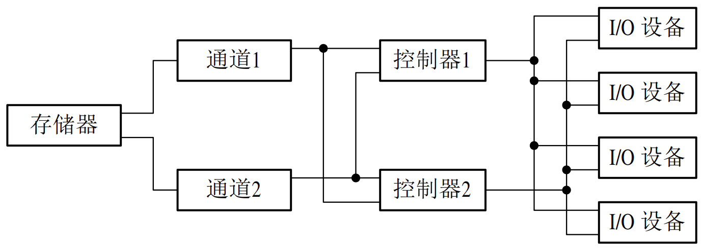
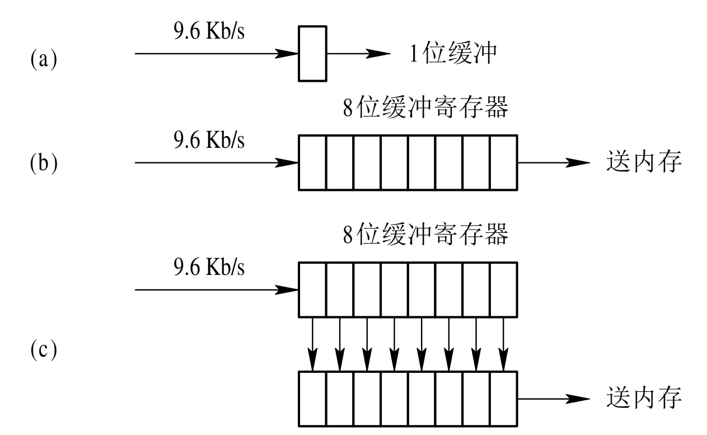
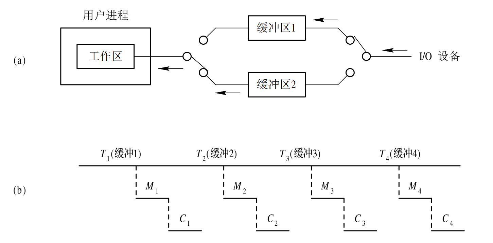
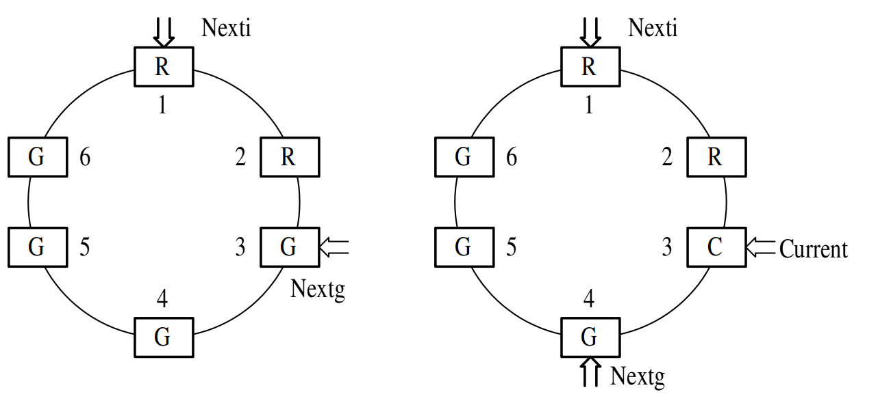
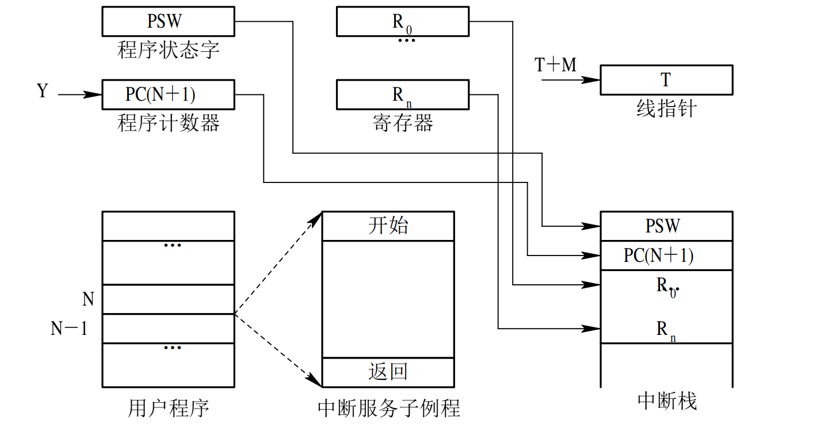
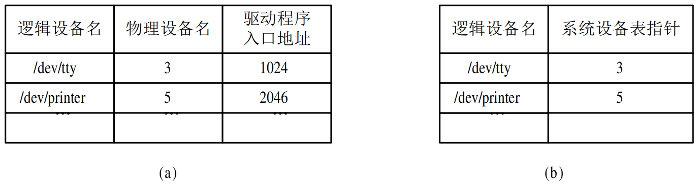
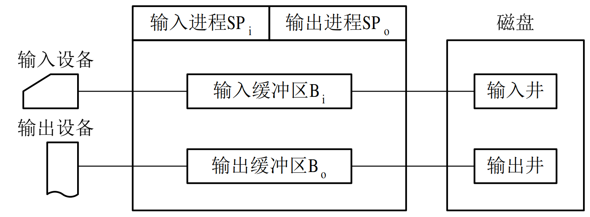
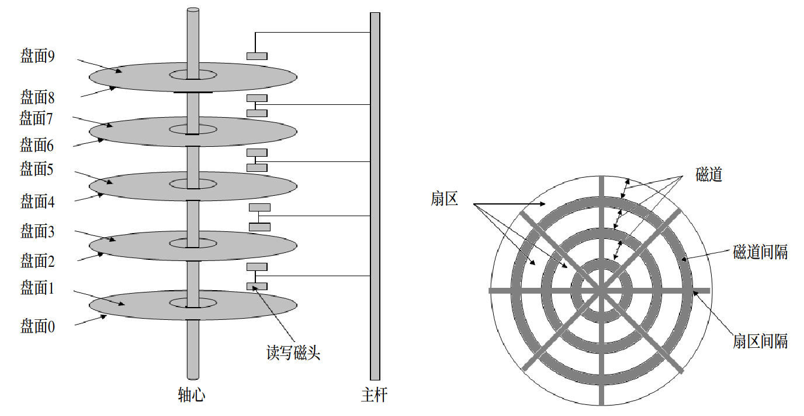
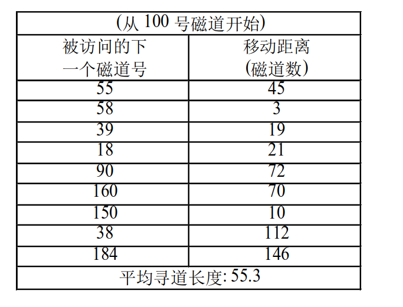
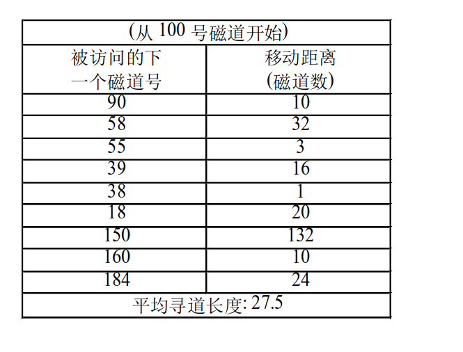

## 5.1　I/O系统 

### 5.1.1　I/O设备

####     1．I/O设备的类型

　　I/O设备的类型繁多，从OS观点看，其重要的性能指标有: 设备使用特性、数据传输速率、数据的传输单位、设备共享属性等。因而可从不同角度对它们进行分类。 

　　1)按设备的使用特性分类
　　按设备的使用特性，可将设备分为两类。第一类是存储设备，也称外存或后备存储器、辅助存储器，是计算机系统用以存储信息的主要设备。该类设备存取速度较内存慢，但容量比内存大得多，相对价格也便宜。第二类就是输入/输出设备，又具体可分为输入设备、输出设备和交互式设备。输入设备用来接收外部信息，如键盘、鼠标、扫描仪、视频摄像、各类传感器等。输出设备是用于将计算机加工处理后的信息送向外部的设备，如打印机、绘图仪、显示器、数字视频显示设备、音响输出设备等。交互式设备则是集成上述两类设备，利用输入设备接收用户命令信息，并通过输出设备(主要是显示器)同步显示用户命令以及命令执行的结果。 

　　2)按传输速率分类
　　按传输速度的高低，可将I/O设备分为三类。第一类是低速设备，这是指其传输速率仅为每秒钟几个字节至数百个字节的一类设备。属于低速设备的典型设备有键盘、鼠标器、语音的输入和输出等设备。第二类是中速设备，这是指其传输速率在每秒钟数千个字节至数十万个字节的一类设备。典型的中速设备有行式打印机、 激光打印机等。第三类是高速设备，这是指其传输速率在数百个千字节至千兆字节的一类设备。典型的高速设备有磁带机、磁盘机、光盘机等。 

　　3)按信息交换的单位分类
　　按信息交换的单位，可将I/O设备分成两类。第一类是块设备(Block Device)，这类设备用于存储信息。由于信息的存取总是以数据块为单位，故而得名。它属于有结构设备。典型的块设备是磁盘，每个盘块的大小为512 B～4 KB。磁盘设备的基本特征是其传输速率较高，通常每秒钟为几兆位；另一特征是可寻址，即对它可随机地读/写任一块；此外，磁盘设备的I/O常采用DMA方式。第二类是字符设备(Character Device)，用于数据的输入和输出。其基本单位是字符，故称为字符设备。它属于无结构类型。字符设备的种类繁多，如交互式终端、打印机等。字符设备的基本特征是其传输速率较低，通常为几个字节至数千字节；另一特征是不可寻址，即输入/输出时不能指定数据的输入源地址及输出的目标地址；此外，字符设备在输入/输出时，常采用中断驱动方式。 

　　4)按设备的共享属性分类
　　这种分类方式可将I/O设备分为如下三类：
　　(1)独占设备。这是指在一段时间内只允许一个用户(进程)访问的设备，即临界资源。因而，对多个并发进程而言，应互斥地访问这类设备。系统一旦把这类设备分配给了某进程后，便由该进程独占，直至用完释放。应当注意，独占设备的分配有可能引起进程死锁。 

　　(2)共享设备。这是指在一段时间内允许多个进程同时访问的设备。当然，对于每一时刻而言，该类设备仍然只允许一个进程访问。显然，共享设备必须是可寻址的和可随机访问的设备。典型的共享设备是磁盘。对共享设备不仅可获得良好的设备利用率，而且它也是实现文件系统和数据库系统的物质基础。
　　(3)虚拟设备。这是指通过虚拟技术将一台独占设备变换为若干台逻辑设备，供若干个用户(进程)同时使用。 

#### 　　2．设备与控制器之间的接口

　　通常，设备并不是直接与CPU进行通信，而是与设备控制器通信，因此，在I/O设备中应含有与设备控制器间的接口，在该接口中有三种类型的信号(见图5-1 所示)，各对应一条信号线。 


图5-1　设备与控制器间的接口 

　　1)数据信号线
　　这类信号线用于在设备和设备控制器之间传送数据信号。对输入设备而言，由外界输入的信号经转换器转换后所形成的数据，通常先送入缓冲器中，当数据量达到一定的比特(字符)数后，再从缓冲器通过一组数据信号线传送给设备控制器，如图5-1所示。对输出设备而言，则是将从设备控制器经过数据信号线传送来的一批数据先暂存于缓冲器中，经转换器作适当转换后，再逐个字符地输出。 

　　2)控制信号线
　　这是作为由设备控制器向I/O设备发送控制信号时的通路。该信号规定了设备将要执行的操作，如读操作(指由设备向控制器传送数据)或写操作(从控制器接收数据)，或执行磁头移动等操作。

　　3)状态信号线
　　这类信号线用于传送指示设备当前状态的信号。设备的当前状态有正在读(或写)；设备已读(写)完成，并准备好新的数据传送。 

### 5.1.2　设备控制器

#### 　　1．设备控制器的基本功能

　　1)接收和识别命令
　　CPU可以向控制器发送多种不同的命令，设备控制器应能接收并识别这些命令。为此，在控制器中应具有相应的控制寄存器，用来存放接收的命令和参数，并对所接收的命令进行译码。例如，磁盘控制器可以接收CPU发来的Read、Write、Format等15条不同的命令，而且有些命令还带有参数；相应地，在磁盘控制器中有多个寄存器和命令译码器等。 

　　2)数据交换
　　这是指实现CPU与控制器之间、控制器与设备之间的数据交换。对于前者，是通过数据总线，由CPU并行地把数据写入控制器，或从控制器中并行地读出数据；对于后者，是设备将数据输入到控制器，或从控制器传送给设备。为此，在控制器中须设置数据寄存器。 

　　3)标识和报告设备的状态
　　控制器应记下设备的状态供CPU了解。例如，仅当该设备处于发送就绪状态时，CPU才能启动控制器从设备中读出数据。为此，在控制器中应设置一状态寄存器，用其中的每一位来反映设备的某一种状态。当CPU将该寄存器的内容读入后，便可了解该设备的状态。 

　　4)地址识别
　　就像内存中的每一个单元都有一个地址一样，系统中的每一个设备也都有一个地址，而设备控制器又必须能够识别它所控制的每个设备的地址。此外，为使CPU能向(或从)寄存器中写入(或读出)数据，这些寄存器都应具有唯一的地址。例如，在IB-MPC机中规定，硬盘控制器中各寄存器的地址分别为320～32F之一。控制器应能正确识别这些地址，为此，在控制器中应配置地址译码器。 

　　5)数据缓冲
　　由于I/O设备的速率较低而CPU和内存的速率却很高，故在控制器中必须设置一缓冲器。在输出时，用此缓冲器暂存由主机高速传来的数据，然后才以I/O设备所具有的速率将缓冲器中的数据传送给I/O设备；在输入时，缓冲器则用于暂存从I/O设备送来的数据，待接收到一批数据后，再将缓冲器中的数据高速地传送给主机。 

　　6)差错控制
　　设备控制器还兼管对由I/O设备传送来的数据进行差错检测。若发现传送中出现了错误，通常是将差错检测码置位，并向CPU报告，于是CPU将本次传送来的数据作废，并重新进行一次传送。这样便可保证数据输入的正确性。 

#### 　　2．设备控制器的组成

　　1)设备控制器与处理机的接口
　　该接口用于实现CPU与设备控制器之间的通信。共有三类信号线: 数据线、地址线和控制线。数据线通常与两类寄存器相连接，第一类是数据寄存器(在控制器中可以有一个或多个数据寄存器，用于存放从设备送来的数据(输入)或从CPU送来的数据(输出))；第二类是控制/状态寄存器(在控制器中可以有一个或多个这类寄存器，用于存放从CPU送来的控制信息或设备的状态信息)。 

　　2)设备控制器与设备的接口
　　在一个设备控制器上，可以连接一个或多个设备。相应地，在控制器中便有一个或多个设备接口，一个接口连接一台设备。在每个接口中都存在数据、控制和状态三种类型的信号。控制器中的I/O逻辑根据处理机发来的地址信号去选择一个设备接口。 

　　3)I/O逻辑
　　在设备控制器中的I/O逻辑用于实现对设备的控制。它通过一组控制线与处理机交互，处理机利用该逻辑向控制器发送I/O命令；I/O逻辑对收到的命令进行译码。每当CPU要启动一个设备时，一方面将启动命令发送给控制器；另一方面又同时通过地址线把地址发送给控制器，由控制器的I/O逻辑对收到的地址进行译码，再根据所译出的命令对所选设备进行控制。设备控制器的组成示于图5-2中。 


图5-2　设备控制器的组成 

### 5.1.3　I/O通道

#### 　　1. I/O通道(I/O Channel)设备的引入

　　虽然在CPU与I/O设备之间增加了设备控制器后，已能大大减少CPU对I/O的干预，但当主机所配置的外设很多时，CPU的负担仍然很重。为此，在CPU和设备控制器之间又增设了通道。其主要目的是为了建立独立的I/O操作，不仅使数据的传送能独立于CPU，而且也希望有关对I/O操作的组织、 管理及其结束处理尽量独立，以保证CPU有更多的时间去进行数据处理；或者说，其目的是使一些原来由CPU处理的I/O任务转由通道来承担，从而把CPU从繁杂的I/O任务中解脱出来。在设置了通道后，CPU只需向通道发送一条I/O指令。通道在收到该指令后，便从内存中取出本次要执行的通道程序，然后执行该通道程序，仅当通道完成了规定的I/O任务后，才向CPU发中断信号。 

　　实际上，I/O通道是一种特殊的处理机，它具有执行I/O指令的能力，并通过执行通道(I/O)程序来控制I/O操作。但I/O通道又与一般的处理机不同，主要表现在以下两个方面: 一是其指令类型单一，这是由于通道硬件比较简单，其所能执行的命令主要局限于与I/O操作有关的指令；二是通道没有自己的内存，通道所执行的通道程序是放在主机的内存中的，换言之，是通道与CPU共享内存。 

#### 　　2．通道类型

　　1)字节多路通道(Byte Multiplexor Channel)
　　这是一种按字节交叉方式工作的通道。它通常都含有许多非分配型子通道，其数量可从几十到数百个，每一个子通道连接一台I/O设备，并控制该设备的I/O操作。这些子通道按时间片轮转方式共享主通道。当第一个子通道控制其I/O设备完成一个字节的交换后，便立即腾出主通道，让给第二个子通道使用；当第二个子通道也完成一个字节的交换后，同样也把主通道让给第三个子通道；依此类推。当所有子通道轮转一周后，重又返回来由第一个子通道去使用字节多路主通道。这样，只要字节多路通道扫描每个子通道的速率足够快，而连接到子通道上的设备的速率不是太高时，便不致丢失信息。 

　　图5-3示出了字节多路通道的工作原理。它所含有的多个子通道A，B，C，D，E，…，N，…分别通过控制器各与一台设备相连。假定这些设备的速率相近，且都同时向主机传送数据。设备A所传送的数据流为A1A2A3…；设备B所传送的数据流为B1B2B3…把这些数据流合成后(通过主通道)送往主机的数据流为A1B1C1D1 …A2B2C2D2 … A3B3C3D3 …。 


图5-3　字节多路通道的工作原理 

　　2)数组选择通道(Block Selector Channel)
　　字节多路通道不适于连接高速设备，这推动了按数组方式进行数据传送的数组选择通道的形成。这种通道虽然可以连接多台高速设备，但由于它只含有一个分配型子通道，在一段时间内只能执行一道通道程序，控制一台设备进行数据传送，致使当某台设备占用了该通道后，便一直由它独占，即使是它无数据传送，通道被闲置，也不允许其它设备使用该通道，直至该设备传送完毕释放该通道。可见，这种通道的利用率很低。 

　　3)数组多路通道(Block Multiplexor Channel)
　　数组选择通道虽有很高的传输速率，但它却每次只允许一个设备传输数据。数组多路通道是将数组选择通道传输速率高和字节多路通道能使各子通道(设备)分时并行操作的优点相结合而形成的一种新通道。它含有多个非分配型子通道，因而这种通道既具有很高的数据传输速率，又能获得令人满意的通道利用率。也正因此，才使该通道能被广泛地用于连接多台高、中速的外围设备，其数据传送是按数组方式进行的。 

#### 　　3．“瓶颈”问题

　　由于通道价格昂贵，致使机器中所设置的通道数量势必较少，这往往又使它成了I/O的瓶颈，进而造成整个系统吞吐量的下降。例如，在图5-4 中，假设设备1至设备4是四个磁盘，为了启动磁盘4，必须用通道1和控制器2；但若这两者已被其它设备占用，必然无法启动磁盘4。类似地，若要启动盘1和盘2，由于它们都要用到通道1，因而也不可能启动。这些就是由于通道不足所造成的“瓶颈”现象。 


图5-4　单通路I/O系统 

　　解决“瓶颈”问题的最有效的方法，便是增加设备到主机间的通路而不增加通道，如图5-5所示。换言之，就是把一个设备连接到多个控制器上，而一个控制器又连接到多个通道上。图中的设备1、2、3和4，都有四条通往存储器的通路。例如，通过控制器1和通道1到存储器；也可通过控制器2和通道1到存储器。多通路方式不仅解决了“瓶颈”问题，而且提高了系统的可靠性，因为个别通道或控制器的故障不会使设备和存储器之间没有通路。 



图5-5　多通路I/O系统 

### 5.1.4　总线系统

　　由图5-6 可以看出，在计算机系统中的各部件，如CPU、存储器以及各种I/O设备之间的联系，都是通过总线来实现的。总线的性能是用总线的时钟频率、带宽和相应的总线传输速率等指标来衡量的。随着计算机中CPU和内存速率的提高，字长的增加，以及不断地引入新型设备，促使人们对总线的时钟频率、带宽和传输速率的要求也不断提高。这便推动了总线的不断发展，使之由早期的ISA总线发展为EISA总线、VESA总线，进而又演变成当前广为流行的PCI总线。 


图5-6　总线型I/O系统结构 

#### 　　1．ISA和EISA总线

　　1)ISA(Industry Standard Architecture)总线
　　这是为在1984年推出的80286型微机而设计的总线结构。其总线的带宽为8位，最高传输速率为2 Mb/s。之后不久又推出了16位的(EISA)总线，其最高传输速率为8 Mb/s，后又升至16 Mb/s，能连接12台设备。

　　2)EISA(Extended ISA)总线
　　到20世纪80年代末期，ISA总线已难于满足带宽和传输速率的要求，于是人们又开发出扩展ISA(EISA)总线，其带宽为32位，总线的传输速率高达32 Mb/s，同样可以连接12台外部设备。 

#### 　　2．局部总线(Local Bus)

　　多媒体技术的兴起，特别是全运动视频处理、高保真音响、高速LAN，以及高质量图形处理等技术，都要求总线具有更高的传输速率，这时的EISA总线已难于满足要求，于是，局部总线便应运而生。所谓局部总线，是指将多媒体卡、高速LAN网卡、高性能图形板等，从ISA总线上卸下来，再通过局部总线控制器直接接到CPU总线上，使之与高速CPU总线相匹配，而打印机、FAX/Modem、CDROM等仍挂在ISA总线上。在局部总线中较有影响的是VESA总线和PCI总线。 

　　1)VESA(Video Electronic Standard Association)总线
　　该总线的设计思想是以低价位迅速占领市场。VESA总线的带宽为32位，最高传输速率为132 Mb/s。它在20世纪90年代初被推出时，广泛应用于486微机中。但VESA总线仍存在较严重的缺点，比如，它所能连接的设备数仅为2～4台，在控制器中无缓冲，故难于适应处理器速度的不断提高，也不能支持后来出现的Pentium微机。 

　　2)PCI(Peripheral Component Interface)总线
　　随着Pentium系列芯片的推出，Intel公司分别在1992年和1995年颁布了PCI总线的V1.0和V2.1规范，后者支持64位系统。PCI在CPU和外设间插入一复杂的管理层，用于协调数据传输和提供一致的接口。在管理层中配有数据缓冲，通过该缓冲可将线路的驱动能力放大，使PCI最多能支持10种外设，并使高时钟频率的CPU能很好地运行，最大传输速率可达132 

## 5.2　I/O控制方式 

### 5.2.1　程序I/O方式

　　早期的计算机系统中，由于无中断机构，处理机对I/O设备的控制采取程序I/O(Programmed I/O)方式，或称为忙—等待方式，即在处理机向控制器发出一条I/O指令启动输入设备输入数据时，要同时把状态寄存器中的忙/闲标志busy置为1，然后便不断地循环测试busy。当 busy=1时，表示输入机尚未输完一个字(符)，处理机应继续对该标志进行测试，直至busy=0，表明输入机已将输入数据送入控制器的数据寄存器中。于是处理机将数据寄存器中的数据取出，送入内存指定单元中，这样便完成了一个字(符)的I/O。接着再去启动读下一个数据，并置busy=1。图5-7(a)示出了程序I/O方式的流程。 


图5-7　程序I/O和中断驱动方式的流程 

### 5.2.2　中断驱动I/O控制方式

　　现代计算机系统中，都毫无例外地引入了中断机构，致使对I/O设备的控制，广泛采用中断驱动(Interrupt Driven)方式，即当某进程要启动某个I/O设备工作时，便由CPU向相应的设备控制器发出一条I/O命令，然后立即返回继续执行原来的任务。设备控制器于是按照该命令的要求去控制指定I/O设备。此时，CPU与I/O设备并行操作。例如，在输入时，当设备控制器收到CPU发来的读命令后，便去控制相应的输入设备读数据。一旦数据进入数据寄存器，控制器便通过控制线向CPU发送一中断信号，由CPU检查输入过程中是否出错，若无错，便向控制器发送取走数据的信号，然后再通过控制器及数据线将数据写入内存指定单元中。图 5-7(b)示出了中断驱动方式的流程。 

　　在I/O设备输入每个数据的过程中，由于无需CPU干预，因而可使CPU与I/O设备并行工作。仅当输完一个数据时，才需CPU花费极短的时间去做些中断处理。可见，这样可使CPU和I/O设备都处于忙碌状态，从而提高了整个系统的资源利用率及吞吐量。例如，从终端输入一个字符的时间约为100 ms，而将字符送入终端缓冲区的时间小于0.1 ms。若采用程序I/O方式，CPU约有99.9 ms的时间处于忙—等待的过程中。但采用中断驱动方式后，CPU可利用这99.9 ms的时间去做其它的事情，而仅用0.1 ms的时间来处理由控制器发来的中断请求。可见，中断驱动方式可以成百倍地提高CPU的利用率。 

### 5.2.3　直接存储器访问(DMA)I/O控制方式

#### 　　1．DMA(Direct Memory Access)控制方式的引入

　　虽然中断驱动 I/O 比程序 I/O 方式更有效，但须注意，它仍是以字(节)为单位进行I/O的，每当完成一个字(节)的I/O时，控制器便要向CPU请求一次中断。换言之，采用中断驱动I/O方式时的CPU是以字(节)为单位进行干预的。如果将这种方式用于块设备的I/O，显然是极其低效的。例如，为了从磁盘中读出1 KB的数据块，需要中断CPU 1K次。为了进一步减少CPU对I/O的干预而引入了直接存储器访问方式，见图 5-7(c)所示。该方式的特点是：

  - 数据传输的基本单位是数据块，即在CPU与I/O设备之间，每次传送至少一个数据块； 　　
  - 所传送的数据是从设备直接送入内存的，或者相反；
  - 仅在传送一个或多个数据块的开始和结束时，才需CPU干预，整块数据的传送是在控制器的控制下完成的。

可见，DMA方式较之中断驱动方式，又是成百倍地减少了CPU对I/O的干预，进一步提高了CPU与I/O设备的并行操作程度。 

#### 　　2．DMA控制器的组成

　　DMA控制器由三部分组成：

- 主机与DMA控制器的接口；
- DMA控制器与块设备的接口；
- I/O控制逻辑。

图5-8 示出了DMA控制器的组成。这里主要介绍主机与控制器之间的接口。 


图5-8　DMA控制器的组成 

　　为了实现在主机与控制器之间成块数据的直接交换，必须在DMA控制器中设置如下四类寄存器：

　　(1) 命令/状态寄存器(CR)。用于接收从CPU发来的I/O命令，或有关控制信息，或设备的状态。
　　(2) 内存地址寄存器(MAR)。在输入时，它存放把数据从设备传送到内存的起始目标地址；在输出时，它存放由内存到设备的内存源地址。 
　　(3) 数据寄存器(DR)。用于暂存从设备到内存，或从内存到设备的数据。
　　(4) 数据计数器(DC)。存放本次CPU要读或写的字(节)数。 

#### 　　3．DMA工作过程

　　我们以从磁盘读入数据为例，来说明DMA方式的工作流程。当CPU要从磁盘读入一数据块时，便向磁盘控制器发送一条读命令。该命令被送到其中的命令寄存器(CR)中。同时，还须发送本次要将数据读入的内存起始目标地址，该地址被送入内存地址寄存器（MAR）中；本次要读数据的字(节)数则送入数据计数器(DC)中，还须将磁盘中的源地址直接送至DMA控制器的I/O控制逻辑上。然后，启动DMA控制器进行数据传送，以后，CPU便可去处理其它任务。此后，整个数据传送过程便由DMA控制器进行控制。

　　当DMA控制器已从磁盘中读入一个字(节)的数据并送入数据寄存器(DR)后，再挪用一个存储器周期，将该字(节)传送到MAR所指示的内存单元中。接着便对MAR内容加1，将DC内容减1。若减1后DC内容不为0，表示传送未完，便继续传送下一个字(节)；否则，由DMA控制器发出中断请求。图5-9是DMA方式的工作流程。


 图5-9  DMA方式的工作流程图 

### 5.2.4　I/O 通道控制方式

#### 　　1．I/O 通道控制方式的引入

　　虽然DMA方式比起中断方式来已经显著地减少了CPU的干预，**即已由以字(节)为单位的干预减少到以数据块为单位的干预，**但CPU每发出一条I/O指令，也只能去读(或写)一个连续的数据块。而当我们需要一次去读多个数据块且将它们分别传送到不同的内存区域，或者相反时，则须由CPU分别发出多条I/O指令及进行多次中断处理才能完成。 

　　I/O通道方式是DMA方式的发展，它可进一步减少CPU的干预，**即把对一个数据块的读(或写)为单位的干预减少为对一组数据块的读(或写)及有关的控制和管理为单位的干预。**同时，又可实现CPU、通道和I/O设备**三者的并行操作，从而更有效地提高整个系统的资源利用率**。例如，当CPU要完成一组相关的读(或写)操作及有关控制时，只需向I/O通道发送一条I/O指令，以给出其所要执行的通道程序的首址和要访问的I/O设备，通道接到该指令后，通过执行通道程序便可完成CPU指定的I/O任务。 

#### 　　2．通道程序

　　通道是通过执行通道程序，并与设备控制器共同实现对I/O设备的控制的。通道程序是由一系列通道指令(或称为通道命令)所构成的。通道指令与一般的机器指令不同，在它的每条指令中都包含下列诸信息：

　　(1) 操作码。操作码规定了指令所执行的操作，如读、写、控制等操作。
　　(2) 内存地址。内存地址标明字符送入内存(读操作)和从内存取出(写操作)时的内存首址。
　　(3) 计数。该信息表示本条指令所要读(或写)数据的字节数。 

　　(4) 通道程序结束位P。该位用于表示通道程序是否结束。P=1表示本条指令是通道程序的最后一条指令。
　　(5) 记录结束标志R。R=0表示本通道指令与下一条指令所处理的数据是同属于一个记录；R=1表示这是处理某记录的最后一条指令。 

　　下面示出了一个由六条通道指令所构成的简单的通道程序。该程序的功能是将内存中不同地址的数据写成多个记录。其中，前三条指令是分别将813～892单元中的80个字符和1034～1173单元中的140个字符及5830～5889单元中的60个字符写成一个记录；第4条指令是单独写一个具有300个字符的记录；第5、6条指令共写含500个字符的记录。 


## 5.3　缓 冲 管 理 

### 5.3.1　缓冲的引入

　　(1) **缓和 CPU 与 I/O 设备间速度不匹配的矛盾。**事实上，凡在数据到达速率与其离去速率不同的地方，都可设置缓冲区，以缓和它们之间速率不匹配的矛盾。众所周知，CPU的运算速率远远高于I/O设备的速率，如果没有缓冲区，则在输出数据时，必然会由于打印机的速度跟不上而使CPU停下来等待；然而在计算阶段，打印机又空闲无事。显然，如果在打印机或控制器中设置一缓冲区，用于快速暂存程序的输出数据，以后由打印机“慢慢地”从中取出数据打印，这样，就可提高CPU的工作效率。类似地，在输入设备与CPU之间也设置缓冲区，也可使CPU的工作效率得以提高。 

　　(2) **减少对 CPU 的中断频率，放宽对 CPU 中断响应时间的限制。**在远程通信系统中，如果从远地终端发来的数据仅用一位缓冲来接收，如图 5-11(a) 所示，则必须在每收到一位数据时便中断一次 CPU，这样，对于速率为 9.6 Kb/s 的数据通信来说，就意味着其中断CPU的频率也为9.6 Kb/s，即每100 μs就要中断CPU一次，而且CPU必须在 100 μs 内予以响应，否则缓冲区内的数据将被冲掉。倘若设置一个具有 8 位的缓冲(移位)寄存器，如图 5-10(b) 所示，则可使 CPU 被中断的频率降低为原来的 1/8；若再设置一个 8 位寄存器，如图 5-10(c) 所示，则又可把 CPU 对中断的响应时间放宽到 800 μs。



图5-11　利用缓冲寄存器实现缓冲  

　　(3) **提高 CPU 和 I/O 设备之间的并行性。**缓冲的引入可显著地提高 CPU 和 I/O 设备间的并行操作程度，提高系统的吞吐量和设备的利用率。例如，在 CPU 和打印机之间设置了缓冲区后，便可使 CPU 与打印机并行工作。 

### 5.3.2　单缓冲和双缓冲

#### 　　1．单缓冲( Single Buffer )

　　在单缓冲情况下，每当用户进程发出一 I/O 请求时，操作系统便在主存中为之分配一缓冲区，如图5-12 所示。在块设备输入时，假定从磁盘把一块数据输入到缓冲区的时间为 T，操作系统将该缓冲区中的数据传送到用户区的时间为 M，而CPU对这一块数据处理(计算)的时间为 C 。由于T和C是可以并行的(见图5-12)，当T>C时，系统对每一块数据的处理时间为M+T，反之则为M+C，故可把系统对每一块数据的处理时间表示为Max(C，T)+M。 


图5-12　单缓冲工作示意图 

#### 　　2．双缓冲( Double Buffer )

　　为了加快输入和输出速度，提高设备利用率，人们又引入了双缓冲区机制，也称为缓冲对换( Buffer Swapping )。在设备输入时，先将数据送入第一缓冲区，装满后便转向第二缓冲区。此时操作系统可以从第一缓冲区中移出数据，并送入用户进程(见图5-13)。接着由CPU对数据进行计算。在双缓冲时，系统处理一块数据的时间可以粗略地认为是Max(C，T)。如果C<T，可使块设备连续输入；如果C>T，则可使CPU不必等待设备输入。对于字符设备，若采用行输入方式，则采用双缓冲通常能消除用户的等待时间，即用户在输入完第一行之后，在CPU执行第一行中的命令时，用户可继续向第二缓冲区输入下一行数据。 



图5-13　双缓冲工作示意图 


图5-14　双机通信时缓冲区的设置 

### 5.3.3　循环缓冲

#### 　　1．循环缓冲的组成

　　(1)**多个缓冲区。**在循环缓冲中包括多个缓冲区，其每个缓冲区的大小相同。作为输入的多缓冲区可分为三种类型：用于装输入数据的空缓冲区R、已装满数据的缓冲区G以及计算进程正在使用的现行工作缓冲区C，如图 5-15 所示。 



图5-15　循环缓冲 

　　(2) 多个指针。作为输入的缓冲区可设置三个指针：用于指示计算进程下一个可用缓冲区 G 的指针 Nextg 、指示输入进程下次可用的空缓冲区R的指针 Nexti，以及用于指示计算进程正在使用的缓冲区 C 的指针 Current。 

#### 　　2．循环缓冲区的使用

　　计算进程和输入进程可利用下述两个过程来使用循环缓冲区。
　　(1) Getbuf 过程。当计算进程要使用缓冲区中的数据时，可调用 Getbuf 过程。该过程将由指针 Nextg 所指示的缓冲区提供给进程使用，相应地，须把它改为现行工作缓冲区，并令 Current 指针指向该缓冲区的第一个单元，同时将 Nextg 移向下一个 G 缓冲区。类似地，每当输入进程要使用空缓冲区来装入数据时，也调用Getbuf过程，由该过程将指针Nexti所指示的缓冲区提供给输入进程使用，同时将Nexti指针移向下一个R缓冲区。 

　　(2) Releasebuf 过程。当计算进程把 C 缓冲区中的数据提取完毕时，便调用 Releasebuf 过程，将缓冲区 C 释放。此时，把该缓冲区由当前(现行)工作缓冲区 C 改为空缓冲区 R。类似地，当输入进程把缓冲区装满时，也应调用 Releasebuf 过程，将该缓冲区释放，并改为 G 缓冲区。 

#### 　　3．进程同步

　　使用输入循环缓冲，可使输入进程和计算进程并行执行。相应地，指针 Nexti 和指针 Nextg 将不断地沿着顺时针方向移动，这样就可能出现下述两种情况:

　　(1) Nexti 指针追赶上 Nextg 指针。这意味着输入进程输入数据的速度大于计算进程处理数据的速度，已把全部可用的空缓冲区装满，再无缓冲区可用。此时，输入进程应阻塞，直到计算进程把某个缓冲区中的数据全部提取完，使之成为空缓冲区 R，并调用 Releasebuf 过程将它释放时，才将输入进程唤醒。这种情况被称为系统受计算限制。 

　　(2) Nextg 指针追赶上 Nexti 指针。这意味着输入数据的速度低于计算进程处理数据的速度，使全部装有输入数据的缓冲区都被抽空，再无装有数据的缓冲区供计算进程提取数据。这时，计算进程只能阻塞，直至输入进程又装满某个缓冲区，并调用 Releasebuf 过程将它释放时，才去唤醒计算进程。这种情况被称为系统受I/O限制。 

### 5.3.4　缓冲池

#### 　　1．缓冲池的组成

　　对于既可用于输入又可用于输出的公用缓冲池，其中至少应含有以下三种类型的缓冲区:

​          ① 空(闲)缓冲区；
​          ② 装满输入数据的缓冲区；
​          ③ 装满输出数据的缓冲区。 

　　为了管理上的方便，可将相同类型的缓冲区链成一个队列，于是可形成以下三个队列:

　　(1) 空缓冲队列 emq。这是由空缓冲区所链成的队列。其队首指针 F(emq) 和队尾指针 L(emq) 分别指向该队列的首缓冲区和尾缓冲区。

　　(2) 输入队列 inq。这是由装满输入数据的缓冲区所链成的队列。其队首指针F(inq)和队尾指针L(inq)分别指向该队列的首缓冲区和尾缓冲区。

　　(3) 输出队列 outq。这是由装满输出数据的缓冲区所链成的队列。其队首指针F(outq)和队尾指针L(outq)分别指向该队列的首缓冲区和尾缓冲区。

　　除了上述三个队列外，还应具有四种工作缓冲区：① 用于收容输入数据的工作缓冲区；② 用于提取输入数据的工作缓冲区；③ 用于收容输出数据的工作缓冲区；④ 用于提取输出数据的工作缓冲区。 　 

#### 　　2．Getbuf 过程和 Putbuf 过程

　　在“数据结构”课程中，曾介绍过队列和对队列进行操作的两个过程，它们是：

　　(1)  Addbuf(type，number) 过程。该过程用于将由参数 number 所指示的缓冲区 B 挂在 type 队列上。
　　(2)  Takebuf(type) 过程。该过程用于从 type 所指示的队列的队首摘下一个缓冲区。

　　为使诸进程能互斥地访问缓冲池队列，可为每一队列设置一个互斥信号量 MS(type) 。此外，为了保证诸进程同步地使用缓冲区，又为每个缓冲队列设置了一个资源信号量 RS(type)。既可实现互斥又可保证同步的Getbuf过程和Putbuf过程描述如下： 

```
　　Procedure Getbuf(type)
　　　begin
　　　　Wait(RS(type))；
　　　　Wait(MS(type))；
　　　　B(number):=Takebuf(type)；
　　　　Signal(MS(type))；
　　　end
　　Procedure Putbuf(type，number)
　　　begin
　　　　Wait(MS(type))；
　　　　Addbuf(type，number)；
　　　　Signal(MS(type))；
　　　　Signal(RS(type))；
　　　end 
```

#### 　　3．缓冲区的工作方式

　　缓冲区可以工作在收容输入、提取输入、收容输出和提取输出四种工作方式下，如图5-16 所示。


图5-16　缓冲区的工作方式 

　　(1) 收容输入。在输入进程需要输入数据时，便调用 Getbuf(emq) 过程，从空缓冲队列 emq 的队首摘下一空缓冲区，把它作为收容输入工作缓冲区 hin 。然后，把数据输入其中，装满后再调用 Putbuf(inq，hin) 过程，将该缓冲区挂在输入队列 inq 上。

　　(2) 提取输入。当计算进程需要输入数据时，调用 Getbuf(inq) 过程，从输入队列 inq 的队首取得一个缓冲区，作为提取输入工作缓冲区 (sin)，计算进程从中提取数据。计算进程用完该数据后，再调用 Putbuf(emq，sin)过程，将该缓冲区挂到空缓冲队列 emq 上。 　

　　(3) 收容输出。当计算进程需要输出时，调用Getbuf(emq)过程从空缓冲队列emq的队首取得一个空缓冲区，作为收容输出工作缓冲区hout。当其中装满输出数据后，又调用Putbuf(outq，hout)过程，将该缓冲区挂在outq末尾。

　　(4) 提取输出。由输出进程调用 Getbuf(outq) 过程，从输出队列的队首取得一装满输出数据的缓冲区，作为提取输出工作缓冲区 sout。在数据提取完后，再调用 Putbuf(emq，sout) 过程，将该缓冲区挂在空缓冲队列末尾。 

## 5.4　I/O 软 件 

### 5.4.1  I/O软件的设计目标和原则

　　计算机系统中包含了众多的I/O设备，其种类繁多，硬件构造复杂，物理特性各异，速度慢，与CPU速度不匹配，并涉及到大量专用CPU及数字逻辑运算等细节，如寄存器、中断、控制字符和设备字符集等，造成对设备的操作和管理非常复杂和琐碎。因此，从系统的观点出发，采用多种技术和措施，解决由于外部设备与CPU速度不匹配所引起的问题，提高主机和外设的并行工作能力，提高系统效率，成为操作系统的一个重要目标。另一方面，对设备的操作和管理的复杂性，也给用户的使用带来了极大的困难。

　　用户必须掌握I/O 系统的原理，对接口和控制器及设备的物理特性要有深入了解，这就使计算机的推广应用受到很大限制。所以，设法消除或屏蔽设备硬件内部的低级处理过程，为用户提供一个简便、易用、抽象的逻辑设备接口，保证用户安全、方便地使用各类设备，也是I/O软件设计的一个重要原则。 
　　具体而言，I/O软件应达到下面的几个目标：

　　1)与具体设备无关

　　对于 I/O 系统中许多种类不同的设备，作为程序员，只需要知道如何使用这些资源来完成所需要的操作，而无需了解设备的有关具体实现细节。例如，应用程序访问文件时，不必去考虑被访问的是硬盘、软盘还是 CD-ROM；对于管理软件，也无需因为 I/O 设备变化，而重新编写涉及设备管理的程序。 　
　　为了提高 OS 的可移植性和易适应性，I/O 软件应负责屏蔽设备的具体细节，向高层软件提供抽象的逻辑设备，并完成逻辑设备与具体物理设备的映射。 

　　2)统一命名
　　要实现上述的设备无关性，其中一项重要的工作就是如何给 I/O 设备命名。不同的操作系统有不同的命名规则，一般而言，是在系统中对各类设备采取预先设计的、统一的逻辑名称进行命名，所有软件都以逻辑名称访问设备。这种统一命名与具体设备无关，换言之，同一个逻辑设备的名称，在不同的情况下可能对应于不同的物理设备。 

　　3)对错误的处理
　　一般而言，错误多数是与设备紧密相关的，因此对于错误的处理，应该尽可能在接近硬件的层面处理，在低层软件能够解决的错误就不让高层软件感知，只有低层软件解决不了的错误才通知高层软件解决。许多情况下，错误恢复可以在低层得到解决，而高层软件不需要知道。 

　　4)缓冲技术
　　由于 CPU 与设备之间的速度差异，无论是块设备还是字符设备，都需要使用缓冲技术。对于不同类型的设备，其缓冲区(块)的大小是不一样的，块设备的缓冲是以数据块为单位的，而字符设备的缓冲则以字节为单位。就是同类型的设备，其缓冲区(块)的大小也是存在差异的，如不同的磁盘，其扇区的大小有可能不同。因此，I/O 软件应能屏蔽这种差异，向高层软件提供统一大小的数据块或字符单元，使得高层软件能够只与逻辑块大小一致的抽象设备进行交互。 

　　5)设备的分配和释放
　　对于系统中的共享设备，如磁盘等，可以同时为多个用户服务。对于这样的设备，应该允许多个进程同时对其提出 I/O 请求。但对于独占设备，如键盘和打印机等，在某一段时间只能供一个用户使用，对其分配和释放的不当，将引起混乱，甚至死锁。对于独占设备和共享设备带来的许多问题，I/O软件必须能够同时进行妥善的解决。 

　　6) I/O 控制方式
　　针对具有不同传输速率的设备，综合系统效率和系统代价等因素，合理选择 I/O 控制方式，如像打印机等低速设备应采用中断驱动方式，而对磁盘等高速设备则采用 DMA 控制方式等，以提高系统的利用率。为方便用户，I/O 软件也应屏蔽这种差异，向高层软件提供统一的操作接口。 

　　综上所述，I/O 软件涉及的面非常宽，往下与硬件有着密切的关系，往上又与用户直接交互，它与进程管理、存储器、文件管理等都存在着一定的联系，即它们都可能需要 I/O 软件来实现 I/O 操作。为使十分复杂的 I/O 软件能具有清晰的结构，更好的可移植性和易适应性，目前在 I/O 软件中已普遍采用了层次式结构，将系统中的设备操作和管理软件分为若干个层次，每一层都利用其下层提供的服务，完成输入、输出功能中的某些子功能，并屏蔽这些功能实现的细节，向高层提供服务。 

　　在层次式结构的  I/O 软件中，只要层次间的接口不变，对每个层次中的软件进行的修改都不会引起其下层或高层代码的变更，仅最低层才会涉及到硬件的具体特性。通常把I/O 软件组织成四个层次，如图5-17所示(图中的箭头表示I/O的控制流)。各层次及其功能如下所述：

　　(1)用户层软件：实现与用户交互的接口，用户可直接调用在用户层提供的、与I/O操作有关的库函数，对设备进行操作。 

　　(2) 设备独立性软件：负责实现与设备驱动器的统一接口、设备命名、设备的保护以及设备的分配与释放等，同时为设备管理和数据传送提供必要的存储空间。

　　(3) 设备驱动程序：与硬件直接相关，负责具体实现系统对设备发出的操作指令，驱动I/O设备工作的驱动程序。
　　(4) 中断处理程序：用于保存被中断进程的CPU环境，转入相应的中断处理程序进行处理，处理完后再恢复被中断进程的现场后返回到被中断进程。 


图5-17  I/O系统的层次及功能 

### 5.4.2　中断处理程序

#### 　　1．唤醒被阻塞的驱动(程序)进程

　　当中断处理程序开始执行时，首先去唤醒处于阻塞状态的驱动(程序)进程。如果是采用了信号量机制，则可通过执行signal操作，将处于阻塞状态的驱动(程序)进程唤醒；在采用信号机制时，将发送一信号给阻塞进程。 

#### 　　2．保护被中断进程的CPU环境

　　通常由硬件自动将处理机状态字 PSW 和程序计数器 (PC) 中的内容，保存在中断保留区(栈)中，然后把被中断进程的 CPU 现场信息(即包括所有的 CPU 寄存器，如通用寄存器、段寄存器等内容)都压入中断栈中，因为在中断处理时可能会用到这些寄存器。图5-17给出了一个简单的保护中断现场的示意图。该程序是指令在N位置时被中断的，程序计数器中的内容为 N+1，所有寄存器的内容都被保留在栈中。 



图5-18　中断现场保护示意图 

#### 　　3．转入相应的设备处理程序

　　由处理机对各个中断源进行测试，以确定引起本次中断的 I/O 设备，并发送一应答信号给发出中断请求的进程，使之消除该中断请求信号，然后将相应的设备中断处理程序的入口地址装入到程序计数器中，使处理机转向中断处理程序。 

#### 　　4．中断处理

　　对于不同的设备，有不同的中断处理程序。该程序首先从设备控制器中读出设备状态，以判别本次中断是正常完成中断，还是异常结束中断。若是前者，中断程序便进行结束处理；若还有命令，可再向控制器发送新的命令，进行新一轮的数据传送。若是异常结束中断，则根据发生异常的原因做相应的处理。 

#### 　5．恢复被中断进程的现场

　　当中断处理完成以后，便可将保存在中断栈中的被中断进程的现场信息取出，并装入到相应的寄存器中，其中包括该程序下一次要执行的指令的地址 N+1、处理机状态字 PSW，以及各通用寄存器和段寄存器的内容。这样，当处理机再执行本程序时，便从 N+1 处开始，最终返回到被中断的程序。 

　　I/O 操作完成后，驱动程序必须检查本次 I/O 操作中是否发生了错误，并向上层软件报告，最终向调用者报告本次 I/O 的执行情况。除了上述的第 4 步外，其它各步骤对所有 I/O 设备都是相同的，因而对于某种操作系统，例如 UNIX 系统，是把这些共同的部分集中起来，形成中断总控程序。每当要进行中断处理时，都要首先进入中断总控程序。而对于第 4 步，则对不同设备须采用不同的设备中断处理程序继续执行。图 5-19 示出了中断处理流程。


图5-19　中断处理流程  

### 5.4.3　设备驱动程序

　　设备驱动程序通常又称为设备处理程序，它是 I/O 进程与设备控制器之间的通信程序，又由于它常以进程的形式存在，故以后就简称之为设备驱动进程。其主要任务是接收上层软件发来的抽象 I/O 要求，如 read 或 write 命令，在把它转换为具体要求后，发送给设备控制器，启动设备去执行；此外，它也将由设备控制器发来的信号传送给上层软件。由于驱动程序与硬件密切相关，故应为每一类设备配置一种驱动程序；有时也可为非常类似的两类设备配置一个驱动程序。例如，打印机和显示器需要不同的驱动程序，但SCSI磁盘驱动程序通常可以处理不同大小和不同速度的多个 SCSI 磁盘，甚至还可以处理 SCSI CD-ROM。 

#### 　　1．设备驱动程序的功能

　　为了实现 I/O 进程与设备控制器之间的通信，设备驱动程序应具有以下功能：
　　(1) 接收由设备独立性软件发来的命令和参数，并将命令中的抽象要求转换为具体要求，例如，将磁盘块号转换为磁盘的盘面、磁道号及扇区号。
　　(2) 检查用户 I/O 请求的合法性，了解 I/O 设备的状态，传递有关参数，设置设备的工作方式。
　　(3) 发出 I/O 命令。如果设备空闲，便立即启动I/O设备去完成指定的I/O操作；如果设备处于忙碌状态，则将请求者的请求块挂在设备队列上等待。 
　　(4) 及时响应由控制器或通道发来的中断请求，并根据其中断类型调用相应的中断处理程序进行处理。
　　(5) 对于设置有通道的计算机系统，驱动程序还应能够根据用户的I/O请求，自动地构成通道程序。 

#### 　　2．设备处理方式

　　(1) 为每一类设备设置一个进程，专门用于执行这类设备的 I/O 操作。比如，为所有的交互式终端设置一个交互式终端进程；又如，为同一类型的打印机设置一个打印进程。

　　(2) 在整个系统中设置一个 I/O 进程，专门用于执行系统中所有各类设备的 I/O 操作。也可以设置一个输入进程和一个输出进程，分别处理系统中所有各类设备的输入或输出操作。

　　(3) 不设置专门的设备处理进程，而只为各类设备设置相应的设备处理程序(模块)，供用户进程或系统进程调用。 

#### 　　3．设备驱动程序的特点

　　设备驱动程序属于低级的系统例程，它与一般的应用程序及系统程序之间有下述明显差异:

　　(1) 驱动程序主要是指在请求 I/O 的进程与设备控制器之间的一个通信和转换程序。它将进程的I/O请求经过转换后，传送给控制器；又把控制器中所记录的设备状态和I/O操作完成情况及时地反映给请求I/O的进程。 

　　(2) 驱动程序与设备控制器和I/O设备的硬件特性紧密相关，因而对不同类型的设备应配置不同的驱动程序。例如，可以为相同的多个终端设置一个终端驱动程序，但有时即使是同一类型的设备，由于其生产厂家不同，它们也可能并不完全兼容，此时也须为它们配置不同的驱动程序。

　　(3) 驱动程序与I/O设备所采用的I/O控制方式紧密相关。常用的I/O控制方式是中断驱动和DMA方式，这两种方式的驱动程序明显不同，因为后者应按数组方式启动设备及进行中断处理。 

　　(4) 由于驱动程序与硬件紧密相关，因而其中的一部分必须用汇编语言书写。目前有很多驱动程序的基本部分，已经固化在 ROM 中。
　　
　　(5) 驱动程序应允许可重入。一个正在运行的驱动程序常会在一次调用完成前被再次调用。例如，网络驱动程序正在处理一个到来的数据包时，另一个数据包可能到达。
　　
　　(6) 驱动程序不允许系统调用。但是为了满足其与内核其它部分的交互，可以允许对某些内核过程的调用，如通过调用内核过程来分配和释放内存页面作为缓冲区，以及调用其它过程来管理MMU定时器、DMA控制器、中断控制器等。 

#### 4．设备驱动程序的处理过程

　　不同类型的设备应有不同的设备驱动程序，但大体上它们都可以分成两部分，其中，除了要有能够驱动I/O设备工作的驱动程序外，还需要有设备中断处理程序，以处理I/O完成后的工作。
　　设备驱动程序的主要任务是启动指定设备。但在启动之前，还必须完成必要的准备工作，如检测设备状态是否为“忙”等。在完成所有的准备工作后，才最后向设备控制器发送一条启动命令。 

　　以下是设备驱动程序的处理过程。
　　1)将抽象要求转换为具体要求
　　通常在每个设备控制器中都含有若干个寄存器，分别用于暂存命令、数据和参数等。由于用户及上层软件对设备控制器的具体情况毫无了解，因而只能向它发出抽象的要求(命令)，但这些命令无法传送给设备控制器。因此，就需要将这些抽象要求转换为具体要求。例如，将抽象要求中的盘块号转换为磁盘的盘面、 磁道号及扇区。这一转换工作只能由驱动程序来完成，因为在OS中只有驱动程序才同时了解抽象要求和设备控制器中的寄存器情况；也只有它才知道命令、 数据和参数应分别送往哪个寄存器。 

　　2)检查I/O请求的合法性
　　对于任何输入设备，都是只能完成一组特定的功能，若该设备不支持这次的I/O请求，则认为这次I/O请求非法。例如，用户试图请求从打印机输入数据，显然系统应予以拒绝。此外，还有些设备如磁盘和终端，它们虽然都是既可读又可写的，但若在打开这些设备时规定的是读，则用户的写请求必然被拒绝。 

　　3)读出和检查设备的状态
　　在启动某个设备进行I/O操作时，其前提条件应是该设备正处于空闲状态。因此在启动设备之前，要从设备控制器的状态寄存器中，读出设备的状态。例如，为了向某设备写入数据，此前应先检查该设备是否处于接收就绪状态，仅当它处于接收就绪状态时，才能启动其设备控制器，否则只能等待。 

　　4)传送必要的参数
　　对于许多设备，特别是块设备，除必须向其控制器发出启动命令外，还需传送必要的参数。例如在启动磁盘进行读/写之前，应先将本次要传送的字节数和数据应到达的主存始址，送入控制器的相应寄存器中。
　　5)工作方式的设置
　　有些设备可具有多种工作方式，典型情况是利用RS-232接口进行异步通信。在启动该接口之前，应先按通信规程设定参数：波特率、奇偶校验方式、停止位数目及数据字节长度等。 

　　6)启动I/O设备
　　在完成上述各项准备工作之后，驱动程序可以向控制器中的命令寄存器传送相应的控制命令。对于字符设备，若发出的是写命令，驱动程序将把一个数据传送给控制器；若发出的是读命令，则驱动程序等待接收数据，并通过从控制器中的状态寄存器读入状态字的方法，来确定数据是否到达。
　　驱动程序发出I/O命令后，基本的I/O操作是在设备控制器的控制下进行的。通常，I/O操作所要完成的工作较多，需要一定的时间，如读/写一个盘块中的数据，此时驱动(程序)进程把自己阻塞起来，直到中断到来时才将它唤醒。 

### 5.4.4  设备独立性软件

#### 　　1．设备独立性的概念

　　为了提高OS的可适应性和可扩展性，在现代OS中都毫无例外地实现了设备独立性(Device Independence)，也称为设备无关性。其基本含义是: 应用程序独立于具体使用的物理设备。为了实现设备独立性而引入了逻辑设备和物理设备这两个概念。在应用程序中，使用逻辑设备名称来请求使用某类设备；而系统在实际执行时，还必须使用物理设备名称。因此，系统须具有将逻辑设备名称转换为某物理设备名称的功能，这非常类似于存储器管理中所介绍的逻辑地址和物理地址的概念。在应用程序中所使用的是逻辑地址，而系统在分配和使用内存时，必须使用物理地址。在实现了设备独立性的功能后，可带来以下两方面的好处。 

　　1)设备分配时的灵活性
　　当应用程序(进程)以物理设备名称来请求使用指定的某台设备时，如果该设备已经分配给其他进程或正在检修，而此时尽管还有几台其它的相同设备正在空闲，该进程却仍阻塞。但若进程能以逻辑设备名称来请求某类设备时，系统可立即将该类设备中的任一台分配给进程，仅当所有此类设备已全部分配完毕时，进程才会阻塞。 

　　2)易于实现I/O重定向
　　所谓I/O重定向，是指用于I/O操作的设备可以更换(即重定向)，而不必改变应用程序。例如，我们在调试一个应用程序时，可将程序的所有输出送往屏幕显示；而在程序调试完后，如需正式将程序的运行结果打印出来，此时便须将I/O重定向的数据结构——逻辑设备表中的显示终端改为打印机，而不必修改应用程序。I/O重定向功能具有很大的实用价值，现已被广泛地引入到各类OS中。 

#### 　　2．设备独立性软件

　　驱动程序是一个与硬件(或设备)紧密相关的软件。为了实现设备独立性，必须再在驱动程序之上设置一层软件，称为设备独立性软件。至于设备独立性软件和设备驱动程序之间的界限，根据不同的操作系统和设备有所差异，主要取决于操作系统、设备独立性和设备驱动程序的运行效率等多方面因素的权衡，因为对于一些本应由设备独立性软件实现的功能，可能由于效率等诸多因素，实际上设计在设备驱动程序中。总的来说，设备独立性软件的主要功能可分为以下两个方面： 

　　(1)执行所有设备的公有操作。这些公有操作包括: 
　　① 对独立设备的分配与回收；
　　② 将逻辑设备名映射为物理设备名，进一步可以找到相应物理设备的驱动程序；
　　③ 对设备进行保护，禁止用户直接访问设备；
　　④ 缓冲管理，即对字符设备和块设备的缓冲区进行有效的管理，以提高I/O的效率；
　　⑤ 差错控制，由于在I/O操作中的绝大多数错误都与设备无关，故主要由设备驱动程序处理，而设备独立性软件只处理那些设备驱动程序无法处理的错误；
　　⑥ 提供独立于设备的逻辑块，不同类型的设备信息交换单位是不同的，读取和传输速率也各不相同，如字符型设备以单个字符为单位，块设备是以一个数据块为单位，即使同一类型的设备，其信息交换单位大小也是有差异的，如不同磁盘由于扇区大小的不同，可能造成数据块大小的不一致，因此设备独立性软件应负责隐藏这些差异，对逻辑设备使用并向高层软件提供大小统一的逻辑数据块。 

　　(2)向用户层(或文件层)软件提供统一接口。无论何种设备，它们向用户所提供的接口应该是相同的。例如，对各种设备的读操作，在应用程序中都使用read；而对各种设备的写操作，也都使用write。 

#### 3．逻辑设备名到物理设备名映射的实现

　　1)逻辑设备表
　　为了实现设备的独立性，系统必须设置一张逻辑设备表(LUT，Logical Unit Table)，用于将应用程序中所使用的逻辑设备名映射为物理设备名。在该表的每个表目中包含了三项：逻辑设备名、物理设备名和设备驱动程序的入口地址，如图5-20(a)所示。当进程用逻辑设备名请求分配I/O设备时，系统为它分配相应的物理设备，并在LUT上建立一个表目，填上应用程序中使用的逻辑设备名和系统分配的物理设备名，以及该设备驱动程序的入口地址。当以后进程再利用该逻辑设备名请求I/O操作时，系统通过查找LUT，便可找到物理设备和驱动程序。 



图5-20　逻辑设备表 

　　2)LUT的设置问题
　　LUT的设置可采取两种方式：第一种方式是在整个系统中只设置一张LUT。由于系统中所有进程的设备分配情况都记录在同一张LUT中，因而不允许在LUT中具有相同的逻辑设备名，这就要求所有用户都不使用相同的逻辑设备名。在多用户环境下这通常是难以做到的，因而这种方式主要用于单用户系统中。第二种方式是为每个用户设置一张LUT。每当用户登录时，便为该用户建立一个进程，同时也为之建立一张LUT，并将该表放入进程的PCB中。由于通常在多用户系统中，都配置了系统设备表，故此时的逻辑设备表可以采用图 5-19(b)中的格式。 

### 5.4.5  用户层的I/O软件

　　一般而言，大部分的I/O软件都在操作系统内部，但仍有一小部分在用户层，包括与用户程序链接在一起的库函数，以及完全运行于内核之外的一些程序。
　　用户层软件必须通过一组系统调用来取得操作系统服务。在现代的高级语言以及C语言中，通常提供了与各系统调用一一对应的库函数，用户程序通过调用对应的库函数使用系统调用。这些库函数与调用程序连接在一起，包含在运行时装入在内存的二进制程序中，如C语言中的库函数write等，显然这些库函数的集合也是I/O系统的组成部分。但在许多现代操作系统中，系统调用本身已经采用C语言编写，并以函数形式提供，所以在使用C语言编写的用户程序中，可以直接使用这些系统调用。 

## 5.5　设 备 分 配 

### 5.5.1　设备分配中的数据结构

#### 1．设备控制表(DCT)

　　系统为每一个设备都配置了一张设备控制表，用于记录本设备的情况，如图5-21所示。 


　图5-21　设备控制表 

　设备控制表中，除了有用于指示设备类型的字段type和设备标识字段deviceid外，还应含有下列字段：

　　(1)设备队列队首指针。凡因请求本设备而未得到满足的进程，其PCB都应按照一定的策略排成一个队列，称该队列为设备请求队列或简称设备队列。其队首指针指向队首PCB。在有的系统中还设置了队尾指针。

　　(2)设备状态。当设备自身正处于使用状态时，应将设备的忙/闲标志置“1”。若与该设备相连接的控制器或通道正忙，也不能启动该设备，此时则应将设备的等待标志置“1”。 

　　(3)与设备连接的控制器表指针。该指针指向该设备所连接的控制器的控制表。在设备到主机之间具有多条通路的情况下，一个设备将与多个控制器相连接。此时，在DCT中还应设置多个控制器表指针。

　　(4)重复执行次数。由于外部设备在传送数据时，较易发生数据传送错误，因而在许多系统中，如果发生传送错误，并不立即认为传送失败，而是令它重新传送，并由系统规定设备在工作中发生错误时应重复执行的次数。在重复执行时，若能恢复正常传送，则仍认为传送成功。仅当屡次失败，致使重复执行次数达到规定值而传送仍不成功时，才认为传送失败。 　

#### 　　2．控制器控制表、通道控制表和系统设备表

　　(1) 控制器控制表(COCT)。系统为每一个控制器都设置了一张用于记录本控制器情况的控制器控制表，如图5-22(a)所示。
　　(2) 通道控制表(CHCT)。每个通道都配有一张通道控制表，如图5-22(b)所示。 
　　(3) 系统设备表(SDT)。这是系统范围的数据结构，其中记录了系统中全部设备的情况。每个设备占一个表目，其中包括有设备类型、设备标识符、设备控制表及设备驱动程序的入口等项，如图5-22(c)所示。 


图5-22　COCT、CHCT和SDT 

### 5.5.2　设备分配时应考虑的因素

　　为了使系统有条不紊地工作，系统在分配设备时，应考虑这样几个因素: ① 设备的固有属性；② 设备分配算法；③ 设备分配时的安全性；④ 设备独立性。本小节介绍前三个问题，下一小节专门介绍设备独立性问题。 

#### 　　1．设备的固有属性

　　在分配设备时，首先应考虑与设备分配有关的设备属性。设备的固有属性可分成三种: 第一种是独占性，是指这种设备在一段时间内只允许一个进程独占，此即第二章所说的“临界资源”；第二种是共享性，指这种设备允许多个进程同时共享；第三种是可虚拟设备，指设备本身虽是独占设备，但经过某种技术处理，可以把它改造成虚拟设备。对上述的独占、 共享、可虚拟三种设备应采取不同的分配策略。 

　　(1) 独占设备。对于独占设备，应采用独享分配策略，即将一个设备分配给某进程后，便由该进程独占，直至该进程完成或释放该设备，然后，系统才能再将该设备分配给其他进程使用。这种分配策略的缺点是，设备得不到充分利用，而且还可能引起死锁。
　　(2) 共享设备。对于共享设备，可同时分配给多个进程使用，此时须注意对这些进程访问该设备的先后次序进行合理的调度。
　　(3) 可虚拟设备。由于可虚拟设备是指一台物理设备在采用虚拟技术后，可变成多台逻辑上的所谓虚拟设备，因而说，一台可虚拟设备是可共享的设备，可以将它同时分配给多个进程使用，并对这些访问该(物理)设备的先后次序进行控制。 

#### 　　2．设备分配算法

　　对设备进行分配的算法，与进程调度的算法有些相似之处，但前者相对简单，通常只采用以下两种分配算法：
　　(1) 先来先服务。当有多个进程对同一设备提出I/O请求时，该算法是根据诸进程对某设备提出请求的先后次序，将这些进程排成一个设备请求队列，设备分配程序总是把设备首先分配给队首进程。 

　　(2) 优先级高者优先。在进程调度中的这种策略，是优先权高的进程优先获得处理机。如果对这种高优先权进程所提出的I/O请求也赋予高优先权，显然有助于这种进程尽快完成。在利用该算法形成设备队列时，将优先权高的进程排在设备队列前面，而对于优先级相同的I/O请求，则按先来先服务原则排队。 

#### 　　3．设备分配中的安全性

　　从进程运行的安全性考虑，设备分配有以下两种方式：

　　1)安全分配方式
　　在这种分配方式中，每当进程发出I/O请求后，便进入阻塞状态，直到其I/O操作完成时才被唤醒。在采用这种分配策略时，一旦进程已经获得某种设备(资源)后便阻塞，使该进程不可能再请求任何资源，而在它运行时又不保持任何资源。因此，这种分配方式已经摒弃了造成死锁的四个必要条件之一的“请求和保持”条件，从而使设备分配是安全的。其缺点是进程进展缓慢，即CPU与I/O设备是串行工作的。 

　　2)不安全分配方式
　　在这种分配方式中，进程在发出I/O请求后仍继续运行，需要时又发出第二个I/O请求、 第三个I/O请求等。仅当进程所请求的设备已被另一进程占用时，请求进程才进入阻塞状态。这种分配方式的优点是，一个进程可同时操作多个设备，使进程推进迅速。其缺点是分配不安全，因为它可能具备“请求和保持”条件，从而可能造成死锁。因此，在设备分配程序中，还应再增加一个功能，以用于对本次的设备分配是否会发生死锁进行安全性计算，仅当计算结果说明分配是安全的情况下才进行设备分配。 

### 5.5.3　独占设备的分配程序

#### 1．基本的设备分配程序

　　1)分配设备
　　首先根据I/O请求中的物理设备名，查找系统设备表(SDT)，从中找出该设备的DCT，再根据DCT中的设备状态字段，可知该设备是否正忙。若忙，便将请求I/O进程的PCB挂在设备队列上；否则，便按照一定的算法来计算本次设备分配的安全性。如果不会导致系统进入不安全状态，便将设备分配给请求进程；否则，仍将其PCB插入设备等待队列。 

　　2)分配控制器
　　在系统把设备分配给请求 I/O 的进程后，再到其 DCT 中找出与该设备连接的控制器的COCT，从COCT的状态字段中可知该控制器是否忙碌。若忙，便将请求I/O进程的PCB挂在该控制器的等待队列上；否则，便将该控制器分配给进程。

　　3)分配通道
　　在该 COCT 中又可找到与该控制器连接的通道的 CHCT，再根据 CHCT 内的状态信息，可知该通道是否忙碌。若忙，便将请求 I/O 的进程挂在该通道的等待队列上；否则，将该通道分配给进程。只有在设备、 控制器和通道三者都分配成功时，这次的设备分配才算成功。然后，便可启动该I/O设备进行数据传送。 

#### 2．设备分配程序的改进

仔细研究上述基本的设备分配程序后可以发现: 

① 进程是以物理设备名来提出I/O请求的；

② 采用的是单通路的I/O系统结构，容易产生“瓶颈”现象。为此，应从以下两方面对基本的设备分配程序加以改进，以使独占设备的分配程序具有更强的灵活性，并提高分配的成功率。 

　　1)增加设备的独立性
　　为了获得设备的独立性，进程应使用逻辑设备名请求 I/O。这样，系统首先从 SDT 中找出第一个该类设备的 DCT。若该设备忙，又查找第二个该类设备的 DCT，仅当所有该类设备都忙时，才把进程挂在该类设备的等待队列上；而只要有一个该类设备可用，系统便进一步计算分配该设备的安全性。 

　　2)考虑多通路情况
　　为了防止在I/O系统中出现“瓶颈”现象，通常都采用多通路的I/O系统结构。此时对控制器和通道的分配同样要经过几次反复，即若设备(控制器)所连接的第一个控制器(通道)忙时，应查看其所连接的第二个控制器(通道)，仅当所有的控制器(通道)都忙时，此次的控制器(通道)分配才算失败，才把进程挂在控制器(通道)的等待队列上。而只要有一个控制器(通道)可用，系统便可将它分配给进程。 

### 5.5.4　SPOOLing技术

#### 1．什么是SPOOLing

　　为了缓和CPU的高速性与I/O设备低速性间的矛盾而引入了脱机输入、脱机输出技术。

​        该技术是利用专门的外围控制机，将低速I/O设备上的数据传送到高速磁盘上；或者相反。事实上，当系统中引入了多道程序技术后，完全可以利用其中的一道程序，来模拟脱机输入时的外围控制机功能，把低速I/O设备上的数据传送到高速磁盘上；再用另一道程序来模拟脱机输出时外围控制机的功能，把数据从磁盘传送到低速输出设备上。这样，便可在主机的直接控制下，实现脱机输入、输出功能。此时的外围操作与CPU对数据的处理同时进行，我们把这种在联机情况下实现的同时外围操作称为 SPOOLing(Simultaneaus Periphernal Operating On Line)，或称为假脱机操作。 

#### 2．SPOOLing系统的组成

　　由上所述得知，SPOOLing技术是对脱机输入、输出系统的模拟。相应地，SPOOLing系统必须建立在具有多道程序功能的操作系统上，而且还应有高速随机外存的支持，这通常是采用磁盘存储技术。

　　SPOOLing系统主要有以下三部分：

　　(1) 输入井和输出井。这是在磁盘上开辟的两个大存储空间。输入井是模拟脱机输入时的磁盘设备，用于暂存I/O设备输入的数据；输出井是模拟脱机输出时的磁盘，用于暂存用户程序的输出数据。 

　　(2) 输入缓冲区和输出缓冲区。为了缓和CPU和磁盘之间速度不匹配的矛盾，在内存中要开辟两个缓冲区：输入缓冲区和输出缓冲区。输入缓冲区用于暂存由输入设备送来的数据，以后再传送到输入井。输出缓冲区用于暂存从输出井送来的数据，以后再传送给输出设备。

　　(3) 输入进程SPi和输出进程SPo。这里利用两个进程来模拟脱机I/O时的外围控制机。**其中，进程SPi模拟脱机输入时的外围控制机，将用户要求的数据从输入机通过输入缓冲区再送到输入井，当CPU需要输入数据时，直接从输入井读入内存；进程SPo模拟脱机输出时的外围控制机，把用户要求输出的数据先从内存送到输出井，待输出设备空闲时，再将输出井中的数据经过输出缓冲区送到输出设备上。** 



#### 　　3．共享打印机

　　打印机是经常要用到的输出设备，属于独占设备。**利用SPOOLing技术，可将之改造为一台可供多个用户共享的设备**，从而提高设备的利用率，也方便了用户。共享打印机技术已被广泛地用于多用户系统和局域网络中。当用户进程请求打印输出时，SPOOLing系统同意为它打印输出，但并不真正立即把打印机分配给该用户进程，而只为它做两件事：① 由输出进程在输出井中为之申请一个空闲磁盘块区，并将要打印的数据送入其中；② 输出进程再为用户进程申请一张空白的用户请求打印表，并将用户的打印要求填入其中，再将该表挂到请求打印队列上。如果还有进程要求打印输出，系统仍可接受该请求，也同样为该进程做上述两件事。 

　　如果打印机空闲，输出进程将从请求打印队列的队首取出一张请求打印表，根据表中的要求将要打印的数据，从输出井传送到内存缓冲区，再由打印机进行打印。打印完后，输出进程再查看请求打印队列中是否还有等待打印的请求表。若有，又取出队列中的第一张表，并根据其中的要求进行打印，如此下去，直至请求打印队列为空，输出进程才将自己阻塞起来。仅当下次再有打印请求时，输出进程才被唤醒。 

#### 　　4．SPOOLing系统的特点

　　SPOOLing系统具有如下主要特点：

　　(1) **提高了I/O的速度。**这里，对数据所进行的I/O操作，已从对低速I/O设备进行的I/O操作，演变为对输入井或输出井中数据的存取，如同脱机输入输出一样，提高了I/O速度，缓和了CPU与低速I/O设备之间速度不匹配的矛盾。 

　　(2) **将独占设备改造为共享设备。**因为在SPOOLing系统中，实际上并没为任何进程分配设备，而只是在输入井或输出井中为进程分配一个存储区和建立一张I/O请求表。这样，便把独占设备改造为共享设备。

　　(3) **实现了虚拟设备功能。**宏观上，虽然是多个进程在同时使用一台独占设备，而对于每一个进程而言，他们都会认为自己是独占了一个设备。当然，该设备只是逻辑上的设备。SPOOLing系统实现了将独占设备变换为若干台对应的逻辑设备的功能。 

### 5.6　磁盘存储器的管理 

### 5.6.1　磁盘性能简述

#### 　　1．数据的组织和格式

　　磁盘设备可包括一或多个物理盘片，每个磁盘片分一个或两个存储面(surface)(见图5-24(a))，**每个磁盘面被组织成若干个同心环，这种环称为磁道(track)**，各磁道之间留有必要的间隙。为使处理简单起见，在每条磁道上可存储相同数目的二进制位。这样，磁盘密度即每英寸中所存储的位数，**显然是内层磁道的密度较外层磁道的密度高。**每条磁道又被逻辑上划分成若干个扇区(sectors)，软盘大约为8～32个扇区，硬盘则可多达数百个，图5-24(b)显示了一个磁道分成8个扇区。**一个扇区称为一个盘块(或数据块)，常常叫做磁盘扇区。**各扇区之间保留一定的间隙。 



图5-24　磁盘的结构和布局 

　　一个物理记录存储在一个扇区上，磁盘上存储的物理记录块数目是由扇区数、磁道数以及磁盘面数所决定的。例如，一个10 GB容量的磁盘，有8个双面可存储盘片，共16个存储面(盘面)，每面有16 383个磁道(也称柱面)，63个扇区。 
$$
16\times 16383\times 63
$$
　　为了提高磁盘的存储容量，充分利用磁盘外面磁道的存储能力，**现代磁盘不再把内外磁道划分为相同数目的扇区，而是利用外层磁道容量较内层磁道大的特点**，将盘面划分成若干条环带，使得同一环带内的所有磁道具有相同的扇区数。**显然，外层环带的磁道拥有较内层环带的磁道更多的扇区**。为了减少这种磁道和扇区在盘面分布的几何形式变化对驱动程序的影响，大多数现代磁盘都隐藏了这些细节，向操作系统提供虚拟几何的磁盘规格，而不是实际的物理几何规格。 

　　为了在磁盘上存储数据，必须先将磁盘低级格式化。图5-25示出了一种温盘(温切斯特盘)中一条磁道格式化的情况。其中每条磁道含有30个固定大小的扇区，每个扇区容量为600个字节，其中512个字节存放数据，其余的用于存放控制信息。每个扇区包括两个字段：

7 byte 数据： Track、Head 和 CRC 

　　(1) 标识符字段，其中一个字节的 SYNCH 具有特定的位图像，作为该字段的定界符，利用磁道号、 磁头号及扇区号三者来标识一个扇区；CRC 字段用于段校验。
　　(2) 数据字段，其中可存放512个字节的数据。


图5-25　磁盘的格式化  

#### 　　2．磁盘的类型

　　对磁盘，可以从不同的角度进行分类。最常见的有：将磁盘分成硬盘和软盘、单片盘和多片盘、固定头磁盘和活动头(移动头)磁盘等。下面仅对固定头磁盘和移动头磁盘做些介绍。

　　1)固定头磁盘
　　**这种磁盘在每条磁道上都有一读/写磁头**，所有的磁头都被装在一刚性磁臂中。**通过这些磁头可访问所有各磁道，并进行并行读/写**，有效地提高了磁盘的I/O速度。这种结构的磁盘主要用于大容量磁盘上。 

　　2)移动头磁盘
　　**每一个盘面仅配有一个磁头**，也被装入磁臂中。为能访问该盘面上的所有磁道，该磁头必须能移动以进行寻道。**可见，移动磁头仅能以串行方式读/写，致使其I/O速度较慢**；但由于其结构简单，故仍广泛应用于中小型磁盘设备中。在微型机上配置的温盘和软盘都采用移动磁头结构，故本节主要针对这类磁盘的I/O进行讨论。 

#### 　　3．磁盘访问时间

　　1)寻道时间T~s~
　　**这是指把磁臂(磁头)移动到指定磁道上所经历的时间。**该时间是启动磁臂的时间s与磁头移动n条磁道所花费的时间之和，即 
$$
T_s=m\times n +s
$$
其中，m是一常数，与磁盘驱动器的速度有关。对于一般磁盘，m=0.2；对于高速磁盘，m≤0.1，磁臂的启动时间约为2 ms。这样，对于一般的温盘，其寻道时间将随寻道距离的增加而增大，大体上是5～30 ms。 

　    2)旋转延迟时间T~r~
　　**这是指定扇区移动到磁头下面所经历的时间。**不同的磁盘类型中，旋转速度至少相差一个数量级，如软盘为300 r/min，硬盘一般为7200～15 000 r/min，甚至更高。对于磁盘旋转延迟时间而言，如硬盘，旋转速度为15 000 r/min，每转需时4 ms，平均旋转延迟时间Tr为2 ms；而软盘，其旋转速度为 300 r/min或600 r/min，这样，平均T~r~为50～100 ms。 

这个通常计算平均值 
$$
T_r=\frac{1}{2r}
$$


　   3)传输时间T~t~
　　这是指把数据从磁盘读出或向磁盘写入数据所经历的时间。T~t~的大小与每次所读/写的字节数b和旋转速度有关: 
$$
T_t=\frac{b}{rN}
$$
其中，r为磁盘每秒钟的转数；N为一条磁道上的字节数，当一次读/写的字节数相当于半条磁道上的字节数时，T~t~与T~r~相同。因此，可将访问时间T~a~表示为 
$$
T_a=T_s+T_r+T_t=T_s+\frac{1}{2r}+\frac{b}{rN}
$$
　　由上式可以看出，在访问时间中，寻道时间和旋转延迟时间基本上都与所读/写数据的多少无关，而且它通常占据了访问时间中的大头。例如，我们假定寻道时间和旋转延迟时间平均为20 ms，而磁盘的传输速率为10 MB/s，如果要传输10 KB的数据，此时总的访问时间为21 ms，可见传输时间所占比例是非常小的。当传输100 KB数据时，其访问时间也只是30 ms，即当传输的数据量增大10倍时，访问时间只增加约50%。目前磁盘的传输速率已达80 MB/s以上，数据传输时间所占的比例更低。可见，适当地集中数据(不要太零散)传输，将有利于提高传输效率。 

### 5.6.2　磁盘调度

#### 　　1．先来先服务(FCFS，First Come First Served)

　　这是一种最简单的磁盘调度算法。**它根据进程请求访问磁盘的先后次序进行调度。**此算法的优点是公平、简单，且每个进程的请求都能依次地得到处理，不会出现某一进程的请求长期得不到满足的情况。但此算法由于未对寻道进行优化，致使平均寻道时间可能较长。图5-25示出了有9个进程先后提出磁盘I/O请求时，按FCFS算法进行调度的情况。这里将进程号(请求者)按他们发出请求的先后次序排队。这样，平均寻道距离为55.3条磁道，与后面即将讲到的几种调度算法相比，**其平均寻道距离较大**，故FCFS算法仅适用于请求磁盘I/O的进程数目较少的场合。 　
$$
L=\sum_{i=1}^{i=n}|i-x|
$$


数据结构：数组



图5-26　FCFS调度算法 

#### 　　2．最短寻道时间优先(SSTF，Shortest Seek Time First)

　　该算法选择这样的进程：**其要求访问的磁道与当前磁头所在的磁道距离最近，以使每次的寻道时间最短。**但这种算法不能保证平均寻道时间最短。图5-26示出了按SSTF算法进行调度时，各进程被调度的次序、每次磁头移动的距离，以及9次调度磁头平均移动的距离。比较图5-25和图5-26可以看出，SSTF算法的平均每次磁头移动距离明显低于FCFS的距离，因而SSTF较之FCFS有更好的寻道性能，故过去曾一度被广泛采用。 

算法：

- 队列 
- 每一次移动前都要排序 

#### 　　3．扫描(SCAN)算法

　　1)进程“饥饿”现象
　　SSTF算法虽然能获得较好的寻道性能，但却可能导致某个进程发生“饥饿”(Starvation)现象。（老进程一直在等待得不到访问）因为只要不断有新进程的请求到达，且其所要访问的磁道与磁头当前所在磁道的距离较近，这种新进程的I/O请求必然优先满足。对SSTF算法略加修改后所形成的SCAN算法，即可防止老进程出现“饥饿”现象。 

　　2)SCAN算法
　　该算法不仅考虑到欲访问的磁道与当前磁道间的距离，**更优先考虑的是磁头当前的移动方向。**例如，当磁头正在自里向外移动时，SCAN算法所考虑的下一个访问对象，应是其欲访问的磁道既在当前磁道之外，又是距离最近的。这样自里向外地访问，直至再无更外的磁道需要访问时，才将磁臂换向为自外向里移动。

​        这时，同样也是每次选择这样的进程来调度，即要访问的磁道在当前位置内距离最近者，这样，磁头又逐步地从外向里移动，直至再无更里面的磁道要访问，从而避免了出现“饥饿”现象。由于在这种算法中磁头移动的规律颇似电梯的运行，因而又常称之为**电梯调度算法**。图 5-27示出了按SCAN算法对9个进程进行调度及磁头移动的情况。 

算法：

- 二叉树



图5-27　SSTF调度算法

#### 　　4．循环扫描(CSCAN)算法

　　SCAN算法既能获得较好的寻道性能，又能防止“饥饿”现象，故被广泛用于大、中、小型机器和网络中的磁盘调度。但SCAN也存在这样的问题：**当磁头刚从里向外移动而越过了某一磁道时，恰好又有一进程请求访问此磁道**，这时，该进程必须等待，待磁头继续从里向外，然后再从外向里扫描完所有要访问的磁道后，才处理该进程的请求，致使该进程的请求被大大地推迟。

　　为了减少这种延迟，CSCAN算法规定磁头单向移动，例如，只是自里向外移动，当磁头移到最外的磁道并访问后，磁头立即返回到最里的欲访问的磁道，亦即将最小磁道号紧接着最大磁道号构成循环，进行循环扫描。采用循环扫描方式后，上述请求进程的请求延迟将从原来的2T减为T + Smax，其中，T为由里向外或由外向里单向扫描完要访问的磁道所需的寻道时间，而Smax是将磁头从最外面被访问的磁道直接移到最里面欲访问的磁道(或相反)的寻道时间。图5-28示出了CSCAN算法对9个进程调度的次序及每次磁头移动的距离。 


图5-28　CSCAN调度算法示例 

#### 　　5．NStepSCAN和FSCAN调度算法

　　1)NStepSCAN算法
　　在SSTF、 SCAN及CSCAN几种调度算法中，**都可能会出现磁臂停留在某处不动的情况**，例如，有一个或几个进程对某一磁道有较高的访问频率，即这个(些)进程反复请求对某一磁道的I/O操作，从而垄断了整个磁盘设备。我们把这一现象称为“磁臂粘着”(Armstickiness)。在高密度磁盘上容易出现此情况。N步SCAN算法是将磁盘请求队列分成若干个长度为N的子队列，磁盘调度将按FCFS算法依次处理这些子队列。而每处理一个队列时又是按SCAN算法，对一个队列处理完后，再处理其他队列。当正在处理某子队列时，如果又出现新的磁盘I/O请求，便将新请求进程放入其他队列，这样就可避免出现粘着现象。当N值取得很大时，会使N步扫描法的性能接近于SCAN算法的性能；当N=1时，N步SCAN算法便蜕化为FCFS算法。 

**关键是 N 的选取和队列设置**

   2)FSCAN算法

​        FSCAN算法实质上是N步SCAN算法的简化，即FSCAN只将磁盘请求队列分成两个子队列。一个是由当前所有请求磁盘I/O的进程形成的队列，由磁盘调度按SCAN算法进行处理。在扫描期间，将新出现的所有请求磁盘I/O的进程，放入另一个等待处理的请求队列。这样，所有的新请求都将被推迟到下一次扫描时处理。 　　　

### 5.6.3　磁盘高速缓存

#### 　　1．磁盘高速缓存的形式

　　这里所说的磁盘高速缓存，并非通常意义下的内存和CPU之间所增设的一个小容量高速存储器，而是指利用内存中的存储空间来暂存从磁盘中读出的一系列盘块中的信息。因此，这里的高速缓存是一组在逻辑上属于磁盘，而物理上是驻留在内存中的盘块。高速缓存在内存中可分成两种形式。第一种是在内存中开辟一个单独的存储空间来作为磁盘高速缓存，其大小是固定的，不会受应用程序多少的影响；第二种是把所有未利用的内存空间变为一个缓冲池，供请求分页系统和磁盘I/O时(作为磁盘高速缓存)共享。此时，高速缓存的大小显然不再是固定的。当磁盘I/O的频繁程度较高时，该缓冲池可能包含更多的内存空间；而在应用程序运行得较多时，该缓冲池可能只剩下较少的内存空间。 

#### 　　2．数据交付方式

　　数据交付(Data Delivery)是指将磁盘高速缓存中的数据传送给请求者进程。当有一进程请求访问某个盘块中的数据时，由核心先去查看磁盘高速缓冲器，看其中是否存在进程所需访问的盘块数据的拷贝。若有其拷贝，便直接从高速缓存中提取数据交付给请求者进程，这样，就避免了访盘操作，从而使本次访问速度提高4～6个数量级；否则，应先从磁盘中将所要访问的数据读入并交付给请求者进程，同时也将数据送高速缓存。当以后又需要访问该盘块的数据时，便可直接从高速缓存中提取。 

　　系统可以采取两种方式将数据交付给请求进程：
　　(1) 数据交付。这是直接将高速缓存中的数据，传送到请求者进程的内存工作区中。
　　(2) 指针交付。这是只将指向高速缓存中某区域的指针交付给请求者进程。
　　后一种方式由于所传送的数据量少，因而节省了数据从磁盘高速缓存到进程的内存工作区的时间。 

#### 　　3．置换算法

　　如同请求调页(段)一样，在将磁盘中的盘块数据读入高速缓存时，同样会出现因高速缓存中已装满盘块数据而需要将该数据先换出的问题。相应地，也必然存在着采用哪种置换算法的问题。较常用的置换算法仍然是最近最久未使用算法LRU、最近未使用算法NRU及最少使用算法LFU等。
　　由于请求调页中的联想存储器与高速缓存(磁盘I/O中)的工作情况不同，因而使得在置换算法中所应考虑的问题也有所差异。因此，现在不少系统在设计其高速缓存的置换算法时，除了考虑到最近最久未使用这一原则外，还考虑了以下几点： 

　　1)访问频率
　　通常，每执行一条指令时，便可能访问一次联想存储器，亦即联想存储器的访问频率，基本上与指令执行的频率相当。而对高速缓存的访问频率，则与磁盘I/O的频率相当。因此，对联想存储器的访问频率远远高于对高速缓存的访问频率。 

　　2)可预见性
　　在高速缓存中的各盘块数据，有哪些数据可能在较长时间内不会再被访问，又有哪些数据可能很快就再被访问，会有相当一部分是可预知的。例如，对二次地址及目录块等，在它被访问后，可能会很久都不再被访问。又如，正在写入数据的未满盘块，可能会很快又被访问。 

　　3)数据的一致性
　　由于高速缓存是做在内存中的，而内存一般又是一种易失性的存储器，一旦系统发生故障，存放在高速缓存中的数据将会丢失；而其中有些盘块(如索引结点盘块)中的数据已被修改，但尚未拷回磁盘，因此，当系统发生故障后，可能会造成数据的不一致性。

　　基于上述考虑，在有的系统中便将高速缓存中的所有盘块数据拉成一条LRU链。对于那些会严重影响到数据一致性的盘块数据和很久都可能不再使用的盘块数据，都放在LRU链的头部，使它们能被优先写回磁盘，以减少发生数据不一致性的概率，或者可以尽早地腾出高速缓存的空间。对于那些可能在不久之后便要再使用的盘块数据，应挂在LRU链的尾部，以便在不久以后需要时，只要该数据块尚未从链中移至链首而被写回磁盘，便可直接到高速缓存中(即LRU链中)去找到它们。 

#### 　　4．周期性地写回磁盘

　　还有一种情况值得注意: 那就是根据LRU算法，那些经常要被访问的盘块数据，可能会一直保留在高速缓存中，长期不会被写回磁盘。(注意，LRU链意味着链中任一元素在被访问之后，总是又被挂到链尾而不被写回磁盘；只是一直未被访问的元素，才有可能移到链首，而被写回磁盘。)例如，一位学者一上班便开始撰写论文，并边写边修改，他正在写作的论文就一直保存在高速缓存的LRU链中。如果在快下班时，系统突然发生故障，这样，存放在高速缓存中的已写论文将随之消失，致使他枉费了一天的劳动。 

　　为了解决这一问题，在UNIX系统中专门增设了一个修改(update)程序，使之在后台运行，该程序周期性地调用一个系统调用SYNC。该调用的主要功能是强制性地将所有在高速缓存中已修改的盘块数据写回磁盘。一般是把两次调用SYNC的时间间隔定为30 s。这样，因系统故障所造成的工作损失不会超过30 s的劳动量。而在MS-DOS中所采用的方法是: 只要高速缓存中的某盘块数据被修改，便立即将它写回磁盘，并将这种高速缓存称为“写穿透、高速缓存”(write-through cache)。MS-DOS所采用的写回方式，几乎不会造成数据的丢失，但须频繁地启动磁盘。 

### 5.6.4　提高磁盘I/O速度的其它方法

#### 　　1．提前读(Read-ahead)

　　用户(进程)对文件进行访问时，经常采用顺序访问方式，即顺序地访问文件各盘块的数据。在这种情况下，在读当前块时可以预知下一次要读的盘块。因此，可以采取预先读方式，即在读当前块的同时，还要求将下一个盘块(提前读的块)中的数据也读入缓冲区。这样，当下一次要读该盘块中的数据时，由于该数据已被提前读入缓冲区，因而此时便可直接从缓冲区中取得下一盘块的数据，而不需再去启动磁盘I/O，从而大大减少了读数据的时间。这也就等效于提高了磁盘I/O的速度。“提前读”功能已被广泛采用，如在UNIX系统、OS/2，以及在3 Plus和Netware等的网络OS中，都已采用该功能。 

#### 　　2．延迟写

　　延迟写是指在缓冲区A中的数据，本应立即写回磁盘，但考虑到该缓冲区中的数据在不久之后可能还会再被本进程或其它进程访问(共享资源)，因而并不立即将该缓冲区A中的数据写入磁盘，而是将它挂在空闲缓冲区队列的末尾。随着空闲缓冲区的使用，缓冲区也缓缓往前移动，直至移到空闲缓冲队列之首。当再有进程申请到该缓冲区时，才将该缓冲区中的数据写入磁盘，而把该缓冲区作为空闲缓冲区分配出去。当该缓冲区A仍在队列中时，任何访问该数据的进程，都可直接读出其中的数据而不必去访问磁盘。这样，又可进一步减小等效的磁盘I/O时间。同样，“延迟写”功能已在UNIX系统、OS/2等OS中被广泛采用。 

#### 　　3．优化物理块的分布

　　另一种提高磁盘I/O速度的重要措施是优化文件物理块的分布，使磁头的移动距离最小。虽然链接分配和索引分配方式都允许将一个文件的物理块分散在磁盘的任意位置，但如果将一个文件的多个物理块安排得过于分散，会增加磁头的移动距离。例如，将文件的第一个盘块安排在最里的一条磁道上，而把第二个盘块安排在最外的一条磁道上，这样，在读完第一个盘块后转去读第二个盘块时，磁头要从最里的磁道移到最外的磁道上。如果我们将这两个数据块安排在属于同一条磁道的两个盘块上，显然会由于消除了磁头在磁道间的移动，而大大提高对这两个盘块的访问速度。 

　　对文件盘块位置的优化，应在为文件分配盘块时进行。如果系统中的空白存储空间是采用位示图方式表示的，则要将同属于一个文件的盘块安排在同一条磁道上或相邻的磁道上是十分容易的事。这时，只要从位示图中找到一片相邻接的多个空闲盘块即可。但当系统采用线性表(链)法来组织空闲存储空间时，要为一文件分配多个相邻接的盘块，就要困难一些。此时，我们可以将在同一条磁道上的若干个盘块组成一簇，例如，一簇包括4个盘块，在分配存储空间时，以簇为单位进行分配。这样就可以保证在访问这几个盘块时，不必移动磁头或者仅移动一条磁道的距离，从而减少了磁头的平均移动距离。 

#### 　　4．虚拟盘

　　所谓虚拟盘，是指利用内存空间去仿真磁盘，又称为RAM盘。该盘的设备驱动程序也可以接受所有标准的磁盘操作，但这些操作的执行，不是在磁盘上而是在内存中。这些对用户都是透明的。换言之，用户并不会发现这与真正的磁盘操作有什么不同，而仅仅是略微快些而已。虚拟盘的主要问题是：它是易失性存储器，故一旦系统或电源发生故障，或系统再启动时，原来保存在虚拟盘中的数据将会丢失。因此，虚拟盘通常用于存放临时文件，如编译程序所产生的目标程序等。虚拟盘与磁盘高速缓存的主要区别在于: 虚拟盘中的内容完全由用户控制，而高速磁盘缓存中的内容则是由OS控制的。例如，RAM盘在开始时是空的，仅当用户(程序)在RAM盘中创建了文件后，RAM盘中才有内容。 

### 5.6.5　廉价磁盘冗余阵列

#### 　　1．并行交叉存取

　　为了提高对磁盘的访问速度，已把在大、中型机中应用的交叉存取(Interleave)技术应用到了磁盘存储系统中。在该系统中，有多台磁盘驱动器，系统将每一盘块中的数据分为若干个子盘块数据，再把每一个子盘块的数据分别存储到各个不同磁盘中的相同位置上。

　　在以后，当要将一个盘块的数据传送到内存时，采取并行传输方式，将各个盘块中的子盘块数据同时向内存中传输，从而使传输时间大大减少。例如，在存放一个文件时，可将该文件中的第一个数据子块放在第一个磁盘驱动器上；将文件的第二个数据子块放在第二个磁盘上；……；将第N个数据子块，放在第N个驱动器上。以后在读取数据时，采取并行读取方式，即同时从第1～N个数据子块读出数据，这样便把磁盘I/O的速度提高了N-1倍。图5-29示出了磁盘并行交叉存取方式。 

#### 　　2．RAID的分级

　　RAID在刚被推出时，是分成6级的，即RAID 0级至RAID 5级，后来又增加了RAID 6级和RAID 7级。
　　(1)  RAID 0级。本级仅提供了并行交叉存取。它虽能有效地提高磁盘I/O速度，但并无冗余校验功能，致使磁盘系统的可靠性不好。只要阵列中有一个磁盘损坏，便会造成不可弥补的数据丢失，故较少使用。 

　　(2)  RAID 1级。它具有磁盘镜像功能，例如，当磁盘阵列中具有8个盘时，可利用其中4个作为数据盘，另外 4 个作为镜像盘，在每次访问磁盘时，可利用并行读、写特性，将数据分块同时写入主盘和镜像盘。故其比传统的镜像盘速度快，但其磁盘容量的利用率只有50%，它是以牺牲磁盘容量为代价的。
　　(3)  RAID 3级。这是具有并行传输功能的磁盘阵列。它利用一台奇偶校验盘来完成数据的校验功能，比起磁盘镜像，它减少了所需要的冗余磁盘数。例如，当阵列中只有7个盘时，可利用6个盘作数据盘，一个盘作校验盘。磁盘的利用率为6/7。RAID 3级经常用于科学计算和图像处理。 

　　(4)  RAID 5级。这是一种具有独立传送功能的磁盘阵列。每个驱动器都各有自己独立的数据通路，独立地进行读/写，且无专门的校验盘。用来进行纠错的校验信息，是以螺旋(Spiral)方式散布在所有数据盘上。RAID 5级常用于I/O较频繁的事务处理中。
　　(5)  RAID 6级和RAID 7级。这是强化了的RAID。在RAID 6级的阵列中，设置了一个专用的、可快速访问的异步校验盘。该盘具有独立的数据访问通路，具有比RAID 3级及RAID 5级更好的性能，但其性能改进得很有限，且价格昂贵。RAID 7级是对RAID 6级的改进，在该阵列中的所有磁盘，都具有较高的传输速率和优异的性能，是目前最高档次的磁盘阵列，但其价格也较高。 


图5-29　磁盘并行交叉存取方式 

#### 　　3．RAID的优点

　　RAID自1988年问世后，便引起了人们的普遍关注，并很快地流行起来。这主要是因为RAID具有下述一系列明显的优点:
　　(1) 可靠性高。RAID最大的特点就是它的高可靠性。除了RAID 0级外，其余各级都采用了容错技术。当阵列中某一磁盘损坏时，并不会造成数据的丢失，因为它既可实现磁盘镜像，又可实现磁盘双工，还可实现其它的冗余方式。所以此时可根据其它未损坏磁盘中的信息，来恢复已损坏的盘中的信息。它与单台磁盘机相比，其可靠性高出了一个数量级。 

　　(2) 磁盘I/O速度高。由于磁盘阵列可采取并行交叉存取方式，故可将磁盘I/O速度提高N-1倍(N为磁盘数目)。或者说，磁盘阵列可将磁盘I/O速度提高数倍至数十倍。
　　(3) 性能/价格比高。利用RAID技术来实现大容量高速存储器时，其体积与具有相同容量和速度的大型磁盘系统相比，只是后者的1/3，价格也只是后者的1/3，且可靠性高。换言之，它仅以牺牲1/N的容量为代价，换取了高可靠性；而不像磁盘镜像及磁盘双工那样，须付出50%容量的代价。 