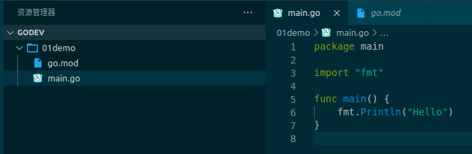

# 第一个 Go 程序

在非 GoPath 路径下创建一个目录，作为 Vscode 的工作区，用 VScode 打开这个目录。

- 新建一个目录 01demo

- 打开对应终端输入 go mod init demo_1，这个命令会产生一个新文件 go.mod

- 创建 main.go 文件

- 在终端输入 go run main.go 就可以运行代码了

最终目录结构

  

main.go 代码

```go
package main // 程序的所在的包
 
import "fmt" // 导入的包

func main() {
	fmt.Println("Hello") // 在终端输出 hello
}
```
运行结果
```shell
$ go run main.go
Hello
```

对上面的一些解释

**go mod init demo_1**

- go mod init demo_1 你可以简单的理解为创建了一个 Go 项目，项目的名字叫做 demo_1（这种说法并不准确，但可以这样理解）；

- 同时 go mod init 命令还会产生一个 go.mod 文件；

- go mod 于 go 好比 maven 于 Java ，是 go 语言管理依赖的东西；

- 用 go mod 进行开发对初学者可能不友好略微繁琐，没有直接在GoPath 下的 src 目录下开发方便，毕竟在开始学 Go 语言的时候你大概率用不到第三方的包。

**package main**

- 一个 xxx.go 文件的第一行代码必须要声明这个文件在哪一个包下面

- package main 就在声明这个文件在 main 包下面 

- 一个项目只能有一个 main 包 ，一个 main.go 文件

**import "fmt"**

- import "fmt" 是在导入包

> 最开始学习 Go 的时候知道这些东西就可以了，初期写的都是小程序用不到太多东西。

