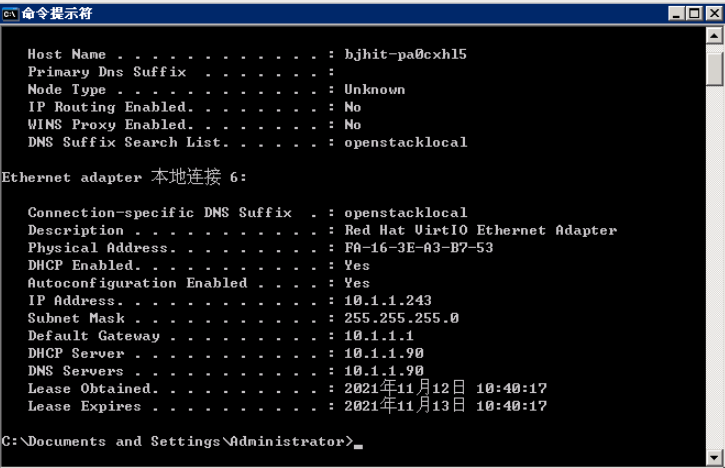
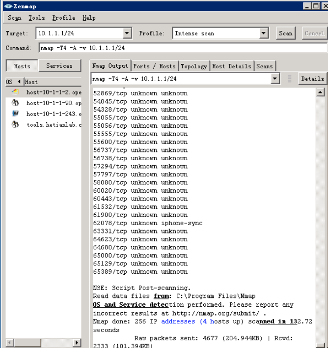
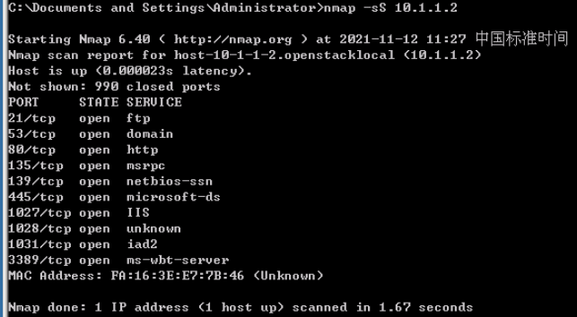

# Lab_1

**TCP与UDP**

  TCP是一种面向连接（连接导向）的、可靠的、基于字节流的运输层通信协议；UDP协议的全称是用户数据报协议，在网络中它与TCP协议一样用于处理数据包，是一种无连接的协议。

**建立TCP连接的三次握手：**

  第一次握手：建立连接时，客户端发送syn包（syn=j）到服务器，并进入SYN_SENT状态，等待服务器确认；SYN：同步序列编号（Synchronize Sequence Numbers）。

  第二次握手：服务器收到syn包，必须确认客户的SYN（ack=j+1），同时自己也发送一个SYN包（syn=k），即SYN+ACK包，此时服务器进入SYN_RECV状态；

  第三次握手：客户端收到服务器的SYN+ACK包，向服务器发送确认包ACK(ack=k+1），此包发送完毕，客户端和服务器进入ESTABLISHED状态，完成三次握手。

  完成三次握手，客户端与服务器开始传送数据。

**扫描的分类**

  常规扫描，通过TCP的三次连接进行扫描；

  半打开扫描，没有完成三次连接进行扫描；

  UDP扫描，由扫描主机发出 UDP 数据包给目标主机的UDP Port ，并等待目标主机 Port 送回ICMP Unreachable信息。

**nmap简介**

  nmap是一个网络探测和安全扫描程序，系统管理者和个人可以使用这个软件扫描大型的网络，获取主机正在运行以及提供什么服务等信息。nmap支持很多扫描技术，例如：UDP、TCP connect()、TCP SYN(半开扫描)、ftp代理(bounce攻击)、反向标志、ICMP、FIN、ACK扫描、圣诞树(Xmas Tree)、SYN扫描和null扫描。从扫描类型一节可以得到细节。nmap还提供了一些高级的特征，例如：通过TCP/IP协议栈特征探测操作系统类型，秘密扫描，动态延时和重传计算，并行扫描，通过并行ping扫描探测关闭的主机，诱饵扫描，避开端口过滤检测，直接RPC扫描(无须端口影射)，碎片扫描，以及灵活的目标和端口设定。

**实验一**

掌握windows下nmap的安装方法

  使用远程桌面登录到实验主机，打开桌面tools文件夹，找到nmap安装文件nmap-6.40-setup.exe，双击进行正常安装。(注：实验环境已安装好。)

  安装完成后桌面会自动添加一个nmap的快捷方式，双击该图标会出现nmap的主界面：

**实验二**

Zenmap图形基本应用，通过扫描本机网关熟悉nmap基本运行环境

  1）查找本机网关

  打开cmd控制台，在控制台中输入ipconfig /all，查看本机网关信息。从下图中可以看到，本机的IP地址为：10.1.1.243，网关地址为：10.1.1.90：



2）在zenmap界面中点击Scan--New Window

输入网关 10.1.1.1


  注：当扫描状态不停的动时，意味着扫描正在进行中，当扫描状态停止时，当前的信息即为扫描返回的完整信息。

  3）整网段扫描

  对本机所处网段进行扫描，分析本网段环境，使用方法：在扫描目标中输入：10.1.1.0/24，然后运行扫描任务。扫描任务停止后查看返回结果。



  在host中列举本网段中所有存活主机，OS项指明该主机的操作系统，点击相关主机即可查看主机的详细信息。

保存扫描结果到 10.1.1.1.xml

```

```


 4)在zenamp界面选择不同的profile重新对目标10.1.1.1进行扫描：

  每选择不同的profile后，下面的“Command”内容就会发生变化，意味着扫描参数同时发生变化。

  5）对每种“Profile”进行测试，观察返回结果有何不同，并分析结果。


#### **nmap命令行的使用**

  掌握nmap命令行下常用的参数

  1）关闭图形界面的zenmap，打开cmd，在cmd下输入命令：nmap，nmap会返回使用说明。

  可以看到nmap的用法：

  Nmap [Scan Tyle<s>] [Options] <target specification>

  其中，目标参数<target specification>为必选项。

  2）常用扫描类型及参数


 例1：判断10.1.1.2的操作系统：

nmap -O 10.1.1.2


例2：在测试中为了不在服务器10.1.1.2上留下连接痕迹，采用半开扫描：

nmap -sS 10.1.1.2




 3）扫描目标主机10.1.1.2所有端口（1-65535）：


对实验结果进行分析，完成思考题目，总结实验的心得体会，并提出实验的改进意见。


1）对局域网中主机扫描与互联网扫描有什么区别？应该怎样选择相应参数？

2）如果你是网络管理员，为了防止其他人扫描你管理的服务器以获取信息，有哪些解决办法？

